 

`NumPy` ← vectorized 연산을 아주 효율적으로 할 수 있게 도와주며 방대한 양의 계산을 코드 몇 줄로 간단히 가능하게

대부분의 수치계산, 기계학습과 같은 것들이 vectorized 연산을 수행

 

`Image Classification`은 컴퓨터비전 분야에서는 Core Task에 속한다

 

Image Classification

우선 입력 이미지를 받는다

컴퓨터가 해야 할 일은 이미지을 보고 어떤 카테고리에 속할지 고르는 것

(컴퓨터에게 이미지는 아주 큰 격자 모양의 숫자 집합으로 보임)

각 픽셀은 `세 개의 숫자`로 표현(각각은 `red`, `green`, `blue`을 의미)

컴퓨터에게 이미지란 단지 거대한 숫자 집합에 불과

의미적론적인 차이(Semantic gap)

 

"고양이"라는 레이블은 우리가 이 이미지에 붙힌 의미상의 레이블

이 이미지가 고양이 사진이라는 사실과 실제 컴퓨터가 보는 픽셀 값과는 큰 차이가 있다

이 이미지에 아주 미묘한 변화만 주더라도 픽셀 값들은 모조리 변하게 될 것

하지만 이 달라진 픽셀 값도 여전히 고양이라는 사실은 변하지 않는다

우리가 만든 알고리즘은 이런 것들에 강인해야 한다

 

바라보는 방향 뿐만 아니라 조명 또한 문제가 될 수 있다

객체 자체에 변형이 있을 수 있다

가려짐(occlusion)도 문제

Background clutter(배경과 비슷한 경우)

또한 하나의 클래스 내에도 다양성이 존재

⇒ "고양이"라는 하나의 개념으로 모든 고양이의 다양한 모습들을 전부 소화해 내야함

 

고양이에 따라 생김새, 크기, 색, 나이가 각양 각색

우리가 상상할 수 있는 어떤 객체라도 잘 다룰 수 있어야만 한다면 아주 어려운 문제

일부 제한된 상황을 가정한다면, 정말 잘 동작 할 뿐만 아니라 인간의 정확도와도 맞먹는 프로그램이 존재할 수도

 

시도해볼만한 것은 우선 이미지에서 edges를 계산

그리고 다양한 Corners와 Edges를 각 카테고리로 분류

가령 세 개의 선이 만나는 지점이면 corner라고 했을 때

귀는 "여기에 corner 하나" "저기에도 corner 하나” 또 "저기에도 코나 하나" 가 있고

이런 방식으로 고양이 인식을 위해 "명시적인 규칙 집합"을 써내려 가는 방법

`하지만` 이런 방식은 잘 동작하지 않는 것으로 알려져 있다

이런 방법들은 확장성 전혀 없는 방법

`이 세상에 존재하는 다양한 객체들에게 유연하게 적용 가능한 확장성 있는 알고리즘`을 만들어야 한다

 

`데이터 중심 접근 방법(Data-Driven Approcach)`

인터넷에 접속해서 엄청 많은 고양이/비행기/사슴 데이터를 수집

Google Image Search

이 데이터셋들을 이용해서 Machine Learning Classifier를 학습시킬 수 있다

ML 알고리즘은 어떤 식으로든 데이터를 잘 요약해서는 다양한 객체들을 인식할 수 있는 모델을 만들어낸다

그리고 학습 모델로 새로운 이미지를 테스트해 보면 고양이나 개를 잘 인식해 낼 것

입력 이미지를 고양이로 인식하려면 이제는 함수 하나가 아니라 두 개 필요

`Train 함수` - 입력은 이미지와 레이블이고, 출력은 우리의 모델

`Predict 함수` - 입력이 모델이고, 출력은 이미지의 예측값

Machine Learning의 key insight

 

Neural Network, CNN, Deep Learning

Data-driven approach는 Deep Learning뿐만 아니라 아주 일반적인 개념

 

조금 더 심플한 Classifier를 보면,

`Nearest neighbor`라는 아주 단순한 Classifier가 있다

`NN 알고리즘`은 상당히 단순

Train Step에서는 아무 일도 하지 않는다

단지 모든 학습 데이터를 기억

그리고 Predict Step에서는 새로운 이미지가 들어오면 새로운 이미지와 기존의 학습 데이터를 비교해서 가장 유사한 이미지로 레이블링을 예측

Data-driven Approach로서 아주 좋은 알고리즘

 

`CIFAR-10 데이터셋`

Cifar-10은 Machine Learning에서 자주 쓰는 연습용(테스트용) 데이터셋

10가지 클래스(비행기, 자동차, 새, 고양이 등)

10가지 각 카테고리가 있고 총 50,000여개의 학습용 이미지가 있다

(50,000여개의 데이터는 각 카테고리에 균일하게 분포)

알고리즘 테스트용 10,000여개의 테스트 이미지가 있다

`NN 알고리즘` ← 트레이닝 셋에서 "가장 가까운 샘플"을 찾는다

그렇게 찾은 "가장 가까운 샘플"의 레이블을 알 수 있다

이 샘플들은 “학습 데이터”이니까

 

중요한 점은 `이미지 쌍이 있을 때 어떻게 비교를 할 것인가`

"어떤 비교 함수를 사용할지”

`L1 Distance`(Manhattan distance)

이미지를 Pixel-wise로 비교

테스트/트레이닝 이미지의 같은 자리의 픽셀을 서로 빼고 절댓값

이렇게 픽셀 간의 차이 값을 계산하고 모든 픽셀의 수행 결과를 모두 더한다

 

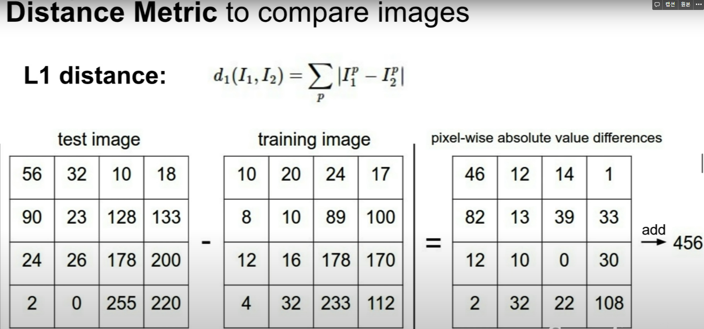

 

NN Classifier를 구현한 Python 코드는 상당히 짧고 간결

NumPy에서 제공하는 Vectorizaed operations을 이용해서

 

NN의 경우 Train 함수가 상당히 단순

단지 학습 데이터를 기억하는 것

Test 함수에서는 이미지를 입력으로 받고 L1 Distance로 비교

학습 데이터들 중 테스트 이미지와 가장 유사한 이미지들을 찾아냄

Numpy의 vectorized operations을 활용하면 구현은 Python code 한 두 줄이면 충분

 

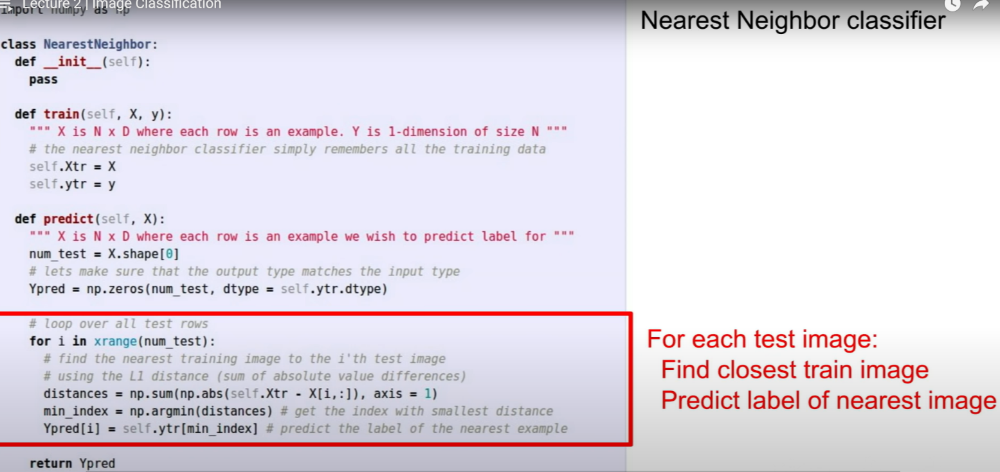

1. Trainset의 이미지가 총 N개라면 Train/Test 함수의 속도는 어떻게 될까

   Train time은 상수시간 O(1) - 데이터를 기억만하면 됨

   포인터만 잘 사용해서 복사를 하면, 데이터 크기와 상관없이 상수시간으로

2. 하지만 Test time에서는 N개의 학습 데이터 전부를 테스트 이미지와 비교해야만 한다

   상당히 느린 작업

   (Train Time < Test Time)

 

실제로 우리는 "Train Time은 조금 느려도 되지만 Test Time에서는 빠르게 동작"하길 원한다

모델이 핸드폰이나, 브라우저와 등 Low Power Device에서 동작해야 할 수도 있으므로

`Classifier가 Test Time에서 어느정도 빠른 성능을 보장해야 할 것`

 

그런 관점에서 NN 알고리즘은 정 반대의 경우

CNN 같은 parametic model들은 NN과는 정 반대

 

NN알고리즘을 실제로 적용해 본다면

"decision regions”

 

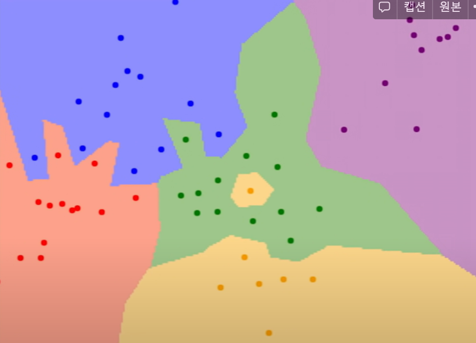

 

2차원 평면 상의 각 점은 학습 데이터 입니다. 그리고 점의 색은 클래스 레이블(카테고리)

2차원 평면 내의 모든 좌표에서 각 좌표가 어떤 학습 데이터와 가장 가까운지 계산

그리고 각 좌표를 해당 클래스로 칠

NN 분류기는 공간을 나눠서 각 레이블로 분류

but, 이 분류기는 그닥 좋지 않다

 

NN 분류기에서 발생 가능한 문제들을 살펴보면

NN 알고리즘은 "가장 가까운 이웃" 만을 보기 때문에 `잡음(noise)`이거나 `가짜(spurious)`가 생김

이러한 문제들 때문에 NN의 좀 더 일반화된 버전인 `k-NN 알고리즘 탄생`

단순하게 가장 가까운 이웃만 찾기보다는 조금 더 고급진 방법을 도입

`Distance metric을 이용해서 가까운 이웃을 K개의 만큼 찾고, 이웃끼리 투표를 하는 방법
가장 많은 특표수를 획득한 레이블로 예측`

투표를 하는 다양하고 복잡한 방법들이 있을 수 있음(거리별 가중치를 고려하는 등)

하지만 가장 잘 동작하면서도 가장 쉬운 방법은 득표수만 고려하는 방법

 

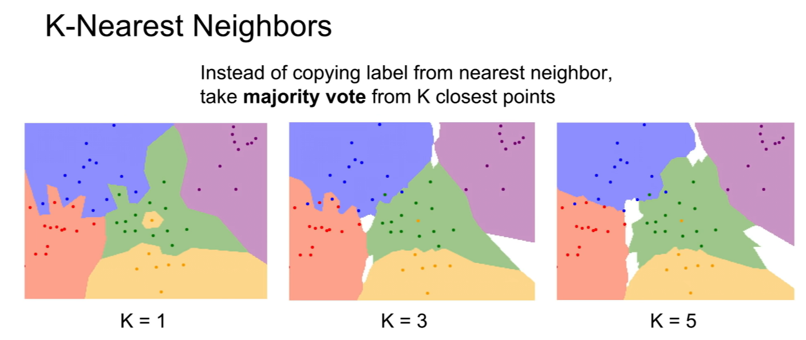

대게 NN분류기를 사용하면, K는 적어도 1보다는 큰 값으로 사용

왜냐하면 K가 1보다 커야 결정 경계가 더 부드러워지고 더 좋은 결과를 보이기 때문

 

"레이블링이 안된 흰색 지역은 어떻게 처리하는지?”

흰색 영역은 k-nn이 "대다수"를 결정할 수 없는 지역

물론 흰색 영역을 매꿀 수 있는 더 좋은 방법들도 있지만

어떤 식으로든 추론을 해보거나, 임의로 정할 수도

 

다양한 관점을 유연하게 다루는 능력

 

이미지를 고차원 공간에 존재하는 하나의 점이라고 생각하는 것

반대로 이미지를 이미지 자체로 볼 수도

이미지의 픽셀들을 하나의 고차원 벡터로 생각하는 관점

이 두 관점을 자유롭게 오갈 수 있는 능력은 아주 유용

 

이미지를 다루는 문제에서 k-nn을 사용하는 전략은 그닥 좋은 방법이 아님

 

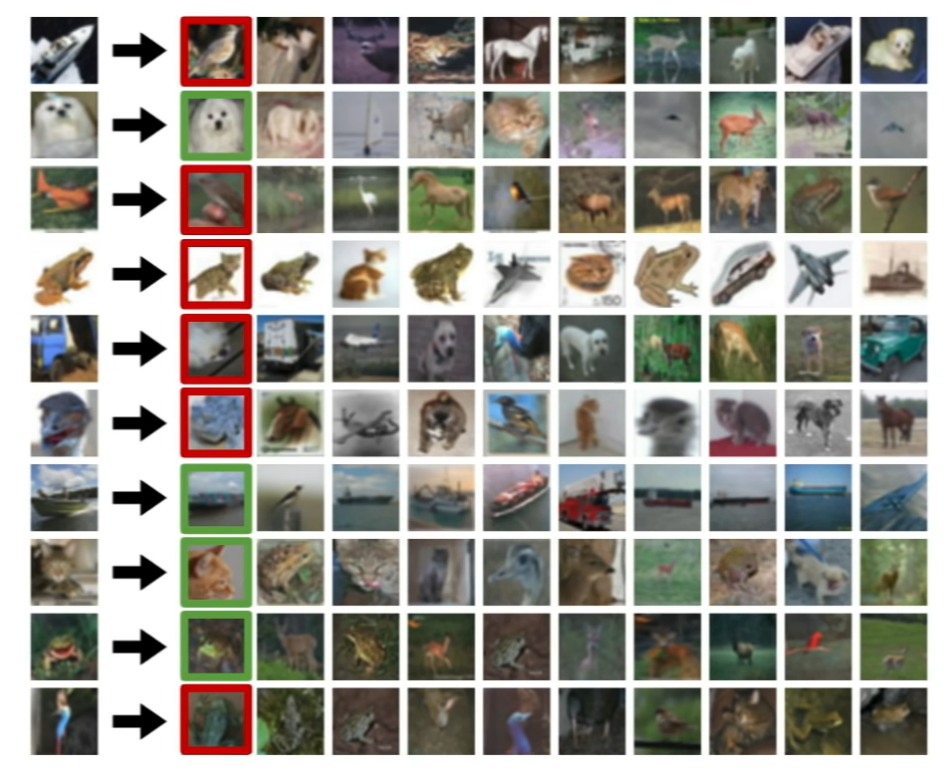

 

잘 분류되었는지 아닌지를 초록/빨간색으로 표기

성능이 별로 안 좋다

 

K값을 높히면? 가장 가까운 이웃 뿐만 아니라 Top-3/Top-5 혹은 모든 행(Row)을 사용하면?

더 많은 이웃들이 투표에 참여하면 각종 잡음들에 조금 더 강인해 질 것임을 추측

 

k-nn을 사용할 때 결정해야 할 한 가지 사항이 더 있다

`서로 다른 점들을 어떻게 비교할 것인지`

지금까지는 `L1 Distance`을 이용

`"픽셀 간 차이 절대값의 합”`

 

하지만 `L2`, 즉 `Euclidean distance를 사용`해도 될 것

`"제곱 합의 제곱근"을 거리로 이용하는 방법`

 

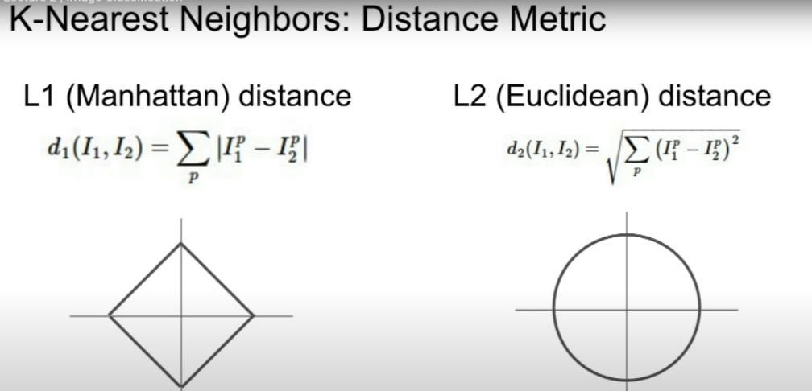

어떤 "거리 척도(distance metric)"을 선택할지는 아주 흥미로운 주제

서로 다른 척도에서는 해당 공간의 근본적인 기하학적 구조 자체가 서로 다르기 때문

왼쪽에 보이는 사각형은 사실 L1 Distance의 관점에서는 원(생긴 모습은 원점을 기준으로 하는 사각형의 모양.. L1 관점에서는 사각형 위의 점들이 모두 원점으로부터 동일한 거리만큼 떨어져 있음)

반면 L2, Euclidean distance 관점에서는 원

 

L1은 어떤 좌표 시스템이냐에 따라 많은 영향을 받음

가령 기존의 좌표계를 회전시키면 L1 distance가 변함

L2 Distance의 경우에는 좌표계와 아무 연관이 없다

만약 특징 벡터의 각각 요소들이 개별적인 의미를 가지고 있다면

L1 Distance가 더 잘 어울릴 수도

 

하지만 특징 벡터가 일반적인 벡터이고, 요소들간의 실질적인 의미를 잘 모르는 경우라면, 아마도 L2 Distance가 조금은 더 잘 어울림

 

k-nn에 다양한 거리 척도를 적용하면 k-nn으로 다양한 종류의 데이터를 다룰 수 있다는 점

벡터나 이미지 외에도 문장 분류하는 문제를 다룬다면 어떤 종류의 데이터도 다룰 수 있음

 

거리 척도에 따라서 결정 경계의 모양 자체가 달라짐

 

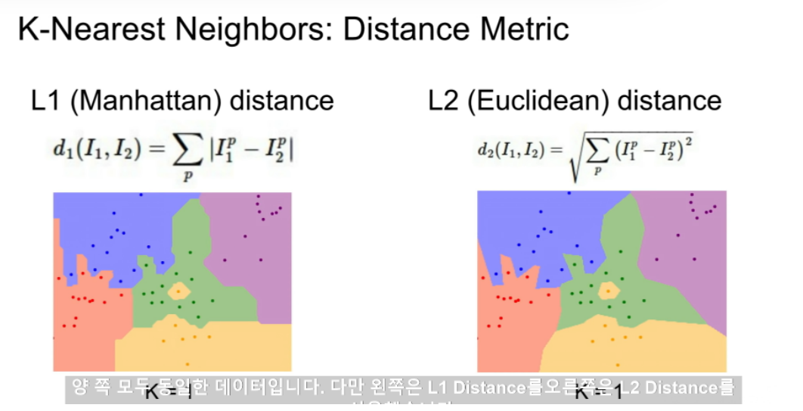

 

L1 Distance를 살펴보면 결정 경계가 "좌표 축"에 영향을 받는 경향

L1 Distance가 좌표 시스템의 영향을 받기 때문

반면 L2 Distance는 좌표 축의 영향을 받지 않고 결정 경계를 만들기 때문에 조금 더 자연스럽다

 

어떻게 하면 "내 문제"와 "데이터"에 꼭 맞는 모델을 찾을 수 있을까

K와 거리척도를 `"하이퍼 파라미터”`라고 한다

하이퍼파라미터는 Train time에 학습하는 것이 아니므로 학습 전 사전에 반드시 선택해야만 함

데이터로 직접 학습시킬 방법이 없다

하이퍼 파라미터를 어떻게 정해야 할까

하이퍼 파라미터를 정하는 일은 `문제의존적(problem-dependent)`

가장 간단한 방법은 `데이터에 맞게 다양한 하이퍼파라미터 값을 시도해 보고 가장 좋은 값을 찾는 것`

 

"어떤 경우에 L1 Distance가 L2 Distance보다 더 좋은가?”

그것은 문제의존적(problem-dependent)

L1은 좌표계에 의존적이므로 데이터가 좌표계에 의존적인지를 판단하는 것이 판단 기준이 될 수 있다

어떤 특징 벡터가 있고 각 요소가 어떤 특별한 의미를 지니고 있다면

가령 직원들을 분류하는 문제가 있을 때, 데이터의 각 요소가 직원들의 다양한 특징에 영향을 줄 수 있다

(봉급, 근속년수..)

이처럼 `각 요소가 특별한 의미를 가지고 있다면 L1 을 사용하는것이 좀 더 괜찮을지도`

 

하지만 일반적으로는 하이퍼파라미터 선택은 어떤 문제와 데이터인지에 의존적

하이퍼파라미터는 단지 여러가지 시도를 해보고 좋은 것을 선택하는 것이 좋다

하이퍼파라미터 값들을 실험해 보는 작업도 다양

"다양한 하이퍼 파라미터를 시도해 보는 것"과 "그중 최고를 선택하는 것”이 무슨 뜻?

"학습데이터의 정확도와 성능"를 최대화하는 하이퍼파라미터를 선택하는 것 ← 끔찍한 방법

가령 NN 분류기의 경우 K = 1 일 때 학습 데이터를 가장 완벽하게 분류

실제로는 K를 더 큰 값으로 선택하는 것이 학습 데이터에서는 몇 개 잘못 분류할 수는 있지만 학습 데이터에 없던 데이터에 대해서는 더 좋은 성능을 보일 수 있다

 

궁극적으로 기계학습에서는 학습 데이터를 얼마나 잘 맞추는지는 중요하지 않고

학습시킨 분류기가 `한번도 보지 못한 데이터를 얼마나 잘 예측하는지가 중요`

학습 데이터에만 신경쓰는 것은 최악

전체 데이터셋 중 학습 데이터를 쪼개서 일부를 테스트 데이터로 사용하는 것

 

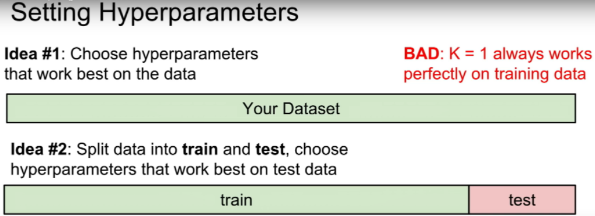

 

학습 데이터로 다양한 하이퍼파라미터 값들을 학습을 시키고 테스트 데이터에 적용시켜본 다음, 하이퍼파라미터를 선택하는 방법 ← 끔찍한 방법

 

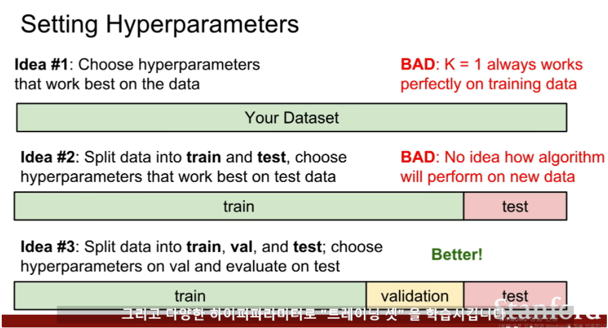

 

훨씬 더 일반적인 방법은 데이터를 세 개로 나누는 것

데이터의 대부분은 트레이닝 셋으로 나누고, 일부는 밸리데이션 셋, 그리고 나머지는 테스트 셋으로

다양한 하이퍼파라미터로 "트레이닝 셋”을 학습시킨다

그리고 "벨리데이션 셋" 으로 검증

그리고 벨리데이션 셋에서 가장 좋았던 하이퍼파라미터를 선택

최종적으로 개발/디버깅 등 모든 일들을 다 마친 후에 벨리데이션 셋에서 가장 좋았던 분류기를 가지고 테스트 셋에서는 "오로지 한번만" 수행

이 마지막 수치가 논문과 보고서에 에 삽입될 것

그 숫자가 알고리즘이 한번도 보지 못한 데이터에 얼마나 잘 동작해 주는지를 실질적으로 말해줄 수 있는 것

 

실제로 벨리데이션 데이터와 테스트 데이터를 엄격하게 나눠놓는 것은 상당히 중요

가령, 우리는 연구 논문을 작성할 때 테스트 셋을 거의 마지막 쯤에야 한번 사용

정직하게 연구를 수행했고 논문의 수치를 공정하게 측정했다는 것을 보장하기 위해서

테스트 데이터를 잘 통제해야 한다

 

또 다른 하이퍼파라미터 선택 전략은

크로스 벨리데이션(교차 검증) - 작은 데이터셋일 경우 많이 사용. 딥러닝에서는 많이 사용하진 않음.

우선 테스트 데이터를 정해놓고 이 테스트 데이터는 아주 마지막에만 사용

나머지 데이터는 트레이닝/벨리데이션 으로 딱 나눠 놓는 대신에 트레이닝 데이터를 여러 부분으로 나눈다

이런 식으로 번갈아가면서 벨리데이션 셋을 지정

5-Fold Cross Validation ← 처음 4개의 fold에서 하이퍼 파라미터를 학습시키고 남은 한 fold에서 알고리즘을 평가

그리고 1,2,3,5 fold에서 다시 학습시키고 4 fold로 평가

이런식으로 계속 순환

이런 방식으로 최적의 하이퍼파라미터를 확인할 수 있을 것

이런 방식은 거의 표준이긴 하지만 실제로는 딥러닝같은 큰 모델을 학습시킬 때는 학습 자체가 계산량이 많기 때문에 실제로는 잘 쓰지 않음

 

"구체적으로 트레이닝 셋과 벨리데이션 셋의 차이가 무엇인지”

k-NN의 예를 들어보자면 트레이닝 셋은 우리가 레이블을 기억하고 있는 이미지들

어떤 이미지를 분류하려면 트레이닝 데이터의 모든 이미지들과 비교하게 됨

그리고 가장 근접한 레이블 선택

알고리즘은 트레이닝 셋 자체를 기억할 것

이제는 벨리데이션 셋을 가져와서 트레이닝 셋과 비교

이를 통해 밸리데이션 셋에서는 분류기가 얼마만큼의 정확도가 나오는지 확인

트레이닝 셋의 레이블을 볼 수 있지만 밸(벨)리데이션 셋의 레이블은 볼 수 없음

벨리데이션 셋의 레이블은 알고리즘이 얼마나 잘 동작하는지를 확인할 때만 사용

 

“테스트 셋이 한번도 보지 못한 데이터를 대표할 수 있는지”

기본적인 통계학적 가정) 우리의 데이터는 독립적이며, 유일한 하나의 분포에서 나온다는 가정

모든 데이터는 동일한 분포를 따른다고 생각해야 함

(물론 실제론 그렇지 않은 경우가 많음)

테스트 셋이 한번도 보지 못한 데이터를 잘 표현하지 못하는 경우와 같은 문제는 datasets creators와 dataset curators가 생각해 볼 문제

데이터 셋 만들 때, 데이터 수집 시 일관된 방법론을 가지고 대량의 데이터를 한번에 수집하는 전략 사용

그 후 무작위로 트레이닝 데이터와 테스트 데이터를 나눠줌

주의할 점) 데이터를 지속적으로 모으고 있는 경우, 먼저 수집한 데이터들을 트레이닝 데이터로 쓰고 이후에 모은 데이터를 테스트 데이터로 사용한다면 문제가 될 수 있음

대신에 데이터셋 전체를 무작위로 섞어서 데이터셋을 나누는 것이 그 문제를 완화시킬 수 있는 한가지 방법

 

크로스 벨리데이션을 수행하고 나면 다음과 같은 그래프

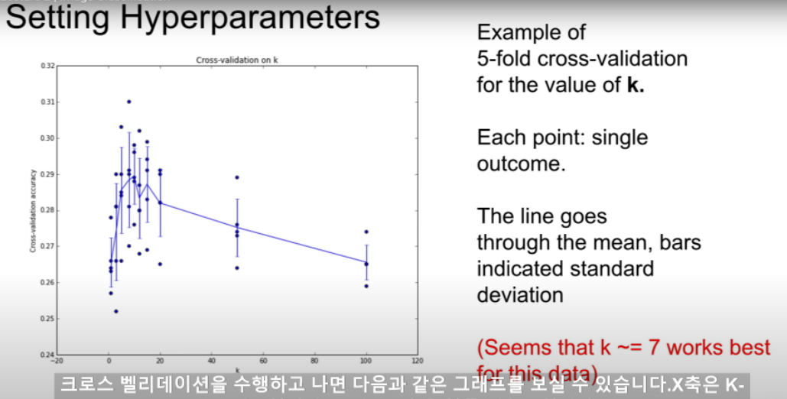

 

X축은 K-NN의 K입니다. 그리고 Y축은 분류 정확도

이 경우에는 5-fold 크로스 벨리데이션을 수행함

각 K마다 5번의 크로스 벨리데이션을 통해 알고리즘이 얼마나 잘 동작하는지 알려줌

"테스트셋이 알고리즘 성능 향상에 미치는 영향”을 알아보려면 K fold 크로스벨리데이션이 도움을 줄 수 있음

여러 validation folds 별 성능의 분산(variance)을 고려해 볼 수 있음

분산을 같이 계산하게 되면, 어떤 하이퍼파라미터가 가장 좋은지 뿐만 아니라, 그 성능의 분산도 알 수 있음

기계학습 모델을 학습시키는 경우에 보통 이런 모습의 그래프를 그리게 될 것

하이퍼파라미터에 따라 모델의 정확도와 성능을 평가할 수 있다

 

벨리데이션 셋의 성능이 최대인 하이퍼 파라미터를 선택하게 될 것

 

실제로는 `입력이 이미지인 경우에는 k-NN 분류기를 잘 사용하지 않음`

너무 느리고 L1/L2 Distance가 이미지간의 거리를 측정하기에 적절하지 않음

이 벡터간의 거리 측정 관련 함수들은(L1/L2) 이미지들 간의 "지각적 유사성"을 측정하는 척도로는 적절하지 않음

 

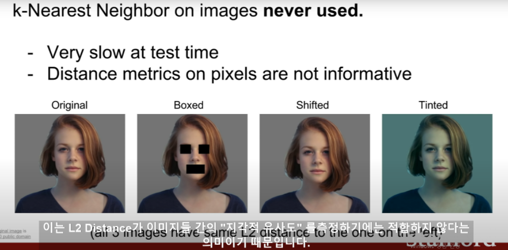

 

우리들은 이미지간의 차이를 어떻게 지각하는 것일까??

Euclidean Distance..

L2 Distance가 이미지들 간의 "지각적 유사도”를 측정하기에는 적합하지 않음

 

K-NN의 또 다른 문제 중 하나는 “차원의 저주”

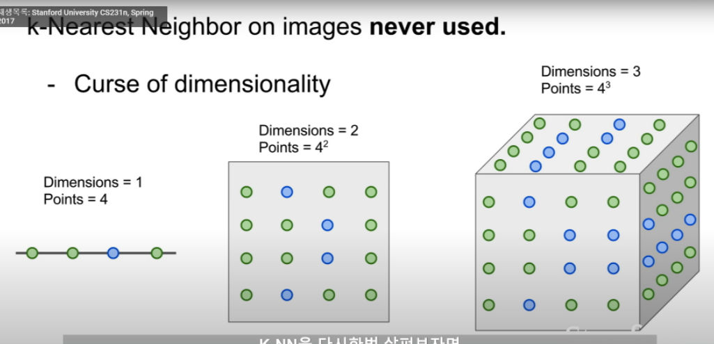

(각 점은 트레이닝 샘플들을 의미. 점 하나하나가 트레이닝 샘플. 각 점의 색은 트레이닝 샘플이 속한 카테고리를 나타냄. 각 공간을 조밀하게 덮기 위해 필요한 트레이닝 샘플의 수는 차원이 늘어남에 따라 기하급수적으로 증가)

K-NN가 하는 일은 트레이닝 데이터를 이용해서 공간을 분할하는 일

K-NN이 잘 동작하려면 전체 공간을 조밀하게 커버할 만큼의 충분한 트레이닝 샘플이 필요하다는 것을 의미

그렇지 않다면 이웃이 사실은 엄청 멀 수도 있고 그렇게 되면 테스트 이미지을 제대로 분류할 수 없을 것

공간을 조밀하게 덮으려면 충분한 량의 학습 데이터가 필요하고 그 양은 차원이 증가함에 따라 기하급수 적으로 증가 ← 아주 좋지 않은 현상

기하급수적인 증가는 언제나 옳지 못함

 

고차원의 이미지라면 모든 공간을 조밀하게 메울만큼의 데이터를 모으는 일은 현실적으로 불가능

 

K-NN을 사용할 시 여러분은 항상 이 점을 염두해야함

 

"이미지"와 "정답 레이블"이 있는 트레이닝 셋

테스트 셋을 예측하는데 이용

 

K-NN 알고리즘은 샘플들의 manifolds를 가정하지 않기 때문에

`K-NN이 제대로 동작할 수 있는 유일한 방법은 공간을 조밀하게 덮을 만큼 충분히 많은 트레이닝 샘플`을 가지는 것

 

`L2 Distance가 이미지간의 유사도을 측정하는데는 좋지 않다`

K-NN을 사용한다면 이미지 간의 유사도를 특정할 수 있는 유일한 방법은 바로 이 단일 거리 성능 척도(L1/L2 등)을 이용하는 수 밖에 없음

Distance metric이 실제로는 이미지간의 유사도를 잘 포착해 내지 못한다는 것을 알려줌

translation과 offset에도 Distance가 일치하도록 제가 임의로 만들어낸 것

 

"최적의 하이퍼파라미터를 찾을 때 까지 학습을 다시 시키는 것이 흔한 방법인지”

다시 학습시킬 여유가 있고 1%의 성능이라도 짜내고 싶다면 하나의 트릭

⇒ K-NN 성능 좋지 않고 이미지에는 잘 사용하지 않음

 

`Linear Classification` ← NN과 CNN의 기반 알고리즘

Nerural Network를 레고블럭에 비유

NN을 구축할 때 다양한 컴포넌트들을 사용할 수 있음

이 컴포넌트들을 한데 모아서 CNN이라는 거대한 타워를 지을 수 있음

앞으로 보게될 다양한 종류의 딥러닝 알고리즘들의 가장 기본이 되는 블럭중 하나가 바로 Linear classifier

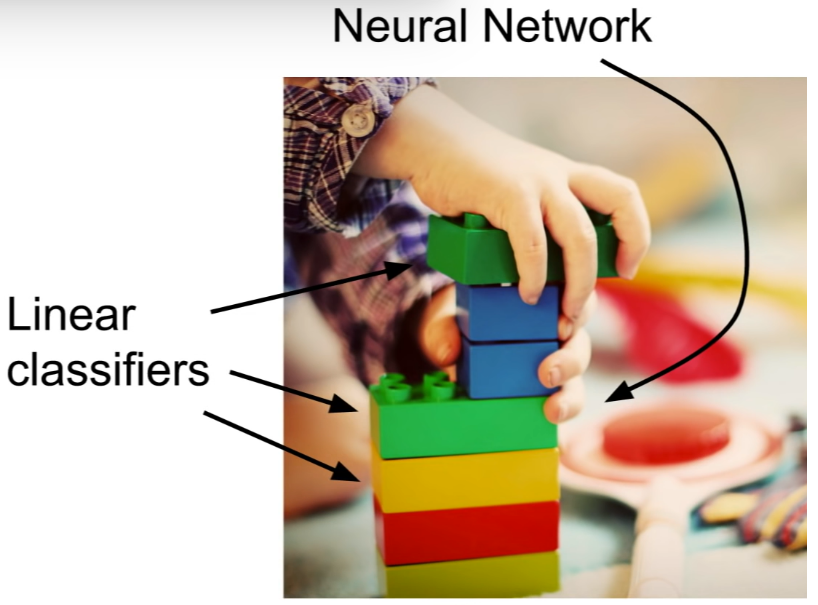

Linear classification이 결국은 전체 NN을 이루게 될 것

 

Image Captioning ← 이미지가 입력이고 이미지를 설명하는 문장이 출력

이미지를 인식하기 위해서 CNN을 사용

언어를 인식하기 위해서 RNN을 사용

두개(CNN + RNN)을 레고 블럭처럼 붙히고 한번에 학습시킴 → 어려운 문제 해결

 

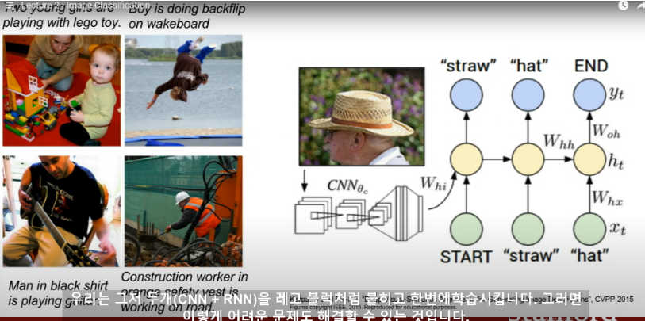

⇒ NN은 레고블럭. Linear Classifier은 그것의 기본이 되는 블럭

 

`CIFAR-10`은 50,000여개의 트레이닝 샘플이 있고 각 이미지는 32x32 픽셀을 가진 3채널 컬러 이미지

Linear classification에서는 K-NN과는 조금 다른 접근 방법 이용

`Linear classification는 "parametric model"의 가장 단순한 형태`

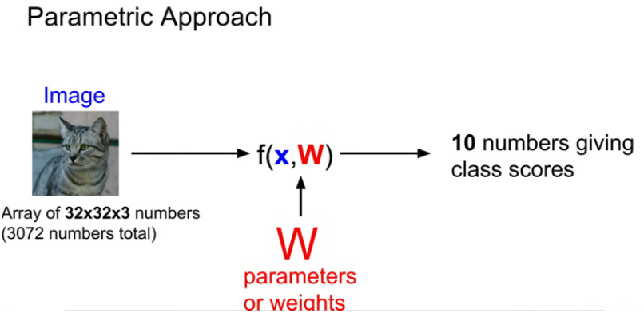

"parametric model"에는 두 개의 요소가 있음

입력 이미지 x

파라미터, 즉 가중치는 W or 세타(theta)

data X와 parameter W를 가지고 함수 작성

10개의 숫자를 출력

이 숫자는 CIFAR-10의 각 10개의 카테고리의 스코어

“고양이”의 스코어가 높다는 건 입력 X가 “고양이”일 확률이 큼을 의미

 

32 x 32 x 3 에서 3은 Red, Green, Blue 3채널 의미.. 보통은 컬러 이미지를 다룸

컬러 정보는 버리기 아까운 유용한 정보

 

앞서 K-NN은 파라미터가 없었고

그저 전체 트레이닝 셋을 가지고 있었고 모든 트레이닝 셋을 Test time에 사용함

`parametric approach에서는 트레이닝 데이터의 정보를 요약`

그 요약된 정보를 `파라미터 W`에 모아줌

이런 방식을 사용하면 Test time에서 더이상 트레이닝 데이터가 필요X

`Test time에서는 파라미터 W만 있으면 그만
핸드폰과 같은 작은 디바이스에서 모델을 동작시켜야 할 때 아주 효율적
딥러닝은 바로 이 함수 F의 구조를 적절하게 잘 설계하는 일`

 

어떤 식으로 가중치 W와 데이터를 조합할지를 여러가지 복잡한 방법으로 고려해볼 수 있음

 

과정들이 모두 다양한 NN 아키텍쳐를 설계하는 과정

가중치 W와 데이터 X를 조합하는 가장 쉬운 방법은 이 둘을 곱하는 것(Linear classification)

F(x,W) = Wx

 

입력 이미지는 32 x 32 x 3

이 값을 길게 펴서 열 벡터로 만들면 3,072-dim 벡터가 됨

3072-dim열 벡터가 10-classes 스코어가 되어야 함

10개 카테고리에 해당하는 각 스코어를 의미하는 10개의 숫자를 얻고 싶은 것

행렬 W는 10 x 3072가 되어야 함

이 둘을 곱하면 10-classes 스코어를 의미하는 10 x 1 짜리 하나의 열 벡터를 얻게됨

 

"Bias”

Bias term도 같이 더해주기도 함

Bias term은 10-dim 열 벡터

Bias term은 입력과 직접 연결되지 않음

 

"데이터와 무관하게” 특정 클래스에 "우선권"을 부여함

데이터셋이 분균형한 상황에서, 고양이 데이터가 개 데이터보다 훨씬 더 많은 상황에서는

고양이 클래스에 상응하는 바이어스가 더 커진다

이 함수가 어떻게 동작하는지 보면,

 

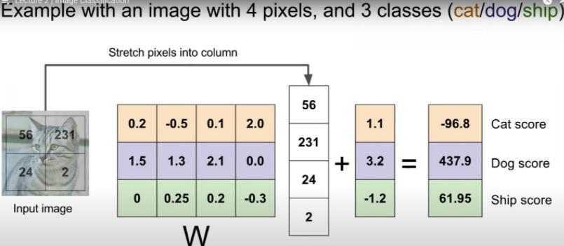

왼쪽에 입력 이미지, 2x2 이미지이고 전체 4개의 픽셀

Linear classifier는 2x2 이미지를 입력으로 받고 이미지를 4-dim 열 벡터로 쭉 편다

10개 클래스를 모두 슬라이드에 담을 수 없어서 이 예제에서는 고양이, 개, 배 이렇게 세가지 클래스만 본다

가중치 행렬 W는 4x3 행렬, 입력은 픽셀 4개고 클래스는 총 3개

3-dim bias 벡터

bias는 데이터와 독립적으로 각 카테고리에 연결됨

"고양이 스코어" 는 입력 이미지의 픽셀 값들과 가중치 행렬을 내적한 값에 bias term을 더한 것

 

이러한 관점에서 Linear classification은 템플릿 매칭과 거의 유사함

 

가중치 행렬 W의 각 행은 각 이미지에 대한 템플릿으로 볼 수 있고 그 행 벡터와 이미지의 열벡터 간의 내적을 계산

내적이란 결국 클래스 간 탬플릿의 유사도를 측정하는 것과 유사함을 알 수 있음

bias는 데이터 독립적으로 각 클래스에 scailing offsets을 더해주는 것

 

템플릿 매칭의 관점에서 Linear classification 해석해보면 가중치 행렬 W의 한 행을 뽑아서 이를 이미지로 시각화시켜 보면

Linear classifier가 이미지 데이터를 인식하기 위해서 어떤 일을 하는지 짐작할 수 있음

 

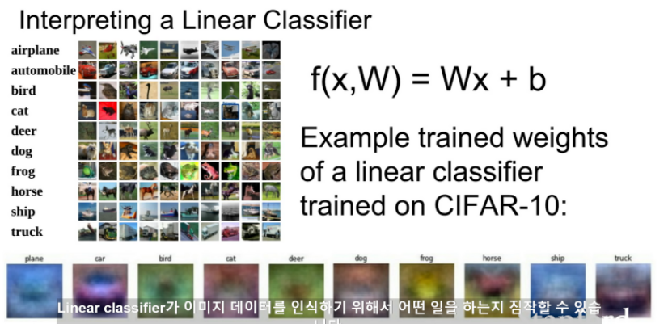

Linear classifier가 이미지를 학습

슬라이드 하단의 이미지는 실제로 가중치 행렬이 어떻게 학습되는지를 볼 수 있음

CIFAR-10의 각 10개의 카테고리에 해당하는 행 벡터를 시각화시킨 것

시각화된 이미지를 살펴보면

Linear classifier의 문제 중 하나는 각 클래스에 대해서 단 하나의 템플릿만을 학습한다는 문제

한 클래스 내에 다양한 특징들이 존재할 수 있지만 모든 것들을 평균화 시키기 때문에

다양한 모습들이 있더라도 각 카테고리를 인식하기 위한 템플릿은 단 하나밖에 없음

Linear classifier가 클래스 당 하나의 템플릿밖에 허용하지 않아서

 

Neural Network같은 복잡한 모델이라면 조금 더 정확도 높은 결과를 볼 수 있을 것

클래스 당 하나의 템플릿만 학습 할 수 있다는 것과 같은 제약조건이 없다면

Linear classifier을 또 다른 관점으로 해석할 수 있는데

이미지를 고차원 공간의 한 점으로 보는 것

 

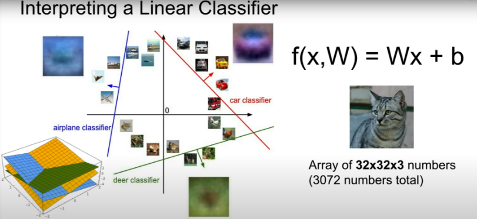

 

Linear classifier는 각 클래스를 구분시켜 주는 선형 결정 경계를 그어주는 역할을 함

 

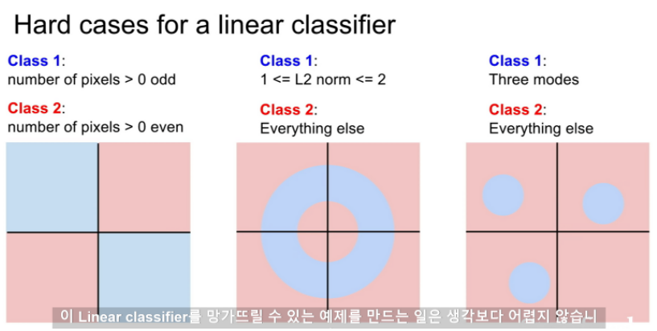

픽셀 갯수를 세는 대신에 영상 내 동물이나 사람의 수가 홀/짝수 인지를 분류하는 문제에선 문제

홀/짝수를 분류하는 것과 같은 반전성 문제(parity problem)는 일반적으로 Linear classification으로 풀기 힘든 문제

 

Linear classifier로는 풀기 힘든 또 하나는 Multimodal problem

Multimodal data라면 한 클래스가 다양한 공간에 분포할 수 있으며 이 문제는 Linear classifier로는 풀 수 없음

Linear classifier에는 문제점이 일부 있긴 하지만 아주 쉽게 이해하고 해석할 수 있는 알고리즘

 

Linear classifier가 단순히 행렬과 벡터 곱의 형태라는 것

템플릿 매칭과 관련이 있고, 이 관점에서 해석해 보면 각 카테고리에 대해 하나의 템플릿을 학습한다는 것을 배움

 

가중치 행렬 W 를 학습시키고 나면 새로운 학습 데이터에도 스코어를 매길 수 있음

 

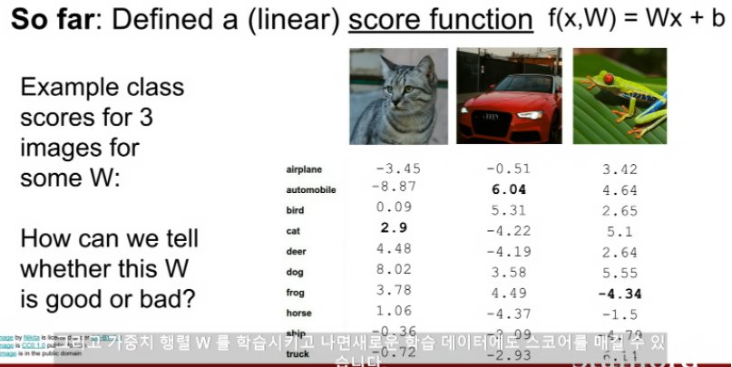
