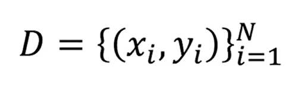
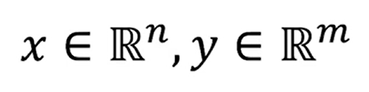
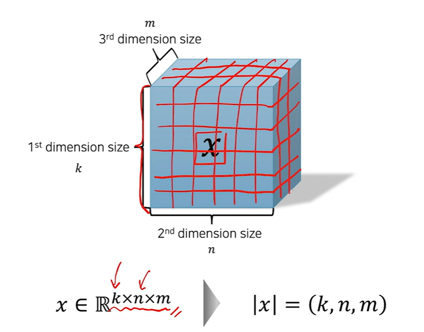
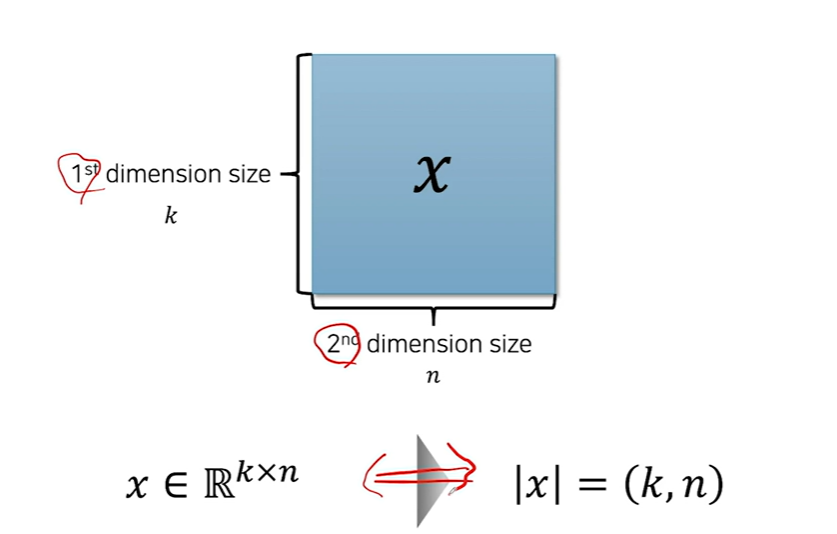
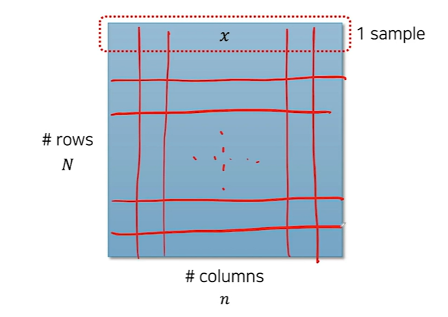
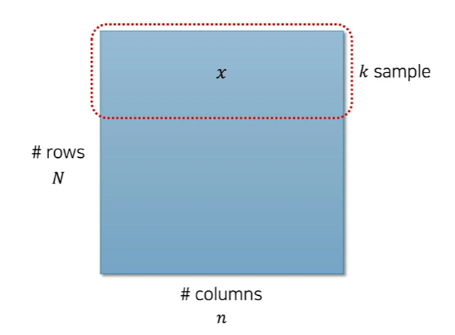
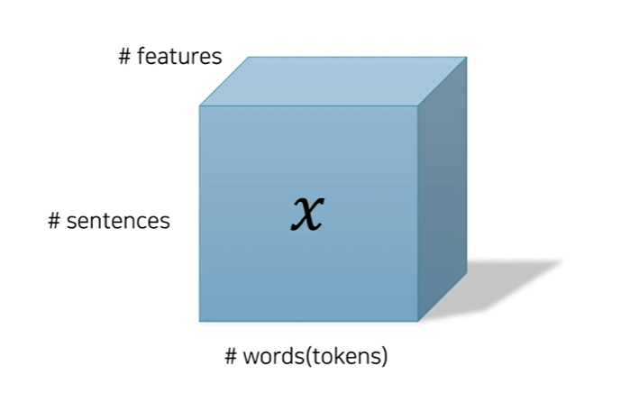

<br />

Python

고등학교 수학: 미분 개념, 행렬 연산 (e.g. 내적), 지수와 로그

개념 -> 수식

<br />

혼자 구현해보기

<br />

---

<br />

anaconda download 구글링해서 다운받기

<br />

`pip`

`which pip` 설치된 곳

`ipython`

```python
import numpy as np
np.__version__
exit
```

<br />

윈도우는 아나콘다 Prompt 에서 주피터 노트북

`jupyter-notebook`

<br />

---

<br />

VSCode 설치 (IDE 환경)

<br />

---

<br />

Deep Learning 딥러닝

Deep Neural Networks (DNN)을 학습시켜 문제를 해결하는 것

인공신경망(Artificial Neural Networks)의 적통을 이어받음

* Neuron들로 구성된 신경망을 학습하여 문제를 해결하도록 동작하는 함수

<br />

기존 신경망에 비하여 더 깊은 구조를 갖는 것이 특징

* 과거 학습시킬 수 없었던 깊은 신경망을 잘 학습시킬 수 있게 됨
* 인터넷 발달로 빅데이터가 널리 활용되고 이를 통해 깊은 신경망 학습 가능
* GPU르르 활용한 병렬연산에 대한 방법이 대중화, 신경망의 학습/추론 속도가 비약적으로 증가

<br />

비선형 함수.

기존 머신러닝에 비해 패턴 인식 능력이 월등함

이미지나 텍스트, 음성과 같은 분야들에서 비약적인 성능 개선을 만듦

* 기존 머신러닝과 달리 hand-crafted feature가 필요 없음
* 단순히 raw 값을 넣는 것으로 자동으로 특징(feature)을 학습

<br />

1980년대, 역전파(Back-propagation) 알고리즘의 개발로 인한 중흥기

2000년대, 근근히 이어나가던 명맥

* Restricted Boltzmann Machine (RBM) and Deep Belief Networks (DBN)
* Stacked Denoising Autoencoder

<br />

2010년대 초, ImageNet 우승과 음성인식(Speech Recognition)의 상용화

2015년, 기계번역(Machine Translation)의 상용화

2017년, 알파고(AlphaGo)의 승리

2018년, GAN을 통한 이미지 합성의 발전

<br />

* 기존 패러다임
  * Hand-crafted feature를 추출하여 머신러닝 모델에 넣고 학습
  * 여러 단계의 sub-module로 이루어져 있었음 (무거운 시스템, 단계적으로 확인 가능)
    * e.g. 음성인식, 기계번역 등
* 새로운 패러다임
  * Raw 값을 신경망에 넣으면, 자동으로 특징(feature)을 학습
  * 하나의 task에 대해서, 하나의 신경망 모델이 존재하는 end-to-end 방식 (내부적으로 까서 해석하긴 힘든)
  * 기존보다 성능이 좋다

<br />

열린 문화와 빠른 트렌드 변화

* 오픈 소스 문화 + 빠른 (무료) 논문 공유

  GitHub, arXiv.org

* 부작용: 사용자의 부담 증가

<br />

 딥러닝의 활용 사례

* 음성인식(Speech Recognition), 사용자 의도 파악(Intend Classification)
  * e.g. Apple Siri, Google Assistant, Samsung Bixby
* 기계번역(Machine Translation)
* 자율주행(Autonomous Driving)
* 객체 인식(Object Detection), 이미지 분류(Image Classification)
  * e.g. 이미지 검색
* 사진 합성(Image Generation), 사진 보정, Super Resolution
  * e.g. 흑백 사진 -> 컬러 사진, 저해상도 사진 -> 고해상도 사진
* 데이터 분석(Data Science)
  * Tabular 데이터 분석
  * 시계열(time-series) 데이터 분석

<br />

---

<br />

좋은 인공지능이란

<br />

인공지능 모델이란?

* x가 주어졌을 때, y를 반환하는 함수

  y = f(x)

* 파라미터(weight parameter, θ)란

  * f가 동작하는 방식(x가 들어왔을 때, 어떤 y를 뱉어낼 것인가?)을 결정

* 학습?

  * x와 y의 쌍으로 이루어진 데이터가 주어졌을 때, x로부터 y로 가는 관계를 배우는 것
  * x와 y를 통해 적절한 파라미터(θ)를 찾아내는 것

* 모델?

  * 상황에 따라 알고리즘 자체를 이르거나, 파라미터를 이름

<br />

좋은 인공지능 모델이란?

* 일반화(Generalization)를 잘하는 모델
* 보지 못한(unseen) 데이터에 대해서 좋은 예측(prediction)을 하는 모델
  * 우리는 모든 경우의 수에 대해서 데이터를 모을 수 없기 때문
  * 보지 못한 경우에 대해서, 모델은 좋은 판단을 내릴 수 있어야 함

<br />

기존 머신러닝의 한계

* 기존 머신러닝은 주로 선형 또는 낮은 차원의 데이터를 다루기 위해 설계됨
* Kernel 등을 사용하여 비선형 데이터를 다룰 수 있지만 한계가 명확
  * 이미지, 텍스트, 음성과 같은 훨씬 더 높은 차원의 데이터들에 대해 낮은 성능을 보임

<br />

---

<br />

### 딥러닝

<br />

Our Objective

* 주어진 데이터에 대해서 결과를 내는 가상의 함수를 모사하는 함수를 만드는 것
  * e.g. 주어진 숫자 그림을 보고 숫자 맞추기

<br />

Working Process

* 문제 정의(가장 중요)

  * 풀고자 하는 문제를 단계별로 나누고 simplify

  * 신경망이라는 함수에 넣기 위한 x와 결과값 y를 정의

    y = f(x)

* 데이터 수집

  * 문제 정의에 따라 정해진 x와 y
  * 풀고자 하는 문제의 영역에 따라 수집 방법이 다름
    * 자연어처리, 컴퓨터비전: crawling
    * 데이터분석: 실제 수집한 데이터
  * 필요에 따라 레이블링(labeling) 작업을 수행
    * 자동적으로 `레이블`(label)이 y로 주어질 수도 있음
    * 하지만 대부분의 경우, 레이블이 따로 필요함
    * 비지도학습(unsupervised learning)을 기대하지 말자

* 데이터 전처리 및 분석

  * 수집된 데이터를 신경망에 넣어주기 위한 형태로 가공하는 과정
    * 입출력 값을 정제(cleaning & normalization)
  * 이 과정에서 탐험적 분석(Exploratory Data Analaysis, EDA)이 필요
    * 데이터에 알맞은 알고리즘을 찾기 위함
    * 자연어처리, 컴퓨터비전의 경우에는 생략되기도 함
  * 영상 처리(computer vision)의 경우, 데이터 증강(augmentation)이 수행
    * e.g. rotation, flipping, shifting 등의 간단한 연산

* 알고리즘 적용

  * 데이터에 대해 가설을 세우고, 해당 가설을 위한 알고리즘(모델) 구현/적용

* 평가

  * 문제 정의에 따른 공정하고 올바른 평가 방법 필요
    * 가설 검증을 위한 실험 설계
  * 테스트 셋(test set) 구성
    * 너무 쉽거나 어렵다면 판별력 떨어짐
    * 실제 데이터와 가장 가깝게 구성되어야 함
  * 정량적 평가(extrinsic evaluation)와 정성적 평가(intrinsic evaluation)로 나뉨

* 배포

  * 학습과 평가가 완료된 모델 weights 파일을 배포함

  * RESTful API 등을 통해 wrapping 후 배포
  * 데이터 분포의 변화에 따른 모델 업데이트 및 유지/보수가 필요할 수 있음

<br />

---

<br />

Appendix: Basic Math

<br />

지수와 로그

* 지수 함수
* 지수 기본 법칙
* 지수 연산 법칙
* 법칙의 응용
* 로그 함수
* 지수와 로그의 관계
* 로그 기본 법칙
* 로그 연산 법칙

<br />

Summation & Product

* Sum
* Product

<br />

argmax

* Pick the argument that makes max  value

<br />

---

<br />

파이토치(PyTorch) 튜토리얼

* 왜 파이토치?
  * 장점
    * NumPy와 매우 비슷한 문법
    * 동적으로 back-propagation 경로 생성 가능
    * 훌륭한 documentation
    * 난이도에 비해 자유도 높음
  * 단점
    * ~~TF에 비해 상대적으로 부족한 오픈 소스 코드~~
    * TF에 비해 낮은 상용화 지원
    * ~~텐서보드 부재~~
    * ~~Google TPU 지원 불가~~

<br />

---

<br />

pytorch.org

<br />

Stable, 운영체제, Conda, Python...

아나콘다 프롬프트에서

`conda install pytorch torchvision torchaudio cudatoolkit=11.3 -c pytorch`

으로 설치함

<br />

`ipython`

```python
import torch
torch.__version__
```

`exit`

<br />

https://pytorch.org/get-started/previous-versions/

<br />

---

<br />

### Dataset

<br />

주어진 데이터에 대해서 결과를 내는 가상의 함수를 모사하는 함수를 만들기

e.g. 주어진 숫자 그림을 보고 숫자 맞추기

<br />

그러기 위해서

* 가상의 함수(ground-truth)를 통해 데이터 쌍(x, y)을 수집해 데이터셋을 만들고, 우리의 함수(e.g. 신경망)가 데이터를 통해 가상의 함수를 모방하도록 한다

  

* 이때, x와 y는 각각 n차원과 m차원의 벡터로 표현될 수 있다

  

<br />

Tabular Dataset

여러 column으로 이루어진 테이블로 구성된 데이터셋(e.g. 엑셀 파일 csv)

* 한 row가 한 개의 sample을 의미
* Column 객수가 벡터의 차원을 의미

<br />

---

<br />

### Tensor

<br />

차원이 0D <- scalar

1D <- vector

2D <- matrix

3D <- tensor (여기까지 시각화)

4D <- tensor

5D <- tensor

6D <- tensor

<br />

Tensor Shape

육면체로 표현



<br />

Matrix Shape



<br />

Typical Tensor Shape: Tabular Dataset



<br />

Mini-batch: Consider Parallel Operations



<br />

Typical Tensor Shape: Natural Language Processing



|x| = (#s, #w, #f)

#f <- |xᵢ,j| = (#f, )

|xᵢ| = (#w, #f)

<br />

Typical Tensor Shape: Computer Vision (Grayscale)

|x| = (#img, h, w)

<br />

Typical Tensor Shape: Computer Vision (Color)

|x| = (#img, #ch, h, w)

|xᵢ| = (#ch, h, w)

<br />

---

<br />
