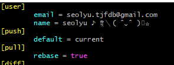

 

 

### 목차

[설정 및 셋팅](#Setting)

[사용자 설정 및 필요한 셋팅들](#Setting2)

 

---

 

### Setting

 

**Mac**용 추천 터미널: https://www.iterm2.com/

**Windows**용 추천 터미널: https://cmder.net/

 

Git은 명령어를 기본으로한 명령어 프로그램

터미널에서 커맨드로 배워야지 Git을 정확하게 사용하는 방법 익힐 수 있다

 

깃헙 데스크탑 비추

아틀라시안에서 만든 소스트리 어플리케이션 전반적으로 많이 사용

GitKraken <- 화려한 UI

현업에서는 명령어 이용해서 사용하는 경우가 많고 소스트리 많이 씀

 

`git --version`

 

[목차로](#목차)

 

---

 

### Setting2

 

Git 을 설치하게 되면 Git에 관련된 모든 환경설정이 .gitconfig 라는 파일 안에 저장되는데

터미널에서 확인하려면

`git config --list`

q 눌러서 다시 터미널로 돌아와서

파일로 열어보고 싶다 하면

`git config --global -e` 로 설정된 아이를 edit 모드로 열 수 있다

텍스트 에디터로 열어보고 싶다면 `code .`

Command Palette에서 code라고 검색하면 Shell Command에 설정할 수 있는 명령어 나옴

`git config --global core.editor "code"`

이렇게 한 후

`git config --global -e` 하면 

.gitconfig 파일이 열림과 동시에 다른 명령어를 수행할 수 있도록 터미널이 계속 활성화되어져 있는데 

반대로 `--wait` 옵션 주면 열린 파일이 종료되기 이전에는 다른 명령어 수행 불가

`git config --global core.editor "code --wait"`

터미널이 기다림

파일 저장하고 close 하면 터미널이 이용가능해짐

 

사용자 정보 설정하기

`git config --global user.name "seolyu"`

`git config --global user.email "leeseolyu@gmail.com"`

`git config user.name`

`git config user.email`

 

`git config --global core.autocrlf true` <- 윈도우

`git config --global core.autocrlf input` <- 맥

운영체제마다 에디터에서 새로운 줄바꿈할 때 들어가는 문자열 달라지는데

윈도우는 carriage-return(\r)과 line feed(\n)가 동시에 들어가는 반면

Mac에서는 line feed 하나만 들어감

이런 차이점으로 Git repository를 다양한 운영체제에서 쓰는 경우에 

내가 수정하지 않았음에도 불구하고 줄바꿈 문자열이 달라져서 

Git history나 Git blame을 보는데 문제가 있을 수 있다

이것을 수정할 수 있는 속성이 autocrlf 설정

윈도우에서 true 로 설정하면 Git에 저장할 땐 carriage-return을 삭제하게 되고

다시 Git에서 윈도우로 가져올 땐 자동으로 carriage-return 붙여줌

Mac 에서는 input 으로 설정하게 되면 Git에서 받아올 땐 별다른 수정이 일어나지 않지만

저장할 땐 carriage-return 삭제해줌

Mac에서는 carriage-return이 붙지 않음에도 불구하고 이렇게 처리를 해 주는 것은 

Mac 에서 이메일을 받아 온 텍스트를 복붙할 때 실수로 carriage-return이 들어갈 수 있기 때문

그래서 윈도우는 true, 맥은 input 으로 설정하는 것이 좋다

 

`git config --global -e` 로 깃 설정 파일 열어서

사용자 설정 [user] 밑에 push와 pull을 추가해주자

push 할 때 default 를 current로 설정함으로 

로컬에 있는 브랜치 이름이 항상 리모트와 동일하다고 설정해줘서 

push를 할 때 일일이 `git push --set-upstream origin master` 옵션을 작성하지 않아도 됨

pull 명령어는 merge와 rebase 옵션을 선택해서 동작할 수 있음

 

[목차로](#목차)

 