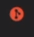

 

 

### 목차

[디버깅 빠르게](#디버깅)

[문제 원인 빠르게 찾기](#문제_원인_빠르게_찾기)

 

---

 

### 디버깅

 

`git blame 원하는파일이름`

해보면

커밋된 해시코드와 누가 도입했는지 날짜와 시간까지 확인 가능

 

소스트리에서는

파일 우클 Annotate Selected...

 

보통은

파일에서 바로 볼 수 있는데

인텔리J같은거는 기본적으로 그 기능이 포함되어져있고

VSCode에서는 gitlens라는 익스텐션 설치

 

[목차로](#목차)

 

---

 

### 문제_원인_빠르게_찾기

 

 

[목차로](#목차)

 

---

