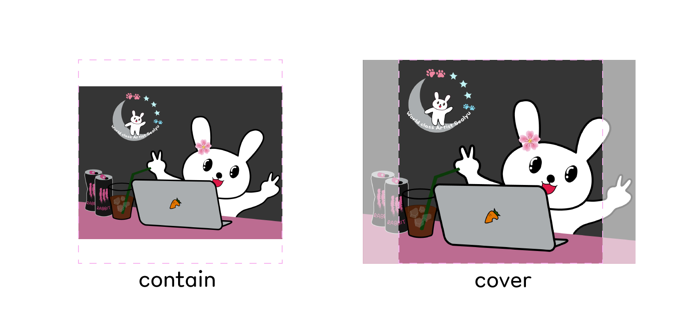

<p align="center">
    <a href="https://github.com/seol-yu/TIL/tree/master/HTML_CSS/HTML_CSS/CSS">
    </a>
    <a href="https://github.com/seol-yu/TIL/tree/master/HTML_CSS/HTML_CSS/CSS">
    </a>
</p>


## Background

<br />

총 다섯가지 속성

1. `background-color`

   `hex` `rgb` `rgba` 로 색상 표현

   ```css
   .box {
       width: 300px;
       height: 300px;
       background-color: #0066ff;
   }
   ```

2. `background-image`

   `url()` 함수 사용해야 한다

   사용할 이미지 경로 넣기

   * 자체 이미지는 상대 경로

     ./assets/dog.png

   * 이미지 주소

   ```css
   .box {
       width: 300px;
       height: 300px;
       background-image: url('./assets/dog.png');
   }
   ```

   ```css
   .box {
       width: 300px;
       height: 300px;
       background-image: url('이미지주소복붙해');
   }
   ```

3. `background-repeat`

   `repeat` | `no-repeat`

   기본은 repeat 반복

   ```css
   .box {
       width: 300px;
       height: 300px;
       background-repeat: no-repeat;
       background-image: url('이미지주소복붙해');
   }
   ```

4. `background-size`

   `contain` | `cover` | `custom`

   

   `background-size: contain;`은 사진 전체가 어떻게든 요소 안에 들어가게

   `background-size: cover;`는 요소 안에 빈공간 없이 꽉 차게 이미지 채워짐

   custom은 가로 세로 50% 100% 이런식으로.. 자동비율 `background-size: auto 80%;` 이런 식으로

   ```css
   .box {
       width: 300px;
       height: 300px;
       background-size: 50% 100%;
       background-repeat: no-repeat;
       background-image: url('이미지주소복붙해');
   }
   ```

5. `background-position`

   x축으로 y축으로 위치 명시

   `background-position: center;`  <- x 축으로 가운데

   `background-position: center center;`  <- y 축으로도 가운데. 제일 많이 씀

   `background-position: 50% 50%;`  <- 얘도 정가운데 배치

   `background-position: left top;`

   ```css
   .box {
       width: 300px;
       height: 300px;
       background-position: center center;
       background-size: contain;
       background-repeat: no-repeat;
       background-image: url('이미지주소복붙해');
   }
   ```

<br />

SEO 생각하면 img 태그 쓰는게 좋다고 생각들겠지만

```css
.card-image {
    display: flex;
    justify-content: center;
    align-items: center;
    width: 300px;
    height: 200px;
    background-color: #000;
    overflow: hidden;
}

.card-image.vertical img {
    width: 100%;
    height: auto;
}

.card-image.horizontal img {
    width: auto;
    height: 100%;
}
```

위 코드 사용하려면 이미지 비율에 따라 제각각 클래스가 자동으로 들어가야하는데, 

HTML / CSS 할 수 없고 서버에서 처리 or 자바스크립트를 써야함

이처럼,

CSS `backgroud-image`로 처리하는 것이 좋은 경우가 있는데

사람들이 어떤 사이즈의 이미지를 올릴지 모를 때 등등

```css
.card-image {
    display: flex;
    justify-content: center;
    align-items: center;
    width: 300px;
    height: 200px;
    border-radius: 6px;
    background-image: url('./assets/img-house.jpg');  /* 따옴표 써도 되고 안써도 됨 */
    background-repeat: no-repeat;
    background-position: center center;
    background-size: cover;
    overflow: hidden;
}
```

<br />

별표 넣기

```css
.property-rate::before {
  content: "";
  display: block;
  width: 16px;
  height: 16px;
  margin-right: 4px;
  background-image: url(./assets/icon-star.svg);
  background-size: contain;
  background-repeat: no-repeat;
  background-position: center center;
}
```

<br />

스크린리더만 읽을 수 있게

```html
<dl class="property-detail">
    <div>
        <!-- 범용 클래스 만들기 -->
        <dt class="sr-only">Rooms and beds</dt>
        <dd>
        	<span>2 bedroom</span>
        </dd>
    </div>
</dl>
```

```css
.sr-only {
    position: absolute;
    z-index: -1;
    width: 1px;
    height: 1px;
    overflow: hidden;
    visibility: hidden;
}
```

우리 눈에 안보이게 하려면

`display: none;` 쓰면 되겠지만 스크린리더 또한 없는 것이라고 생각함

그래서 위와 같이

`position: absolute;` 로 집 나가게 하고

`z-index: -100;` 주고

`width: 1px;` `height: 1px;` 둘 중 하나라도 0으로 줘버리면 스크린리더가 읽어주지 않음

1px이라도 있어야

`overflow: hidden;` 으로 벗어나는 영역 잘라버리기

`opacity: 0;` 으로 투명도도 0으로

`visibility: hidden;`

<br />

정보로 의미가 없는 · 은 css로 주기

span 끝나기 전에 마지막 자식으로 · 주기

```css
.property-detail dd span::after {
  content: "·";
  margin: 0 6px;
}
```

<br />

span 중에 마지막 아이 가상요소

```css
.property-detail dd span:last-child::after {
  content: "";
  margin: 0;
}
```

<br />

`display: flex;` 준 부모의 자식 요소가 본인 컨텐트 크기만큼만 넓이 차지할 경우

`flex-grow` 이용해서 flexbox 공간 남으면 그 공간 차지할지말지

`flex-grow: 0;` <- 절대로 차지X

`flex-grow: 1;` <- 남은 공간 차지

<br />
