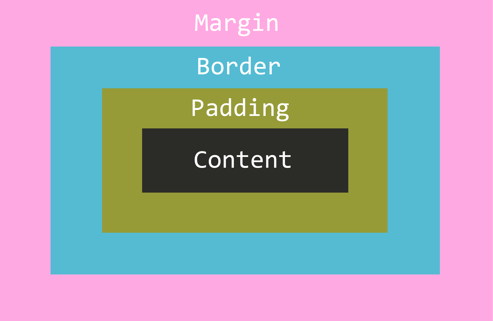

<p align="center">
    <a href="https://github.com/seol-yu/TIL/tree/master/HTML_CSS/HTML_CSS/CSS">
    </a>
    <a href="https://github.com/seol-yu/TIL/tree/master/HTML_CSS/HTML_CSS/CSS">
    </a>
</p>


### 목차
[Box Model](#Box_Model)

[Box Sizing](#Box_Sizing)

[Box](#Box)

[Block](#Block)

[Inline](#Inline)

[Inline Block](#Inline_Block)

<br />

---

<br />

### Box_Model

<br />

```css
.box {
    width: 500px;  /* 가로 */
    height: 300px;  /* 세로 */
    padding: 20px 0;  /* content와 border 사이 공간 */
    border: 1px solid #212121;
    margin-top: 30px;
}
```

<br />

박스 모델 :black_large_square:

HTML에 있는 모든 요소들은 결국 CSS로 표현될 때 박스로 표현

개발자도구에서 Elements에서 Styles 옆에 탭 Computed보면(<- Show all 체크),,

박스 구조는 동일



* Content <- 컨텐트가 들어있는

  가로는 width, 세로는 height

* Padding

  안쪽 여백, 즉 content와 border 사이의 공간을 나타내는 padding

* Border

  테두리를 나타내는 border

  `border: 굵기 스타일 색상;`

  ```css
  border: 1px solid #000;  /* 순서 바뀌어도 됨 */
  
  border: none;  /* border 없음 */
  
  border-radius: 4px;  /* 둥글게. 50% 주면 동그랗게 */
  ```

* Margin

  바깥 여백, 즉 요소와 요소 사이의 간격을 나타내는 margin

<br />

속기형 Shorthand - top부터 시계방향

```css
top right bottom left 시계방향
top과 bottom이 세트, right left 세트

padding: 10px 20px 30px 40px;

top 10px right 20px bottom 40px left 20px
padding: 10px 20px 40px;

top 20px right 40px
bottom 20px left 40px
margin: 20px 40px;
```

<br />

[코드 참고](./실습/02Box_01BoxModel/style.css)

<br />

[목차로](#목차)

<br />

---

<br />

### Box_Sizing

<br />

```css
.box {
    width: 480px;
    height: 480px;
    padding-top: 40px;
    padding-left: 50px;
    background-color: #0066ff;
    color: #fff;
}
```

위와 같이 하면 정사각형이 아니고 520x530 직사각형이 됨

<br />

box 사이즈 잡는 법 `box-sizing`

기본은 content-box

```css
* {
    box-sizing: content-box;
    /* content-box | border-box */
}
```

box-sizing이 content-box이면

width랑 height 준게 Content box에만 적용됨

but, 

`Border영역까지 포함한 덩어리를 하나의 가로 세로로 보는게 자연스럽다`

그래서 보통

```css
* {
    box-sizing: border-box;
}
```

<br />

* 는 전체 선택자. 모든 요소들

우리의 상식에 맞게 동작하는 박스를 위한 강경한 조치

<br />

[코드 참고](./실습/02Box_02BoxSizing/style.css)

<br />

[목차로](#목차)

<br />

---

<br />

### Box

<br />

Box Model만 알아서는 안되고

`Box`를 알아보자

<br />

**어떤 Box Type 쓰냐에 따라  Box Model 작동 방식도 달라진다**

<br />

Box Type -> Box Model

* `Block`
* `Inline`
* `Inline Block`
* `Flex`

<br />

[목차로](#목차)

<br />

---

<br />

### Block

<br />

Box Type => Display

박스타입 결정짓는 CSS 속성 display

<br />

모든 HTML 요소는 박스로 표현되기에 다 display 값 가지고 있다

<br />

:sparkles:`Block` -> **길막**

1. 따로 width를 선언하지 않은 경우, **width=부모의 content-box의 100%**

   따라오는 다른 요소들은 옆에 못 온다

2. **따로 width를 선언한 경우, 남은 공간은 margin으로 자동으로 채움**

   역시 따라오는 다른 요소들 옆에 못 온다

   남은 공간 margin 있는데 디버깅시 안나옴

   `margin: 0 auto;`

   위 코드는 top과 bottom은 0px, left랑 right는 auto 줘서 가운데 배치하는건데

   자동으로 생긴 margin은 auto이므로

   자동으로 생긴 마진 왼쪽 오른쪽 나눠갖기

<br />

길막 특성 외엔

width, height, padding, border, margin 하고 싶은 거 다 하세요

box 모델에 있는 모든 속성들은 다 block 타입에게 적용 가능

<br />

`따로 부모의 height 선언하지 않을 경우, 자식 요소의 height의 합 = 부모의 height`

부모 안에 자식 두 개 있을 때

위에 위치한 자식에게 `style="margin-bottom: 40px;"` 주면 height 도 그만큼 높아짐

<br />

[코드 참고](./실습/02Box_04Block/style.css)

<br />

[목차로](#목차)

<br />

---

<br />

### Inline

<br />

:sparkles:`Inline` => **흐름**

<br />

Block은 길막인 것과 달리 Inline은 흐름에 맞게 옆으로 주르륵

부모 영역 모자라면 줄바꿈해서 또 흐름. 글 쓰듯

<br />

#### Block vs Inline

면 vs 선

면(영역) vs 선(흐름)

<br />

흐름 깨는

width, height, padding-top, padding-bottom, border-top, border-bottom, margin-top, margin-bottom 사용 불가!!!!:no_entry_sign:

<br />

padding-left, padding-right, margin-left, margin-right는 Inline의 흐름을 깨지 않으므로 사용 가능

<br />

span은 대표적인 inline 요소

padding-top 줬을 때 얼핏보면 먹은 것 같은데 엄밀히 따지면 안 생긴 것과 다름없음. 영역으로 의미가 없음

<br />

display: inline-block; 이런식으로 해보면 줄 망가지게 적용?되는 듯

margin-bottom: 100px; 이런거 써도 관심 안가져줌

<br />

[코드 참고](./실습/02Box_05Inline/style.css)

<br />

[목차로](#목차)

<br />

---

<br />

### Inline_Block

<br />

Block && Inline

각각의 좋은 점 가지고 있다

<br />

Inline은 요소 다루기 불편하고

Block은 영역 잡기 좋지만 길막

<br />

**Inline Block은 기본적으로 Inline처럼 가로로 흐르는 동시에 Block처럼 영역도 잡을 수 있음**

```css
span {
    display: inline-block;
}
```

<br />

[코드 참고](./실습/02Box_05Inline/style.css)


<br />

[목차로](#목차)

<br />