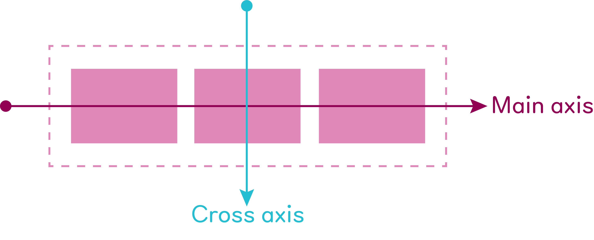
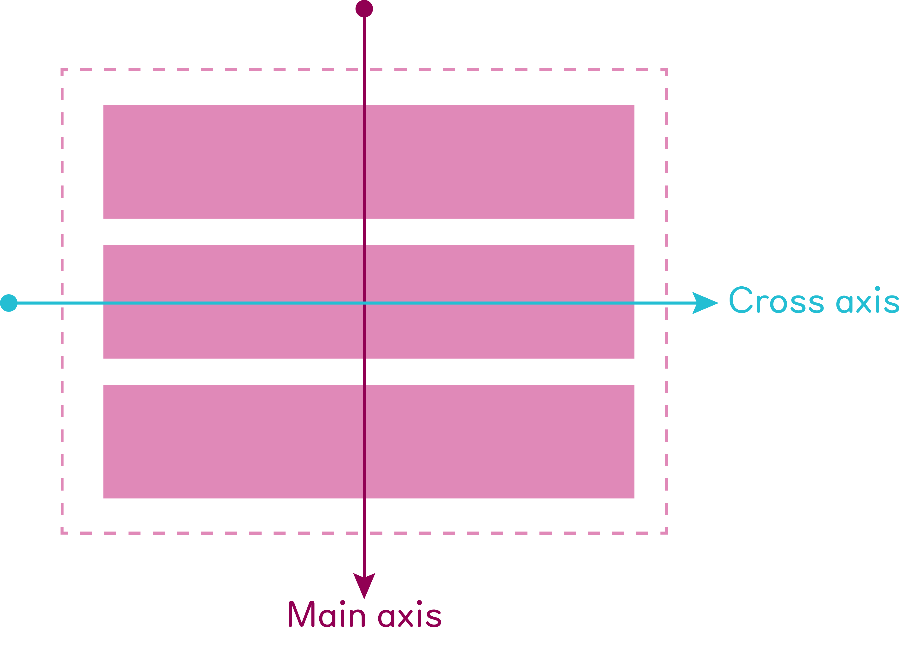
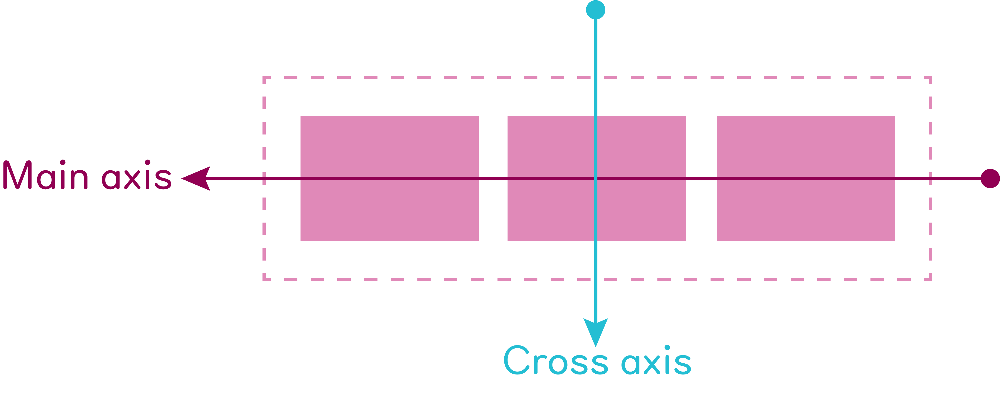
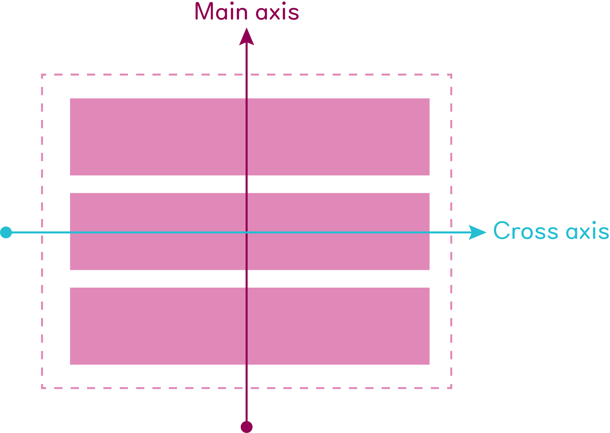
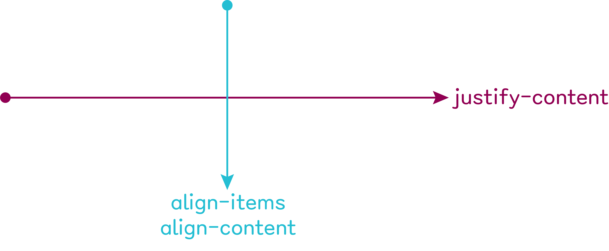

<p align="center">
    <a href="https://github.com/seol-yu/TIL/tree/master/HTML_CSS/HTML_CSS/CSS">
    </a>
    <a href="https://github.com/seol-yu/TIL/tree/master/HTML_CSS/HTML_CSS/CSS">
    </a>
</p>


### 목차

[Flexbox](#Flexbox)

<br />

---

<br />

## Flexbox

정렬의 끝판왕:smiley:

#### How to use it 만 기억

<br />

4 Steps

1. 나, 플렉스박스 쓸거임 `display: flex;`
2. 가로 정렬? 세로 정렬?
3. 무조건 한 줄 안에 다 정렬?
4. 씐나는 플렉스박스 파티 타임!

<br />

Step 1) `나, 플렉스박스 쓸거임`

```css
.flexbox {
    display: flex;
    /* flex | inline-flex */
}
```

근데 누구한테 선언?

정렬하고자 하는 요소들을 감싸는 부모에게

<br />

Step 2) `가로 정렬? 세로 정렬?`

어느방향으로 정렬할지

```css
.flexbox {
    display: flex;
    flex-direction: row;
    /* row | row-reverse | column | column-reverse */
}
```

<br />

`flex-direction: row;` <- 가로 방향

`flex-direction: column;` <- 세로 방향

<br />

보이지 않는 2개의 Axis(축)가 생긴다

flex-direction이 어떤가에 따라 달라짐

* `Main axis`

  flex-direction 방향에 따라서

* `Cross axis`

  Main axis와 수직을 이루는 방향으로

<br />

`flex-direction: row` 설정하면,



<br />

`flex-direction: column` 설정하면,



<br />

`flex-direction: row-reverse` 설정하면,



<br />

`flex-direction: column-reverse` 설정하면,



<br />

Step 3) 무조건 한 줄 안에 다 정렬?

어떻게든 한 줄 안에 모든 요소를 정렬할 것인지,

상황에 따라 여러줄 만들어 정렬할 것인지

```css
.flexbox {
    display: flex;
    flex-direction: row;
    flex-wrap: nowrap;
    /* nowrap | wrap */
}
```

감싸지wrap 않고 자식의 사이즈를 줄여서라도 한 줄로 정렬해버리는 `flex-wrap: nowrap;`

한 줄에 모두 정렬하기에 공간이 넉넉하지 않으면 여러 줄을 만들어 버리는 `flex-wrap: wrap;`

<br />



`Main axis 기준`으로 정렬할 때 쓰는 것이 `justify-content`

`Cross axis 기준`으로 정렬할 때 쓰는 것이 `align-items`

<br />

```css
.parent {
    display: flex;
    flex-direction: row;
    justify-content: center;  /* 가로축 가운데 정렬됨. row니까 */
    flex-wrap: nowrap;
}
```

위 코드를 `justify-content: flex-start;` 라고 하면 왼쪽 정렬. 

(`flex-direction: row-reverse;` 하면 오른쪽으로 정렬됨)

<br />

`justify-content: flex-end;` 오른쪽 정렬

<br />

`justify-content: space-between;` 요소 사이 간격들 같게

`justify-content: space-around;` 요소들 양옆에 사이즈 같게 주기

<br />

```css
.parent {
    display: flex;
    flex-direction: column;
    justify-content: center;  /* 세로축 가운데 정렬됨. column 이니까 */
    flex-wrap: nowrap;
}
```

<br />

```css
.parent {
    display: flex;
    flex-direction: row;
    align-items: center;  /* 수직 방향 가운데 정렬. row니까 */
    flex-wrap: nowrap;
}
```

`align-items: flex-start;` 위쪽 정렬

`align-items: flex-end;` 아래쪽 정렬

<br />

```css
.parent {
    display: flex;
    flex-direction: column;
    align-items: center;  /* 가로 가운데 정렬됨. column 이니까 */
    flex-wrap: nowrap;
}
```

<br />

`align-content`는?

이건 `flex-wrap: wrap;` 일 때, flex line이 2개 생기는 경우

전체 기준으로 배치하려면,

```css
.parent {
    display: flex;
    flex-direction: row;
    flex-wrap: wrap;
    align-content: center;
}
```

flex line 여러개일 때 align-items에 space-between, space-around 먹여도 안되지만

`align-content` 는 `space-between`, `space-around` 도 사용 가능

<br />

일단 `align-items` 써보고 뜻대로 안되면 `align-content`

<br />

`order` 라는 기능

순서 바꿀 때

`order: 1;`

`order: 2;`

`order: 3;`

<br />

```css
.parent {
    display: flex;
    flex-direction: row;  /* 기본값 */
    flex-wrap: nowrap;  /* 기본값 */
    justify-content: flex-start;  /* 기본값 */
}
```

<br />

플렉스박스 썼을 때 자식 요소들이 붙게되는 경우 자식 요소에 `width: 100%;`

<br />

자식요소 중앙(가로 세로 가운데)에 두려면 부모에게

```css
body {
    display: flex;
    justify-content: center;
    align-items: center;
}
```

<br />

[코드 참고](./실습/05Flexbox_01Flexbox/style.css)

[코드 참고](./실습/05Flexbox_02Flexbox/style.css)

[코드 참고](./실습/05Flexbox_03Flexbox/style.css)

<br />

[목차로](#목차)

<br />
