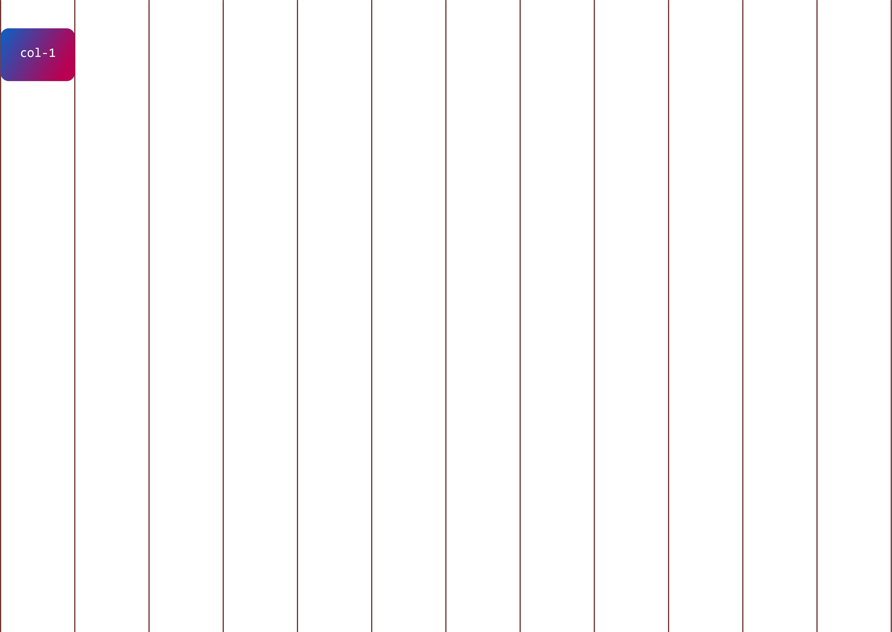
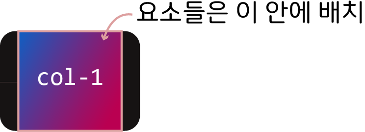

<p align="center">
    <a href="https://github.com/seol-yu/TIL/tree/master/HTML_CSS/HTML_CSS/CSS">
    </a>
    <a href="https://github.com/seol-yu/TIL/tree/master/HTML_CSS/HTML_CSS/CSS">
    </a>
</p>


### 목차

[Grid System](#Grid_System)

[Bootstrap](#Bootstrap)

[반응형 웹 사이트 제작하기](#파이널)

<br />

---

<br />

## Grid_System

<br />

피그마, 스케치업, 포토샵.. 시안 받아서 HTML, CSS, JS 로 작성

`how designers work`

<br />

디자이너가 디자인할 때 

`그리드 시스템` (일종의 가이드라인) 이용해서 디자인

<br />

`container` <- Grid System이 적용되는 전체 범위

`column` <- 일정한 간격으로 선이 있는데 12칸으로. 칸을 column 이라 함 (다양한 레이아웃 가능해서 12 column 많이 씀)

`gutter` <- 여백 주기 위해 col 양쪽 옆에 간격을 위한 여백 거터 영역





<br />

[목차로](#Page_Layout)

<br />

---

<br />

## Bootstrap

<br />

굉장히 쉽게 심지어 반응형까지 되게 css로

반응형 그리드 시스템

https://getbootstrap.com/docs/4.5/getting-started/introduction/

```html
<link rel="stylesheet" href="https://stackpath.bootstrapcdn.com/bootstrap/4.5.0/css/bootstrap.min.css" integrity="sha384-9aIt2nRpC12Uk9gS9baDl411NQApFmC26EwAOH8WgZl5MYYxFfc+NcPb1dKGj7Sk" crossorigin="anonymous">
```

그리드시스템만 해볼꺼니까 css만 import

<br />

부트스트랩 쓸 때

container(<- grid가 적용되는 전체 영역)의 자식으로는 row만

row 자식으로는 col 로 시작하는 것들만

col 안에 만들고 싶은 애 넣기

총 합 12 넘으면 아래로 떨어짐

<br />

[코드 참고](./실습/12PageLayout_02Bootstrap/1.html)

[코드 참고](./실습/12PageLayout_02Bootstrap/index.html)

<br />

[목차로](#Page_Layout)

<br />

---

<br />

### 파이널

<br />

`touch index.html style.css`

<br />

[코드 참고](./실습/Final)

<br />

[목차로](#Page_Layout)

<br />
