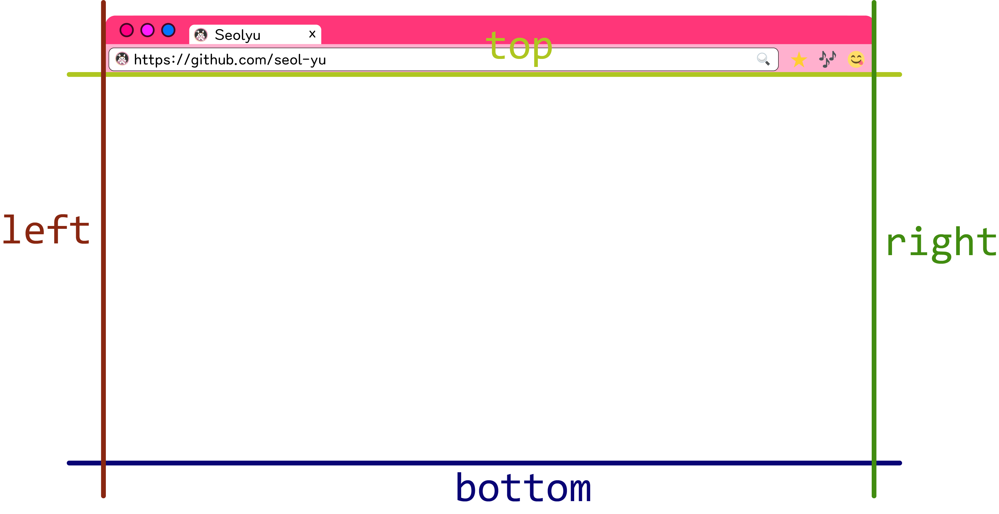

<p align="center">
    <a href="https://github.com/seol-yu/TIL/tree/master/HTML_CSS/HTML_CSS/CSS">
    </a>
    <a href="https://github.com/seol-yu/TIL/tree/master/HTML_CSS/HTML_CSS/CSS">
    </a>
</p>


### 목차

[Position](#Position)

[static](#static)

[relative](#relative)

[absolute](#absolute)

[fixed](#fixed)

[sticky](#sticky)

[위치시키기](#위치시키기)

[z-index](#z-index)

<br />

---

<br />

### Position

<br />

요소를 원하는 위치에 자유롭게 이동시키기 위해 사용하는 속성

1. `static`
2. `relative`
3. `absolute`
4. `fixed`
5. `sticky`

<br />

Type -> 기준점

<br />

[목차로](#목차)

<br />

---

<br />

#### static

모든 요소의 기본 position 값

<br />

<br />

#### relative

이동의 기준점은 자기 자신이 본래 있던 자리

float처럼 붕 뜸. but, layout 붕괴나 주변 요소 영향 걱정 없음

원래 위치는 기억

형제, 부모도 `position: relative;` 한 애 원래 위치 기억

<br />

[목차로](#목차)

<br />

---

<br />

#### absolute

float을 사용했을 때와 비슷한 일들이

* display가 block으로 바뀐다
* but, 길막을 못한다
* 부모, 다른 자식들이 `position: absolute;` 된 애 못 찾음
* float되면 인라인은 걜 볼 수 있었으나 `position: absolute;`의 경우는 인라인이 못 봄 

<br />

float은 부모에 종속되어있었으나 

absolute는 자신을 감싸고 있는 여러 조상 중 자기가 기준을 삼고 싶은 요소 선택할 수 있음

선택 기준은 position이 static이 아닌 요소

즉, `position: relative | absolute | fixed | sticky;` 인 조상. 보통은 기준점에게 `position: relative;` 를 줌

<br />

[목차로](#목차)

<br />

---

<br />

#### fixed

absolute와 거의 동일한 현상 일어나지만

차이는 fixed는 자신의 기준점이 `*viewport*` 기준

viewport <- 브라우저 창 전체 크기

<br />

[목차로](#목차)

<br />

---

<br />

### 위치시키기

<br />



top / bottom 중 하나

left / right 중 하나

쓴다

```css
.위치시키기 {
    bottom: 40px;
    right: 120px;
}
```

<br />

[목차로](#목차)

<br />

---

<br />

### z-index

<br />

`z-index: 1;`

z축으로 다른 요소 가릴 때 씀

정수

<br />

<br />

img 태그는 display가 Inline인데 width, height이 먹었다

왜냐면 파일 자체 사이즈가 있어서

`display: block;` 으로 바꾸긴해라

<br />

```css
/* 부모에 가상요소 클리어 픽스 */
.user-card::after {
    content: '';
    display: block;
    clear: left;
}

.user-photo,
.user-name {
    float: left;
}
```

<br />

위치시킬 때 position

뷰포트 기준으로 하고 싶으면 `fixed`

완전히 떼서 다른 위치로 `absolute` <- 기준이 될 부모는 `relative` 주고

원래 위치 유지하면서 옮기려면 `relative` 

<br />

`transform: translateY(-50%);`

transform은 기준이 자기 자신. height 값 반만큼 위로 올라가기

<br />

모달 화면 중앙에

```css
.modal {
    position: fixed;
    top: 50%;
    left: 50%;
    transform: translate(-50%, -50%);
```

<br />

[코드 참고](./실습/04Position_01Position1/style.css)

[코드 참고](./실습/04Position_02Position2/style.css)

[코드 참고](./실습/04Position_03Position/style.css)

[코드 참고](./실습/04Position_04Position/style.css)

[코드 참고](./실습/04Position_05Position/style.css)

<br />

[목차로](#목차)

<br />