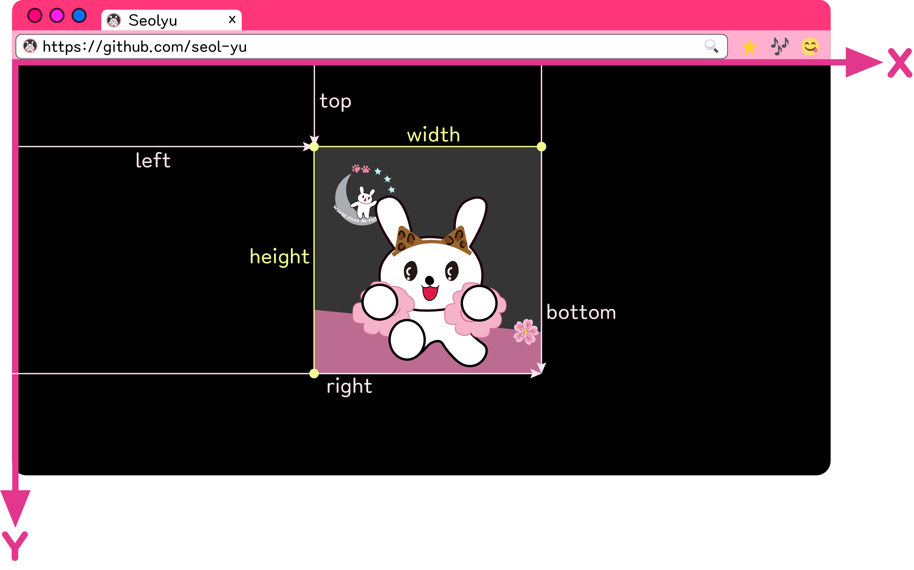
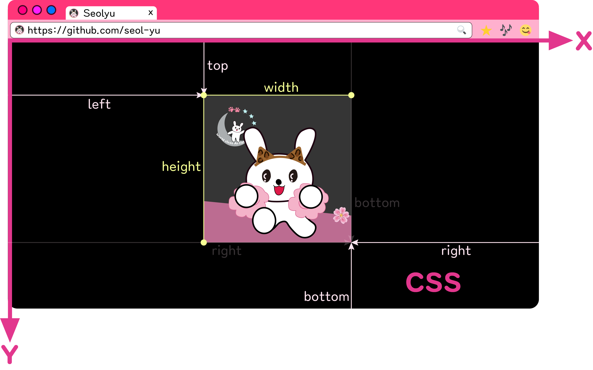

<br />
<a href="https://github.com/seol-yu/TIL/tree/master/JavaScript/101" target="_blank"></a>
<br />

### 목차

[Web APIs 이해](#목차)

[Web APIs란?](#WEB_APIs)

[Browser 구조 분석](#Browser_구조_분석)

[Window 사이즈 표기](#Window_사이즈_표기)

[브라우저 좌표](#브라우저_좌표)

<br/>

---

<br/>

### WEB_APIs

APIs : Application Programming Interfaces

브라우저에 대해 완벽히 이해
브라우저 자체 제공 API가 많다<br />
ex) DOM APIs, Network APIs, Graphics APIs, Audio/Video APIs, Device APIs, File APIs, Storage APIs ..

<br />

Web APIs Security

사용자의 권한 요청이나, HTTPs 를 요구할 수 있음

<br />

:sparkles: HTTP(Hypertext Transfer Protocol) <- 웹 클라이언트와 서버가 어떻게 통신하는지 통신 규약을 정해 놓은 것

클라이언트가 서버에게 정보를 요청하고 다시 서버에서 정보를 받아오는, request/response 방식으로 이루어짐

:sparkles: HTTPs(Hypertext Transfer Protocol Secure) <- 정보를 주고 받는 것들이 잘 감싸져서 보안 처리 잘 된 애

HTTP에서 패스워드 입력해서 서버에 보내면 아무런 encryption(보안처리)이 일어나지 않는데

HTTPs는 secure하게 encrypt 되어 '암호키' 이용해서 보안 처리 됨

<br />

**MDN Web API:**

https://developer.mozilla.org/en-US/docs/Learn/JavaScript/Client-side_web_APIs/Introduction

**Web API collection:**

https://developer.mozilla.org/en-US/docs/Web/API

**Security:**

https://www.thoughtco.com/what-javascript-cannot-do-2037666

<br />

[목차로](#목차)

<br />

---

<br />

### Browser_구조_분석

Window(전체적인 오브젝트) <- 브라우저 전체 창

Document <- 윈도우 안에 페이지가 표기되는 부분

Navigator <- 사용자 눈엔 안보이는 브라우저 관련 정보 담겨있는 오브젝트

<br />

window

* DOM <- document ...
* BOM <- navigator, location, fetch, storage ...
* JavaScript <- Array, Map, Date ...

<br />

`console.log(window)`  <- 윈도우 관련 다양한 함수, 오브젝트 확인

`console.log(this)`

Window는 글로벌 오브젝트라서

`console.log(innerWidth)` 는 `console.log(window.innerWidth)`와 동일

size, scroll, load 확인 때 많이 쓰임

<br />

Window 안에 navigator 오브젝트 <- 브라우저에 포함되어 있는 유용한 정보들 포함

<br />

**Document**

https://developer.mozilla.org/en-US/docs/Web/API/Document

**Window**

https://developer.mozilla.org/en-US/docs/Web/API/Window

**Viewport**

https://developer.mozilla.org/en-US/docs/Glossary/layout_viewport

**Navigator**

https://developer.mozilla.org/en-US/docs/Web/API/Navigator

<br />

[목차로](#목차)

<br />

---

<br />

### Window_사이즈_표기

```
window.screen <- 모니터 사이즈
------------------------------------
아래는 브라우저 사이즈 변경되면 업데이트
window.outer <- 브라우저 사이즈
window.inner <- 페이지가 표기되는 부분 전체(스크롤바 포함)
documentElement.clientWidth <- 스크롤바 제외한 순수 document문서 자체
```

<br />

[목차로](#목차)

<br />

---

<br />

### 브라우저_좌표

coordinates(좌표)

왼쪽 최상위가 (0, 0)

<br />

`Element.getBoundingClientRect()`  <- 요소가 브라우저 위에서 즉 window 위에서 얼마나 멀리 떨어져 있는지, 크기 얼마인지 등

left <- x축

top <- y축

bottom <- 브라우저 제일 위에서 요소 밑까지. 

right <- 왼쪽에서 제일 끝까지

cf) CSS 에서는 포지션을 absolute나 relative로 지정하게 되면 top과 left / right(브라우저 제일 오른쪽으로부터 떨어진 거리)과 bottom(브라우저 제일 밑에서 떨어진 거리) 이용





<br />

### Client x,y  vs  Page x,y

Client x, y  <- 브라우저 window에서 좌표값에 해당

Page x, y  <- 문서의 제일 시작점부터 x, y 계산

<br />

윈도우 스크롤링 APIs

<br />

Window load

<br />

[목차로](#목차)

<br />

