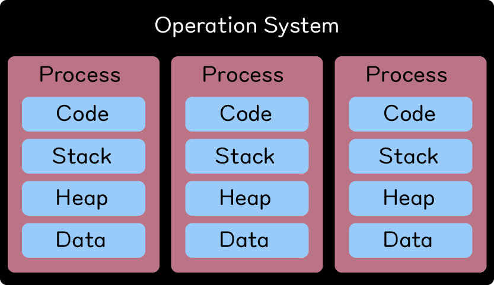
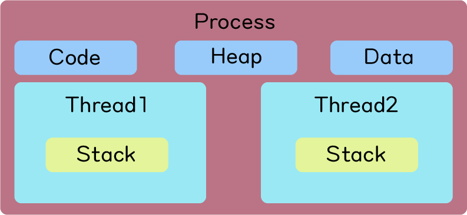
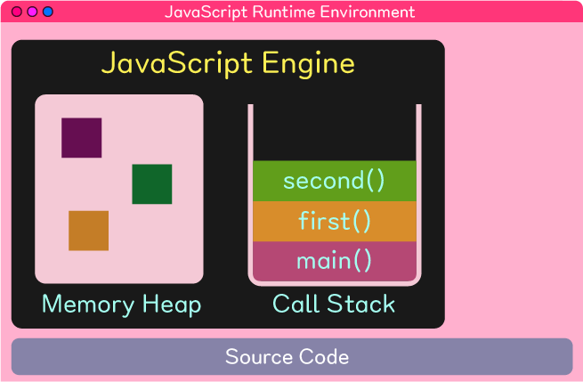
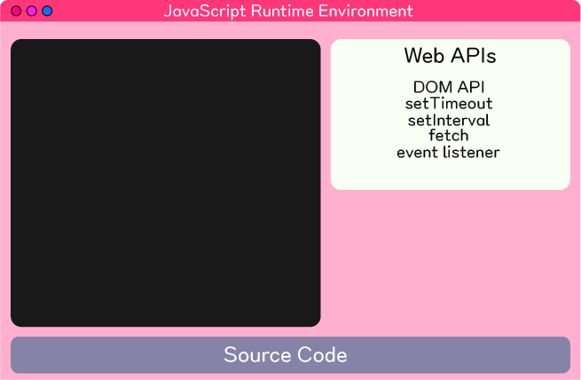
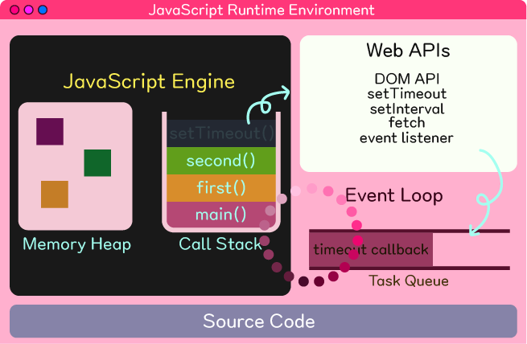
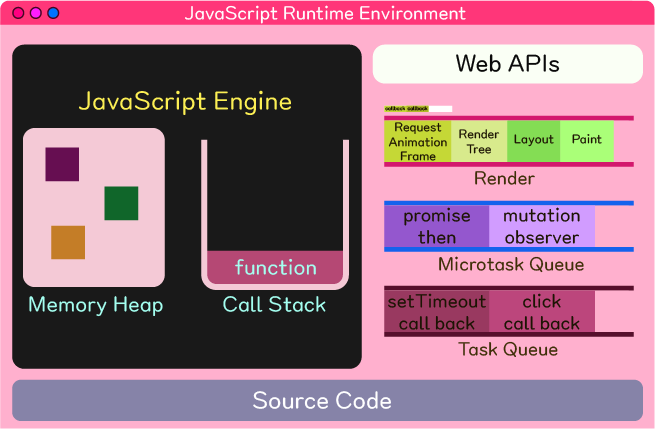

<br />
<a href="https://github.com/seol-yu/TIL/tree/master/JavaScript/101" target="_blank"></a>
<br />

### 목차

[프로세스와 쓰레드의 차이](#프로세스_쓰레드)

[자바스크립트 런타임 환경](#엔진_스택)

[브라우저 런타임 환경 이해](#브라우저_런타임_환경_큐)

[전반적인 큰 그림](#큰_그림)

[setTimeout](#setTimeout)

[Promise](#Promise)

[RAF](#RAF)

<br />

---

<br />

### 프로세스_쓰레드

<br />



* Process 프로세스 

  컴퓨터 위, 즉 운영체제 위에서 연속적으로 실행되고 있는 프로그램

  프로그램은 각각의 프로세스를 가지고 있다

  프로세스는 메모리 위에서 독립적으로 실행된다

  각각의 프로세스는 저마다 리소스 자원들이 정해져 있다

  즉 프로세스마다 할당된 메모리나 데이터들이 지정되어져 있다

  프로세스 안에는 프로그램을 위해서 작성된 코드와 

  그 프로세스 안에서 함수들이 어떤 순서로 실행되어야 하는지 이 함수가 끝나면 어디로 다시 돌아가야 하는지에 대한 정보 저장한 스택이 있고 

  힙은 오브젝트를 생성하거나 데이터를 만들 때 그 데이터들이 저장되는 공간

  힙에는 동적으로 할당된 변수들이 저장되고, 데이터에는 전역 변수나 스태틱 변수들이 할당

  => 각각의 프로세스는 코드, 동작하고 있는 순서를 기억하는 스택, 데이터들이 들어있는 힙과 데이터들이 들어가있다

<br />



* Thread 쓰레드

  쓰레드는 한 프로세스 안에서 여러 개가 동작할 수 있다

  쓰레드는 각각 저마다 해야 되는 업무를 배정 받는다(일꾼)

  저마다 필요한 일들을 수행하게 되고 함수의 호출을 기억해야해서 쓰레드마다 스택이 할당되어져 있다

  프로세스 안에서 동작하는 쓰레드들은 결국 한 프로그램을 위해 일해야해서 프로세스에 지정된 코드와 데이터 힙들을 공통적으로 접근해서 공통적으로 업데이트가 가능

  프로세스는 동시다발적으로 발생 가능해서 프로세스가 좀 더 효율적으로 일할 수 있도록 함

  => 쓰레드는 일 흐름을 기억할 수 있는 고유의 스택이 지정됨, 데이터나 코드나 힙 같은 공통적인 데이터 리소스는 프로세스에 있으므로 쓰레드들은 이 프로세스에 공통적으로 할당된 리소스에 동시 다발적으로 접속해서 동시다발적으로 업데이트 해야해서 서로 공유하면서 사용

<br />

프로세스는 프로그래밍을 동작하는 최고의 단위

쓰레드는 프로그램 안에서 동시에 여러 개가 수행될 수 있는 작은 일꾼 단위

<br />

[목차로](#목차)

<br />

---

<br />

### 엔진_스택

<br />

멀티쓰레딩: 한 프로세스 안에서 여러 가지 쓰레드가 동시다발적으로 일어나는 것

멀티쓰레드를 가지고 있으면 동시적으로 일 수행 가능해서 효율적으로 프로그래밍 동작 가능

<br />

자바는 언어 자체에서 멀티쓰레딩 지원됨

하지만 자바스크립트는 single threaded language

자바스크립트 언어 자체에는 멀티쓰레딩 할 수 있는 방법 없지만 이 자바스크립트가 동작하고 있는 브라우저 위에는 즉 브라우저라는 프로그램 안에서는 여러 가지의 쓰레드가 들어있다

그래서 브라우저 즉 웹 APIs들을 이용하게 되면 멀티쓰레딩 가능

<br />

자바스크립트가 동작하는 런타임 환경에서는 다양한 방식을 이용해서 멀티쓰레딩같은 효과 얻을 수 있다

또 이벤트 루프를 이용해서 더 다양한 동작 실행할 수 있다

<br />

웹 어플리케이션이 브라우저 위에 올라가는 순간 자바스크립트 엔진이 소스 코드를 한 줄씩 해석하고 분석, 실행하는데



메모리 힙과 콜 스택으로 나눠져 있다

메모리 힙은 데이터를 만들 때, 즉 변수를 선언해서 오브젝트를 할당하거나 문자열/숫자를 할당하게 되면 그 데이터들은 전부 다 메모리 힙에 저장된다

그리고 메모리 힙은 구조적으로 정리된 자료구조가 아니라 자료들이 여기저기에 아무곳에서나 저장되어져 있다

<br />

콜 스택은 함수를 실행하는 순서에 따라 차곡차곡 쌓아놓음

cf) 스택 <- LIFO (Last In First Out)

보통 스택에는 push와 pop peek 같은 API들이 있다

<br />

콜 스택은 함수들이 호출하는 순서를 기억했다가 함수가 끝나면 원래 있던 자리로 돌아가기 위해 쓰이는 자료구조 중 하나

모든 프로세스와 쓰레드 안에는 각각 저마다의 콜 스택이 들어가 있다

일을 수행할 때 어디서 왔고 어디로 다시 가야 되는지 정보를 기억해야 하므로

<br />

프로세스마다 또는 스택마다 지정된 콜 스택 사이즈가 있다

재귀 함수 쓸 때 유의

<br />

[목차로](#목차)

<br />

---

<br />

### 브라우저_런타임_환경_큐

<br />

자바스크립트 런타임 환경에서는 자바스크립트만으로 할 수 있는 것이 너무 한정적



but 웹 APIs(브라우저에서 제공하는 API)

브라우저의 멀티쓰레딩을 이용해서 더 다양한 일들 동시에 실행 가능

<br />

ex) fetch <- 백엔드 데이터 받아오기

setTimeout <- 일정 기간의 시간이 지난 후 등록한 콜백 함수 실행

<br />

웹 APIs 와 자바스크립트 엔진이 어떤 식으로 대화하고 서로 협력하면서 일들을 수행하는지 보면,

cf) Queue 큐 <- FIFO (First In First Out)



second() 함수 안에서 setTimeout()을 호출한다면 

setTimeout()을 호출하는 순간 setTimeout()은 콜 스택에서 지워지고 웹 API는 타이머를 시작한다

타이머와 자바스크립트 엔진은 병렬적으로 실행되다가 지정된 시간 끝나면 웹 APIs 는 태스트 큐에 콜백 자체(setTimeout 호출할 때 등록한 콜백)를 넣는다

<br /> 콜 스택과 태스크 큐를 관찰하는 이벤트 루프가 있는데

콜 스택이 비워질 때까지 기다리다가 비워져서 자바스크립트 엔진이 더 이상 일을 하고 있지 않을 때 이벤트 루프가 태스크 큐에 있는 콜백을 콜 스택에 데려와서 자바스크립트 엔진이 이를 실행하게 된다

<br />

태스크 큐에 있는 애는 콜 스택이 비워져있을 때 한번에 하나만 가져오게 된다

<br />

콜 스택에서 지금 수행 중인 아이는 끝날 때까지 보장됨

즉 중간에 다른 태스크나 다른 일들 할 수 없고 수행 중인 코드 블럭 끝날 때까지 이벤트 루프가 기다렸다가 다음에 다른 밑에 있는 콜 스택이 수행되거나 태스트 큐에 있는 애가 실행됨

<br />

[목차로](#목차)

<br />

---

<br />

### 큰_그림

<br />



태스크 큐 외에도 다양한 것들이 있다

1. 마이크로 태스크 큐 <- 프로미스에 등록된 콜백
2. 렌더 시퀀스
3. 테스트 큐 <- 우리가 흔하게 등록한 콜백 함수들이 들어옴

<br />

태스크 큐는 웹 APIs에서 등록한 콜백 함수를 특정한 이벤트(지정된 이벤트)가 발생했을 때 넣는 것

마이크로 태스크 큐 Microtask queue는 프로미스에 등록된 콜백(프로미스가 다 수행이 되고 나면 그 다음에 등록한 then에 등록한 콜백 함수), mutation observer 라는 웹 API 중 한 가지에 등록된 콜백이 들어옴

렌더는, 주기적으로 브라우저에서 요소들을 움직이거나 애니메이션할 때 주기적으로 브라우저를 업데이트 해줘야하는데 그 때 주기적으로 화면 업데이트 해주는 거

cf) DOM 요소 변형된 것이 브라우저에 표기되기 위해선 렌더 트리가 만들어져야하고 레이아웃 크기와 위치들이 계산 된 후 paint와 composite 과정을 통해 브라우저에 표기된다

Request Animation Frame 이라는 API를 부르면 그 때 등록한 콜백은 이 리퀘스트 애니메이션 큐에 차곡 차곡 쌓인다

<br />

이벤트 루프는 평소에 빙글빙글 돌다가 콜 스택에 수행 중인 함수가 있다면 그게 끝날 때까지 기다리다가 끝나면 다시 빙글빙글 돈다

브라우저는 1초당 60개의 프레임을 보여줘야 하는데(60 fps) 그러기 위해 16.7 밀리세컨드 동안 업데이트가 일어나야 된다

이벤트 루프는 엄청나게 빠른 속도로 돌고 있기 때문에 한바퀴 도는데 1ms도 걸리지 않음

보통 16.7ms 범위 안에서 렌더를 한번 업데이트 해주고 다른 일 하다가 다시 렌더 트리 업데이트 했다가 이런 식으로 운영

마이크로 태스크 큐에 아이템들 발견하면 하나씩 콜 스택으로 가져가고, 마이크로 태스크 큐가 빌 때까지 계속 콜 스택으로 가져와서 수행한다

다른 아이템들이 계속 들어오면 그것들도 계속 처리하면서 이벤트 루프가 계속 머문다

마이크로 태스크 큐가 비게 되면 이벤트 루프는 다시 돌면서 태스크 큐 넘어가고 태스크 큐의 경우 마이크로 태스크 큐와 달리 아이템 하나만 콜 스택으로 보내 놓고 콜 스택에 있는 콜백 함수 다 끝나고 나면 다시 순회

브라우저 업데이트할 때가 되면 렌더 시퀀스 들어와서 먼저 리퀘스트 애니메이션 프레임을 통해 등록된 콜백 함수들 하나하나 실행 후 렌더 트리로 와서 렌더 트리 만들고 그 트리를 이용해서 레이아웃 계산하고 페인트 통해서 브라우저 업데이트 한 후 다시 순회

<br />

[목차로](#목차)

<br />

---

<br />

```javascript
const button = document.querySelector('button');
button.addEventListener('click', () => {
    const element = document.createElement('h1');
    document.body.appendChild(element);
    element.style.color = 'red';
    element.innerText = 'hello';
})
```

콜백 안에 작성된 코드는 어떤 순서를 하든 상관이 없다

왜냐하면

이 콜백이 콜백 스택에 들어가는 순간 이벤트 루프는 이것이 다 실행될 때까지 기다렸다가 

나중에 렌더링이 될 때 전체적으로 적용된 아이들이 레이아웃 페인트에 걸쳐서 브라우저에 표기되기 때문이다

<br />

웹 API 중 하나인 addClickListener라는 함수를 이용해서 작성한 콜백 함수를 등록해 놓았다

나중에 클릭 이벤트가 발생하면 웹 API는 등록한 콜백 함수를 테스트 큐에 보낸다

이벤트 루프가 돌다가 태스트 큐에 아이템이 있는 것을 보고 콜 스택으로 가져오고, 

콜 스택에 가져온 콜백 함수가 끝날 때까지 기다렸다가 (바디에 엘리먼트 등록하고 스타일 컬러 바꾸고 innerText 수정) 

콜 스택에서 아이템이 사라지면 이벤트 루프는 이 수정된 사항들을 다 적용해서 렌더링 순서로 가게 된다

그래서 렌더 트리 만들 때 쯤엔 모든 것들이 다 적용된 상태

<br />

결론:

콜백 안에 작성된 코드는 어떤 순서를 하든 상관이 없다

자바스크립트 엔진이 콜백에 들어 있는 코드 블럭이 다 완료될 때까지 기다렸다가 나중에 렌더링이 발생하니까

<br />

[목차로](#목차)

<br />

---

<br />

```javascript
const button = document.querySelector('button');
const box = document.querySelector('.box');
button.addEventListener('click', () => {
    box.style.transition = 'transform 1s ease-in';
    box.style.transform = 'translateX(800px)';
    box.style.transform = 'translateX(500px)';
});
```

위 코드는 왜 의도대로 안될까?

결국 렌더링 발생할 땐 최종적으로 트랜스폼에 할당된 애가 적용되므로

브라우저에는 업데이트 사항 보여지지 않고(이벤트 루프가 Call Stack에 있으므로)

콜백 끝나고 나서야 렌더링 발생

<br />

[목차로](#목차)

<br />

---

<br />

콜 스택에 코드가 수행되고 있을 동안에는 절대로 렌더링으로 올 수 없다

```javascript
const button = document.querySelector('button');
button.addEventListener('click', () => {
    while (true) {
        // repeat
    }
});
```

콜백 함수가 무한정 실행되면

버튼 클릭한 후 아무 변화가 없다

콜 스택이 영원히 끝나지 않아서

브라우저는 더 이상 클릭을 해도 반응이 없다

에러 발생 <- Page Unresponsive. 렉 걸림

<br />

결론: 콜 스택에 등록하는 함수 작성할 땐 오랫동안 일 하는 것 좋지 않다

브라우저 업데이트 안되고 사용자의 이벤트 처리가 안되므로 최대한 콜백은 간단하게 작성

루프나 while, for loop, 재귀 함수 쓸 때 조심해서 사용

<br />

[목차로](#목차)

<br />

---

<br />

### setTimeout

<br />

태스크 큐와 마이크로 태스크 큐의 차이점

<br />

```javascript
function handleClick() {
    console.log('handleClick');
    setTimeout(() => {
        console.log('setTimeout');
        handleClick();
    }, 0);
}
const button = document.querySelector('button');
button.addEventListener('click', () => {
    handleClick();
});
```

위 코드를 보면

무한정 큐 태스크에 콜백 함수가 계속 들어옴

근데 브라우저는 이벤트 처리가 가능하다

<br />

이벤트 루프는 태스크 큐에서는 하나씩만 콜 스택으로 가져온다

콜 스택 끝나면 다시 순회하면서 가끔씩 렌더 쪽 가서 브라우저 렌더링 처리, 이벤트 처리도 하고

다시 태스크 큐에 아이템 있으면 콜 스택 가져오고 ..

<br />

[목차로](#목차)

<br />

---

<br />

### Promise

<br />

마이크로 태스크는 큐 태스크와 달리 큐 안에 있는 모든 아이들이 없어질 때까지, 

그리고 거기에 머물러 있는 동안 새로 들어오는 아이들도 다 함께 처리를 계속적으로 하게 된다

```javascript
function handleClick() {
    console.log('handleClick');
    Promise.resolve(0)
    	.then(() => {
        	console.log('then');
        	handleClick();
    	});
}
const button = document.querySelector('button');
button.addEventListener('click', () => {
    handleClick();
});
```

handleClick()에서는 프로미스를 만들게 되는데, 

이 프로미스는 만들어지면서 resolve 라는 API를 이용하면 바로 0 이라는 값을 리턴하는 프로미스가 만들어진다

프로미스가 만들어져서 프로미스가 정상적으로 0을 만들게 되면 등록된 콜백이 수행된다

콜백에서는 또 다시 then이라고 출력을 하고 handleClick() 을 다시 호출하게 된다

..무한정 반복

<br />

setTimeout은 큐 태스크를 이용하게 되고

프로미스의 콜백은 마이크로 태스크 큐를 이용한다

<br />

그래서

버튼 클릭하면

그 상태로 브라우저가 멈춘다

로그가 무한정 출력되면서 브라우저는 전혀 반응하지 않음

<br />

[목차로](#목차)

<br />

---

<br />

### RAF

<br />

리퀘스트 애니메이션 프레임이라는 API는 등록한 콜백 함수가 나중에 브라우저에서 다음 렌더링이 발생하기 전에 수행되는 것을 보장해준다

```javascript
const button = document.querySelector('button');
button.addEventListener('click', () => {
    requestAnimationFrame(() => {
        document.body.style.backgroundColor = 'beige';
    });
    requestAnimationFrame(() => {
        document.body.style.backgroundColor = 'orange';
    });
    requestAnimationFrame(() => {
        document.body.style.backgroundColor = 'red';
    });
    setTimeout(() => {}, 0);  // 원하는 콜백 등록해 놓고 0 밀리세컨드 있다가 무언가를 수행
});
```

버튼 클릭하면 빨간색으로 변함

<br />

각각의 콜백이 RAF에 등록된다

RAF 큐 안에 색상 변경하는 코드들이 호출 순서대로 들어감

클릭 리스너 콜백 끝나면 이벤트 루프가 순회를 하고 렌더링 순서 진입하게 되면

RAF 큐 안에 있는 콜백들을 순서대로 실행해서 최종적으로 마지막 코드 실행하고 그 후 렌더 트리 들어가고 레이아웃 만들어지고 페인트 이뤄진다

<br />

```javascript
setTimeout(() => {
    //
}, 0);  // 원하는 콜백 등록해 놓고 0 밀리세컨드 있다가 무언가를 수행.
```

위 코드는 지금 수행되고 있는 즉 콜 스택 안에서 이 코드 블럭이 실행되는 이 순간 말고

이게 끝나면 이벤트 루프가 한 바퀴 돌 때 그 다음에 이 코드 블럭을 실행해 달라고 말하고 싶을 떄 많이 쓴다

무언가를 변경하고 나서 다음 차례 때 다음 이벤트 루프가 동작할 떄 실행해달라고 할 때 씀

<br />

(웹 APIs에게 0밀리세컨드 있다가(지금 당장) 이 콜백을 태스크 큐에 넣어라)

웹 APIs는 0밀리세컨드 후 태스크 큐에 아이템 등록한다

그리고 이 콜 스택이 다 끝난 후 비어지게 되면 setTimeout 콜백을 다시 가지고 와서 수행한다

즉 모든 코드가 수행된 후 다음 턴 때 setTimeout에 있는 코드 블럭이 수행됨

<br />

정리하자면,

자바스크립트 엔진에는 힙과 콜 스택이 있다

콜 스택은 함수가 실행되는 과정을 기억하기 위해 쓰이는 자료구조

자바스크립트가 동작하는 런타임 환경에서는 태스크 큐와 마이크로 태스크 큐를 이용해서 asynchronous 비동기적인 처리를 하게 되는데 태스크 큐는 한 번에 하나씩만 가지고 오고 마이크로 태스크 큐는 들어 있는 모든 아이템들이 다 수행될 때까지 가지고 오고(콜 스택에), 렌더는 이벤트 루프가 주기적으로 매번은 아니지만 브라우저에게 UI 업데이트 하기 위해

리퀘스트 애니메이션 프레임 콜백 큐는 업데이트가 일어나기 전에 한번 쭉 순회하면서 코드가 실행

<br />

[목차로](#목차)

<br />
