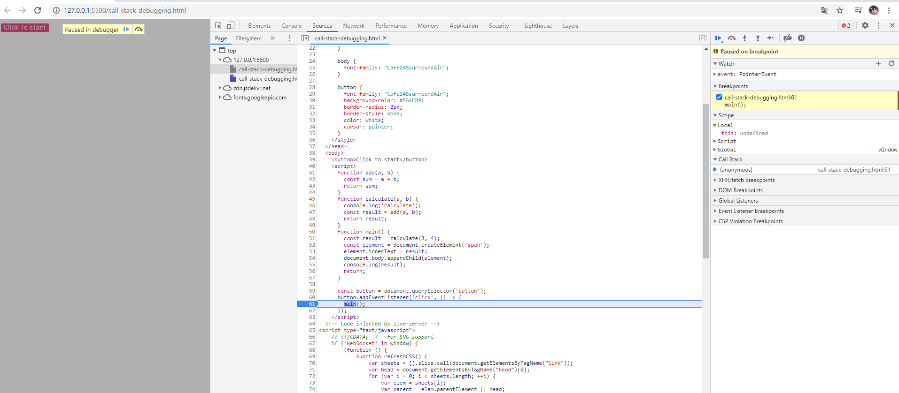
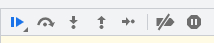

 

 

브레이크 포인트 넣으면 브라우저가 실행하다가 해당 코드를 만나는 순간 잠시 멈춘다

Watch <- 확인하고 싶은 변수 작성하게 되면 원하는 값 확인

Call Stack <- 함수가 어떤 순서대로 호출되어졌는지

Scope <- 로컬은 블럭 안에 있는 스코프 표시, 글로벌은 밖에서 선언된 것들

 

* 브레이크 포인트들 사이 점프할 때
* 한 줄 한 줄씩 어떻게 실행되는지 확인할 때
* 함수 안으로 들어갈 때(setTimeout, Promise 콜백 같은 것들 호출할 때 걔네들이 호출 될 때까지 기다렸다가 그 안으로 들어가는)
* 지금 있는 함수에서 밖으로 나갈 때
* 한줄씩(비동기 콜백에서 그냥 무시하고 넘어감)
* 모든 브레이크 포인트를 다 disable 시키고 싶을 때(한번에 브레이크 포인트 끄거나 켤 때)
* 켜 놓으면 에러가 발생할 때 바로 디버깅 모드로 전환이 되어서 어디에서 문제가 발생했는지 확인 가능

