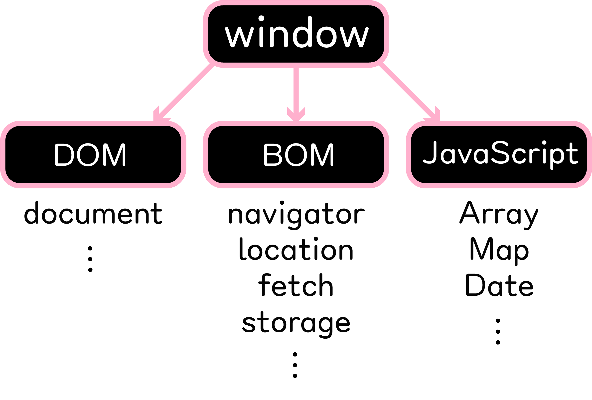
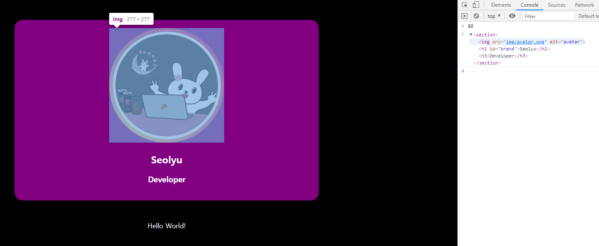
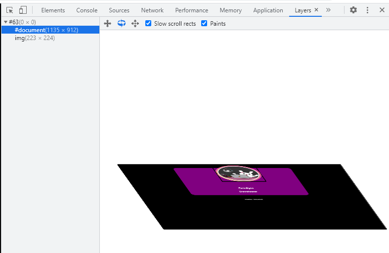
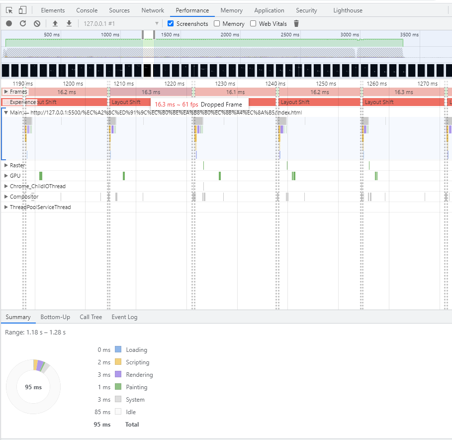
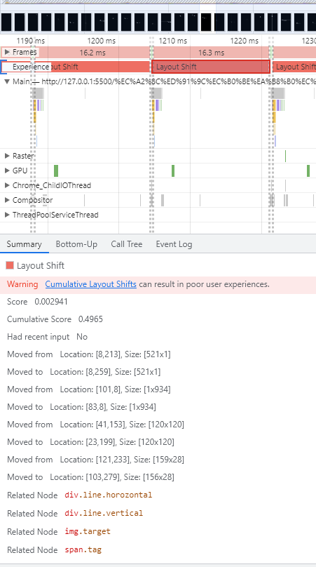
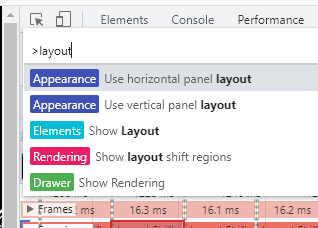
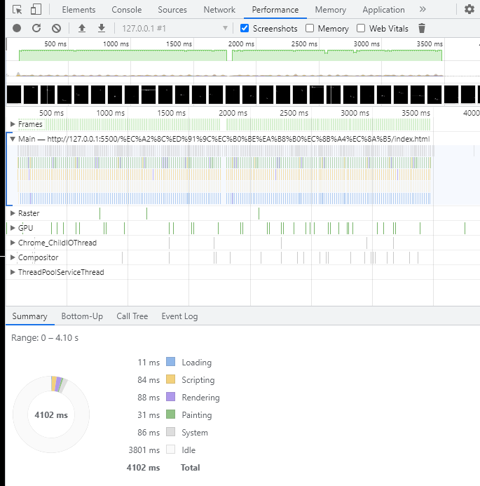
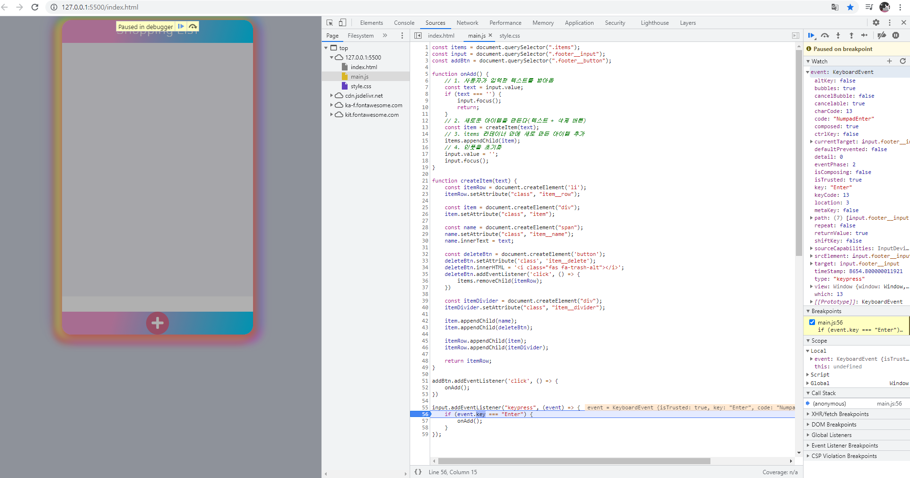

### 목차

[DOM 큰 그림](#DOM)

[Target Event](#Target_Event)

[웹 페이지 요소 분석](#WebPage_Elements)

[CSSOM](#CSSOM)

[성능 보장 렌더링 순서](#Critical_rendering_path)

[브라우저가 어떻게 layers를 만들었는지 확인](#More_tools_Layers)

[CSS 속성값 확인](#CSS_속성값_확인)

[좌표 찾기 실습 리팩토링](#좌표찾기실습_리팩토링)

[성능 개선 증거(퍼포먼스 개발툴 활용)](#퍼포먼스_개발툴)

[DOM 조작하기](#DOM_조작하기)

[innerHTML vs element](#innerHTML_vs_element)

[쇼핑 목록앱 참고](#쇼핑_목록앱_참고)

[디버깅](#디버깅)

<br />

---

<br />

### DOM

<br />

**DOM**

https://developer.mozilla.org/en-US/docs/Web/API/Document_Object_Model/Introduction

**DOM API**

https://developer.mozilla.org/en-US/docs/Web/API/HTML_DOM_API

<br />

DOM (Document Object Model)

HTML파일을 브라우저에서 읽으면서

HTML Tag -> JavaScript Node

브라우저가 이해할 수 있는 자신들만의 오브젝트로 변환한다

<br />

Node라는 오브젝트는 EventTarget이라는 오브젝트를 상속한다

(Node 오브젝트는 EventTarget의 오브젝트)

즉 모든 Node는 이벤트가 발생할 수 있다

<br />

document도 Node를 상속하므로(document도 Node이기 때문에)

또 Node는 EventTarget이기 때문에 document에서도 이벤트가 발생할 수 있다

<br />

이미지나 HTML 요소들은 Element로 변환이 된다

그래서 Element도 Node이고 Node는 EventTarget이기 때문에 모든 요소에서 이벤트가 발생할 수 있다

<br />

텍스트도 마찬가지

Node의 종류는 굉장히 다양하다

<br />

Element 안에서도 굉장히 다양한 Element가 있는데 

HTML 요소라면 HTMLElement(<- HTMLInputElement, HTMLDivElement..)가 되고 

SVG 요소라면 SVGElement

이런 각각의 타입별로 Element가 존재하게 된다

<br />

브라우저가 웹 페이지 즉 HTML 파일을 읽어서 DOM 트리로 변환

Document Object Model의 트리로 변환해서

브라우저가 이해할 수 있도록 자신들만의 오브젝트 나무로 만들어나감

<br />

html(HTMLHtmlElement) <- head(HTMLHeadElement) <- meta(HTMLMetaElement), meta(HTMLMetaElement), title(HTMLTitleElement), link(HTMLLinkElement)

이런 식으로 HTML 태그에는 그에 상응하는 DOM 트리 요소가 있다

<br />

글로벌 오브젝트에는 window가 들어있고

window에는 document라는 것이 들어있다

Document Object Model 안에는 페이지별로 각각 정의한 요소들로 구성



<br />

[목차로](#목차)

<br />

---

<br />

### Target_Event

<br />

**Node**

https://developer.mozilla.org/en-US/docs/Web/API/Node

**Event Target**

https://developer.mozilla.org/en-US/docs/Web/API/EventTarget

<br />

Dom Node라는 인터페이스는 우리가 DOM API를 쓰는데 필수적인 인터페이스다

<br />

모든 Node는 EventTarget이라고도 말할 수 있는데

EventTarget에는 총 세 가지 Methods가 있다

`EventTarget.addEventListener()`

`EventTarget.removeEventListener()`

`EventTarget.dispatchEvent()`

<br />

[목차로](#목차)

<br />

---

<br />

### WebPage_Elements

<br />

Elements 검사 해보면

$0

이런게 나오는데

console에서 $0 해보면 'Use $0 in the console' 콘솔에서 사용해라



<br />

`$0`

`$0.childNodes`

`$0.nextSibling`

`$0.parentNode`

<br />

[목차로](#목차)

<br />

---

<br />

### CSSOM

<br />

**CSSOM**

https://developer.mozilla.org/en-US/docs/Web/API/CSS_Object_Model

<br />

CSSOM (CSS Object Model의 약자)

<br />

CSS Style은 브라우저가 어떻게 이해할까?

브라우저에서 Document Object Model을 만들게 되면 

우리가 정의한 CSS를 병합해서 CSSOM이라는 것을 만든다

<br />

브라우저가 html 파일을 Document Object Model로 만들었다면

html 파일 안에 들어있는 스타일 즉 임베디드된 스타일 또는 CSS 파일에 정의한 CSS나 html 태그에 정의한 스타일 요소들이나 이런 스타일이 따로 지정이 되어 있지 않아도 브라우저상에서 기본적으로 가지고 있는 스타일이 있는데 이런 모든 스타일에 관련된 정보들을 합해서, 즉 DOM과 CSS의 요소를 병합해서 CSSOM이라는 트리를 다시 만든다

<br />

CSSOM <- 브라우저에서 기본적으로 설정된 모든 속성값들도 포함. 즉 cascading 룰에 따라서 합해진 이런 모든 CSS 값들이 정의되어 있다. 이것을 computed styles라고 부르는데 모든 것들이 다 이미 계산된 스타일을 말함

DOM + CSSOM = Render Tree

<br />

ex) span에 opacity가 0, visibility가 hidden으로 설정이 되어 있다면

사용자 눈에는 보이지 않지만, 사실 요소는 거기에 있고 Render 트리에 포함이 된다

하지만

display: none으로 되어 있다면

Render 트리에 포함이 되지 않는다

<br />

[목차로](#목차)

<br />

---

<br />

### Critical_rendering_path

<br />

### Critical rendering path 성능 보장 렌더링 순서

브라우저에 url을 입력하면

HTML request/response -> loading -> scripting(DOM, CSSOM으로 변환) -> rendering(렌더링 트리 만들기) -> layout -> painting

<br />

Construction : DOM + CSSOM + RenderTree

Operation : layout, paint, composition

<br />

RenderTree(DOM 요소뿐만 아니라 최종적으로 계산된 CSS 스타일 포함) 정보를 기반으로 layout 구상

이후 paint 과정 일어나는데 다양한 속성값에 따라 브라우저 엔진마다 성능 개선을 위해 레이어를 만든다(포토샵 레이어 기능 생각)

<br />

CSS will-change 속성값(불필요하게 너무 많이 쓰지X): 브라우저에게 이 요소는 변화될지도 모른다고 말함으로 브라우저가 새로운 레이어에다가 추가해놓음

<br />

rendering tree를 만들 때 어떻게 하면 빠르게 만들 수 있을까?

DOM 요소가 작으면 작을수록, 

CSS 규칙이 작으면 작을수록 tree가 작아지기 때문에 빠르게 만들 수 있음

불필요한 태그 사용X, div 태그 남용X, wrapping 클래스나 wrapping 요소 쓸데없이 만들기X

최대한 요소들을 작게 만들기

<br />

Operation time에는 

performant user interactions 

avoid jank 

ensure reflows & repaints at 60 f/s

paint가 자주 일어나지 않도록 만들기

<br />

자바스크립트나 CSS로 DOM 요소를 조작할 때 

composition만 다시 일어나면 best, 

layout 다시 일어나게 하면 최악

<br />

[목차로](#목차)

<br />

---

<br />

### More_tools_Layers

<br />

개발 툴 열어보면 ... 옵션 More tools - Layers

<br />

그냥

```css
img {
    z-index: 100;
}
```

하면 레이어에 아무 변화 없지만

```css
img {
    z-index: 100;
    will-change: opacity;
}
```

이렇게 will-change 속성값을 주면(opacity가 변경될 수 있다)

이미지를 다른 레이어에 표기



<br />

[목차로](#목차)

<br />

---

<br />

### CSS_속성값_확인

<br />

http://csstriggers.com/

내가 쓰는 CSS 속성값이 좋은지 안좋은지 확인

애니메이션 transition 이용할 때 어떤 속성값, CSS쓰냐에 따라

layout이 발생할 수 있고 또는 paint만 발생할 수도 있고

더 좋게 composition만 발생할 수도 있다

<br />

Blink <- 크롬 브라우저에서 쓰임

<br />

ex) 애니메이션은 top, left(layout, paint, composite까지 발생) 말고 translate 이용하는 것이 좋다

<br />

[목차로](#목차)

<br />

---

<br />

### 좌표찾기실습_리팩토링

<br />

좌표 찾기 실습 리팩토링

cf) 간혹 targetRect 확인해봤을 때 width, height이 0으로 나올 때가 있는데

target에 getBoundingClientRect 함수 호출시 target 이미지가 준비안되어있을 가능성.

(아직 다운로드X, 브라우저 위에 올라오지 않은)

자바스크립트를 HTML에서 defer 옵션 이용해서 썼는데

defer는 document content가 load 되기 전 호출이 되고

모든 이미지와 리소스가 다 준비가 된 상태는 'load' 상태

이때 쯤 getBoundingClientRect을 호출해야 정확한 크기 받을 수 있다


<br />

[목차로](#목차)

<br />

---

<br />

### 퍼포먼스_개발툴

<br />

개발툴 - Performance - Screenshots 체크

Record 누르고 측정하고 싶은 동작 하기 Stop

<br />

빨간색은 경고



사용자가 부드럽고 완만한 경험하려면 1초당 60개 프레임이 화면에 계속 계속 보여줘야 함

한 프레임이 보여질 때 16.67밀리세컨드 동안 이루어져야 됨

무언가를 처리해서 화면에 업데이트 되는 게 16ms 넘어가는 순간 사용자가 화면 이상하다고 느낌

Layout Shift 클릭하면 밑에 자세히 설명 나옴



윈도우는 Ctrl + Shift + p

맥은 command shift p 누르면 개발툴 팔레트 이용 가능

layout 검색하면 Show layout shift regions 메뉴 클릭하면 layout이 어떻게 발생하고 있는지 나옴



<br />

리팩토링한 것은



Command Palette 이용해서 Show layout shift regions 해보면 layout 표기 안되는 것 확인

translate을 이용했으므로(top, left 아닌) layout 발생하지 않음

<br />

[목차로](#목차)

<br />

---

<br />

### DOM_조작하기

<br />

querySelector는 처음에 찾아진 Element를 리턴. 만약 찾지 못하면 null을 리턴

cf) `const image = document.querySelector('img[src="img/avatar.png"]')`  // 골라서

`const image = document.querySelectorAll('img')`  // 문서 안에 있는 img 태그 모두 가지고오기

<br />

새로운 것을 추가할 때는 document에 있는 createElement API 이용

```javascript
const section = document.querySelector('section');
const h2 = document.createElement('h2');
h2.setAttribute('class', 'title');  // <h2 class="title"></h2>
h2.textContent = 'This is a title';  // <h2 class="title">This is a title</h2>
```

<br />

https://developer.mozilla.org/en-US/docs/Web/API/Element/append

이전 호환성 위해 appendChild

<br />

`section.appendChild(h2);`

appendChild API 쓰면 결국 컨테이너 안에서 제일 끝부분에 추가

<br />

https://developer.mozilla.org/en-US/docs/Web/API/Node/insertBefore

`insertBefore` 는 노드를 어떤 reference 노드 전에 추가해 줌

`parentNode.insertBefore(newNode, referenceNode)` <- 추가하고자 하는 parent 컨테이너 박스에 insertBefore를 호출한 다음 새로 추가하고자 하는 노드 그리고 참고할 노드 2개 전달하면 새로운 노드를 이 reference 노드 이전에 추가해준다

<br />

[목차로](#목차)

<br />

---

<br />

### innerHTML_vs_element

<br />

Element의 레퍼런스 즉 Element의 변수를 가지고 있으면서 조금 더 많은 동작을 해야하면 `createElement`을 이용해서 만들어 쓰고

한번 업데이트한 후 다시 변경할 일 없으면 `innerHTML`을 이용해서 동적으로 추가

<br />

[목차로](#목차)

<br />

---

<br />

### 쇼핑_목록앱_참고

<br />

**FontAwesome**

https://fontawesome.com/

https://www.youtube.com/watch?v=X91jsJyZofw&feature=youtu.be&t=340

<br />

[목차로](#목차)

<br />

---

<br />

**CSS Gradient**

https://cssgradient.io/

**Box Shadow CSS Generator**

https://html-css-js.com/css/generator/box-shadow/ 

<br />

컬러 휠로 여러가지 색깔 조합

https://color.adobe.com/ko/create/color-wheel

<br />

[목차로](#목차)

<br />

---

<br />

### 디버깅

<br />

개발툴 - Sources

Breakpoints

Watch <- + 누르고 event



브레이크 포인트 없애고

다시 재개한 후 끄기

<br />

주석의 경우 이 함수는 무엇인지 어떤 의도로 만들어졌는지 어떻게 사용하는 것이 바람직한지 왜 사용해야 되는지 등등 '왜' 의도를 설명할 수 있어야 한다

코드를 그대로 설명하는 주석은 필요 없음

<br />

[목차로](#목차)

<br />