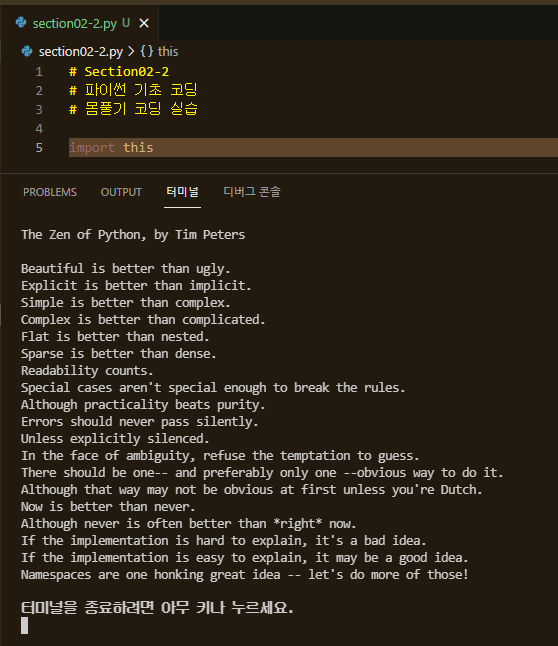

<br />

 <a href="https://github.com/seol-yu/TIL/tree/master/Python/Python_Basic_To_Advanced" target="_blank"></a>

<br />

### 목차

[환경셋팅](#환경셋팅)

[개발 환경 설정](#개발_환경_설정)

[Print 함수](#Print)

[코딩해보기](#코딩해보기)

[가상환경 설정 및 패키지 설치](#가상환경_설정_패키지_설치)

[자료형 - 데이터타입, 숫자형, 연산자](#자료형1)

[자료형 - 문자열 및 연산자](#자료형2)

[자료형 - 리스트와 튜플](#자료형3)

[자료형 - 딕셔너리와 집합](#자료형4)

[자료형 - 데이터 타입 퀴즈 풀이](#자료형5)

[흐름 제어 - 조건문](#조건문)

[흐름 제어 - 반복문](#반복문)

[함수 - 함수와 람다](#함수_람다)

[클래스 - self, 클래스 변수, 인스턴스 변수](#클래스1)

[클래스 - 상속, 다중상속](#클래스2)

[모듈, 패키지](#모듈_패키지)

[파일 - 파일 읽기 및 쓰기](#파일)

[예외 - 에러 및 예외처리](#에러_예외_처리)

[외부 파일 - Excel, CSV 읽기 쓰기](#외부_파일)

[DB - SQLite 연동, 테이블 생성, 데이터 삽입](#DB1)

[DB - 테이블 조회, 조건 조회](#DB2)

[DB - 테이블 수정, 삭제](#DB3)

[프로젝트 - 타이핑 게임 제작](#타이핑_게임)

[코딩 알고리즘 환경 세팅](#알고리즘_셋팅)

<br />

---

<br />

### 환경셋팅

<br />

https://www.python.org/downloads/

Downloads - All releases

Windows가서 64버전 다운로드

(Windows x86-64 executable installer)

Add Python 3.9 to Path 클릭 - Install now(설치 후 재부팅 필요)

명령 프롬프트에서 `python` 해보면 뭔가 나옴

나올 땐 `exit()`

<br />

code.visualstudio.com 가서 Download for Windows 클릭해서 다운받기

2. code로 열기 작업을 Windows 탐색기 파일의 상황에 맞는 메뉴에 추가

3. code로 열기 작업을 Windows 탐색기 디렉터리의 상황에 맞는 메뉴에 추가

추가로 체크

명령 프롬프트에서 `code` 엔터해보면 VSCode 실행됨

<br />

VSCode 익스텐션 python 설치(설치 후 VSCode 껐다 켜기)

<br />

main.py 만들기

왼쪽 아래에 보면 어떤 Python Interpreter 사용할지 설정 가능

Ctrl + Shift + P => Python:Select Interpreter

<br />

print('hello world')

Run - Run without Debugging

<br />

<br />

가상환경 설치해보자

window - cmd

작업 중인 파일(폴더) 상위 폴더에서

cf ) `dir`  디렉토리 목록

`python -m venv python_basic(폴더명)`

들어가보면 `cd python_basic`

include, Lib, Scripts 폴더 생성됨

`cd Scripts`

`activate.bat`

이렇게 하면

(python_basic) 이렇게 되는데

python_basic 가상환경 안에서 동작한다는 뜻

`pip install simplejson`

이 가상환경에서 설치된 것

`pip list`

WARNING 없애려면

`python -m pip install --upgrade pip`

가상환경 설치 끝

<br />

main.py 에서

`import simplejson as json` 써보면 노란줄 뜨는데(난 안뜨지만)

왼쪽 밑에 interpreter 선택하는거 버튼 누르고

Enter interpreter path.. 눌러서

Find..

Scripts 안에 있는 python.exe 선택(혼자 검은색인거)

<br />

Ctrl + Shift + P 키 누르고

build 입력하면

Tasks: Configure Default Build Task

Create tasks.json file from template

아무거나 클릭클릭 Others 클릭

하면 tasks.json 나오는데

```json
{
    // See https://go.microsoft.com/fwlink/?LinkId=733558
    // for the documentation about the tasks.json format
    "version": "2.0.0",
    "tasks": [
        {
            "label": "Project Label",
            "type": "shell",
            "command": "python",
            "args": [
                "${file}"
            ],
            "presentation": {
                "reveal": "always",
                "panel": "new"
            },
            "options": {
                "env": {
                    "PYTHONIOENCODING": "UTF-8"
                }
            },
            "group": {
                "kind": "build",
                "isDefault": true
            }
        }
    ]
}
```

위 코드로 하고 저장

<br />

tasks.json은 .vscode 폴더(이게 python_basic 폴더 안에 있어야하는 것 같아서(밖에 생겨버림) 안에 넣음) 내부에 들어오게 됨..

다음 강의 들어보니까 안에 넣는 것이 아닌 것 같고 task.json에 "command": "python", 으로 하니까 실행됨

settings.json

```json
{
    "python.pythonPath": "Scripts\\python.exe"
}
```

<br />

"Scripts\\python.exe" <- 이 부분을 tasks.json command 에 붙여넣기

"command": "Scripts\\python.exe",

main.py 에서 Ctrl + Shift + B 실행(난 안됨)

<br />

file - Preferences - settings

env 검색 후 Python 클릭

Python > Terminal: Activate Environment 클릭해제 (Ctrl + Shift + B 실행 input 입력 정상적으로 받기 위해)

<br />

[목차로](#목차)

<br />

---

<br />

### 개발_환경_설정

<br />

프레임워크, 오픈소스 활용

<br />

파이썬 장점

* 문법 간결

* 다양한 운영체제 지원

* GUI(마우스로 아이콘 클릭해서 프로그램 실행시킬 수 있는 환경) Application 개발(PyQT)

* 방대한 라이브러리 지원(프레임워크, 오픈소스 - 이미 잘 만들어진 라이브러리 깃허브에서 찾아서 설치해서 즉시 이용)

* 범용 언어(네트워크, 웹, 데이터분석, 기계학습 등)

<br />

공부 방법

* 반드시 직접 코딩 실습
* 어려우면 패스하고 숙련도 쌓이면 해결
* 복습 코딩 및 응용 실습
* 천천히 확실하게 학습

<br />

VSCode 언어 변경(영어로 쓰는게 좋음)

익스텐션(View - Extensions)에서 korean

컨트롤 쉬프트 P - Configure Display Language

강의상에서는 locale.json 이 생성되는데 "locale":"en" 여기 en 말고 ko로 바꾸고 재실행하는데

나는 Configure Display Language 누르자마자 재실행 메세지 나와서 바로 됨

<br />

File - Preferences - Keyboard Shortcuts 단축키 찾기

<br />

[목차로](#목차)

<br />

---

<br />

### Print

<br />

- 가장 기본적인 Output(출력) 함수
- 기본 출력
- Separator, End 옵션 사용
- Format 형식 출력
- Escape Code 사용법

<br />

[section02-1.py 참고](https://github.com/seol-yu/TIL/blob/master/Python/Python_Basic_To_Advanced/Python/python_basic/section02-1.py)

<br />

[목차로](#목차)

<br />

---

<br />

### 코딩해보기

<br />

파이썬 구성요소 기초

- 인코딩(입/출력)
- 변수
- 조건문
- 함수, 클래스, 인스턴스(객체)
- 정보 출력

<br />




Python3 버전에서는 입출력 기본이 utf-8

<br />

[section02-2.py 참고](https://github.com/seol-yu/TIL/blob/master/Python/Python_Basic_To_Advanced/Python/python_basic/section02-2.py)

<br />

[목차로](#목차)

<br />

---

<br />

### 가상환경_설정_패키지_설치

<br />

| 프로젝트 A | 프로젝트 B        | 프로젝트 C |
| ---------- | ----------------- | ---------- |
| Python 3.5 | Python 2.x        | Python 3.6 |
| Django     | Numpy, Tensorflow | PyQT5      |
| Web        | Data Analysis     | GUI APP    |

환경 변수 잘 관리했다면 상관없으나

한 운영체제에 이것저것 버전 다르게 설치하면 어플리케이션 충돌, 호환 문제 생기고 포맷해야하고 그러한데

가상환경 상에서 작업을 하면

별개의 가상환경 통해 효율적으로 여러 프로젝트 관리할 수 있다

<br />

파이썬 가상환경 명령어

* 가상환경 생성

  명령 프롬프트가서

  `cd` 명령어로 기존에 가상환경 만든 폴더 python_basic의 상위 폴더  가서 만들어본다

  `python -m venv 절대경로써도되고가상환경폴더이름`

  `python -m venv python_basic`

  가상환경 실행시켜주면 필요한 것 마음대로 설치, 테스트할 수 있다

* 가상환경 실행/해제 -> (윈도우: Script, 맥: Bin)폴더

  `cd 가상환경폴더`

  `dir`

  `cd Scripts`

  `activate.bat`  <- 가상환경 활성화

  `deactivate.bat`  <- 가상환경 빠져나오기

* 패키지 검색, 설치, 업그레이드 및 삭제

  `pip search simplejson` <- simplejson 있는지 검색(명령어 에러남)

  `pip search simple*`

  `pip install simplejson`

  `pip install --upgrade simplejson`

  `pip uninstall simplejson` <- simplejson 삭제

  `pip show simplejson` <- simplejson 에 대하여 보여주기

* 패키지 리스트 출력

  `pip list`

<br />

[section03.py 참고](https://github.com/seol-yu/TIL/blob/master/Python/Python_Basic_To_Advanced/Python/python_basic/section03.py)

<br />

[목차로](#목차)

<br />

---

<br />

### 자료형1

<br />

파이썬 데이터 타입 종류

- Boolean
- Numbers
- String
- Bytes
- Lists
- Tuples
- Sets
- Dictionaries

<br />

cmd

가상환경 폴더 들어가서

```
cd Scripts
activate
code
```

<br />

파이썬 숫자형 및 연산자

```
+ : 더하기
- : 빼기
* : 곱하기
/ : 나누기
// : 나누기(몫)
% : 나누기(나머지)
** : 지수(제곱)
단항 연산자
```

<br />

[section04-1.py 참고](https://github.com/seol-yu/TIL/blob/master/Python/Python_Basic_To_Advanced/Python/python_basic/section04-1.py)

<br />

[목차로](#목차)

<br />

---

<br />

### 자료형2

<br />

문자열 및 연산자

<br />

문자형 관련 연산자

- 문자열 생성, 길이
- 이스케이프 문자
- 문자열 연산
- 문자열 형 변환
- 문자열 함수
- 문자열 슬라이싱:sparkles:

<br />

[section04-2.py 참고](https://github.com/seol-yu/TIL/blob/master/Python/Python_Basic_To_Advanced/Python/python_basic/section04-2.py)

<br />

[목차로](#목차)

<br />

---

<br />

### 자료형3

<br />

파이썬 자료구조(List, Tuple)

- 리스트 특징
- 튜플 특징
- 인덱싱
- 슬라이싱
- 삽입, 삭제, 함수 사용

<br />

[section04-3.py 참고](https://github.com/seol-yu/TIL/blob/master/Python/Python_Basic_To_Advanced/Python/python_basic/section04-3.py)

<br />

[목차로](#목차)

<br />

---

<br />

### 자료형4

<br />

파이썬 자료구조(Dictionary, Set) <- JSON파일에 쓰임

- 딕셔너리 특징
- 딕셔너리 추가
- 집합 특징
- 집합 자료형 함수
- 자료형 변환

<br />

[section04-4.py 참고](https://github.com/seol-yu/TIL/blob/master/Python/Python_Basic_To_Advanced/Python/python_basic/section04-4.py)

<br />

[목차로](#목차)

<br />

---

<br />

### 자료형5

<br />

모르는 함수 검색

print 함수로 결과 출력

<br />

[section04-5.py 참고](https://github.com/seol-yu/TIL/blob/master/Python/Python_Basic_To_Advanced/Python/python_basic/section04-5.py)

<br />

[목차로](#목차)

<br />

---

<br />

### 조건문

<br />

IF(조건문)

- 조건문 기본 형식
- 관계 연산자 실습(>, >=, <, <=, ==, !=)
- 논리 연산자 실습(and, or, not)
- 다중 조건문(if elif, else)
- 중첩 조건문

<br />

[section05-1.py 참고](https://github.com/seol-yu/TIL/blob/master/Python/Python_Basic_To_Advanced/Python/python_basic/section05-1.py)

<br />

[목차로](#목차)

<br />

---

<br />

### 반복문

<br />

For, while

- 파이썬 코딩의 핵심
- 시퀀스 타입 반복
- Continue, Break
- For - else 구문
- 자료구조 변환

<br />

[section05-2.py 참고](https://github.com/seol-yu/TIL/blob/master/Python/Python_Basic_To_Advanced/Python/python_basic/section05-2.py)

<br />

퀴즈

[section05-3.py 참고](https://github.com/seol-yu/TIL/blob/master/Python/Python_Basic_To_Advanced/Python/python_basic/section05-3.py)

<br />

[목차로](#목차)

<br />

---

<br />

### 함수_람다

<br />

함수 및 람다(lambda) 사용

- 함수 선언
- 함수 다양한 사용
- 다양한 반환 값
- *args, **kwargs
- 람다 함수

<br />

[section06.py 참고](https://github.com/seol-yu/TIL/blob/master/Python/Python_Basic_To_Advanced/Python/python_basic/section06.py)

<br />

[목차로](#목차)

<br />

---

<br />

### 클래스1

<br />

클래스 - Self, 클래스 변수, 인스턴스 변수

클래스 선언 및 Self 의 이해

- 클래스 선언
- 클래스 네임스페이스 Self
- 클래스, 인스턴스 변수
- Self

<br />

[section07-1.py 참고](https://github.com/seol-yu/TIL/blob/master/Python/Python_Basic_To_Advanced/Python/python_basic/section07-1.py)

<br />

[목차로](#목차)

<br />

---

<br />

### 클래스2

<br />

클래스 상속, 다중 상속

- 클래스 상속
- 클래스 다중 상속

<br />

상속을 통해 코딩 -> 코드 재사용, 중복 코드 최소화 -> 코드의 생산성, 유지보수성, 가독성 좋아짐 

<br />

[section07-2.py 참고](https://github.com/seol-yu/TIL/blob/master/Python/Python_Basic_To_Advanced/Python/python_basic/section07-2.py)

<br />

[목차로](#목차)

<br />

---

<br />

### 모듈_패키지

<br />

모듈, 패키지

- 패키지 설정
- 모듈 사용 및 Alias 설정
- 패키지 사용 장점

<br />

파일(독립적 기능 제공 - 논리적으로 코드 묶어놓은 것) 하나 하나 단위를 모듈로 볼 수 있고

그 파일들을 가지고 있는 폴더를 패키지 형태로 볼 수 있다

즉,

모듈들을 디렉토리 구조로 구조적으로 관리하는 것을 패키지

<br />

목적에 맞는 것들을 잘 모아서 폴더에 넣어놔야 나중에 수정, 성능 개선 쉽다

<br />

[section08.py 참고](https://github.com/seol-yu/TIL/blob/master/Python/Python_Basic_To_Advanced/Python/python_basic/section08.py)

<br />

[목차로](#목차)

<br />

---

<br />

### 파일

<br />

파일 읽기, 파일 쓰기

파일 Read, Write

- Open 함수
- 파일 모드의 이해
- 파일 읽기 실습
- 파일 쓰기 실습

<br />

[section09.py 참고](https://github.com/seol-yu/TIL/blob/master/Python/Python_Basic_To_Advanced/Python/python_basic/section09.py)

<br />

[목차로](#목차)

<br />

---

<br />

### 에러_예외_처리

<br />

다양한 Exceptions

- 파이썬 예외 종류
- 문법적 에러 발생 실습
- 런타임 에러 발생 실습
- Try-except-else-finally

<br />

[section10.py 참고](https://github.com/seol-yu/TIL/blob/master/Python/Python_Basic_To_Advanced/Python/python_basic/section10.py)

<br />

[목차로](#목차)

<br />

---

<br />

### 외부_파일

<br />

Excel, CSV 읽기 쓰기

Excel, CSV 처리

- CSV 읽기
- CSV 쓰기
- XSL, XLSX 읽기
- 패키지 설치

<br />

[section11.py 참고](https://github.com/seol-yu/TIL/blob/master/Python/Python_Basic_To_Advanced/Python/python_basic/section11.py)

<br />

[목차로](#목차)

<br />

---

<br />

### DB1

<br />

파이썬 데이터베이스 연동

<br />

SQLite 연동, 테이블 생성, 데이터 삽입

<br />

데이터베이스 및 테이블 생성

- SQLite 기본 사용법
- 테이블 생성
- 데이터 삽입
- 기본 SQL 사용 예제

데이터베이스 생성 등은 에러나면 명령 프롬프트 우클 관리자 권한으로 실행

<br />

DB 생성 등은 명령 프롬프트 우클 관리자 권한으로 실행(에러난다면)

<br />

[section12-1.py 참고](https://github.com/seol-yu/TIL/blob/master/Python/Python_Basic_To_Advanced/Python/python_basic/section12-1.py)

<br />

[목차로](#목차)

<br />

---

<br />

### DB2

<br />

파이썬 데이터베이스 연동

테이블 조회, 조건 조회

<br />

다양한 테이블 조회

- SQLite 기본 사용법
- Selete
- Where
- Tuple, Dictionary Mapping

<br />

[section12-2.py 참고](https://github.com/seol-yu/TIL/blob/master/Python/Python_Basic_To_Advanced/Python/python_basic/section12-2.py)

<br />

[목차로](#목차)

<br />

---

<br />

### DB3

<br />

테이블 수정, 삭제

- UPDATE
- DELETE
- DB 사용 권장 이유

<br />

[section12-3.py 참고](https://github.com/seol-yu/TIL/blob/master/Python/Python_Basic_To_Advanced/Python/python_basic/section12-3.py)

<br />

[목차로](#목차)

<br />

---

<br />

### 타이핑_게임

<br />

타이핑 게임 제작, 기본 완성

- 단어 리스트 로드
- 총 게임 시간 측정
- 정답 개수 체크

<br />

[section13-1.py 참고](https://github.com/seol-yu/TIL/blob/master/Python/Python_Basic_To_Advanced/Python/python_basic/section13-1.py)

<br />

타이핑 게임 제작, 효과음 적용, DB 연동

타이핑 게임 최종 완성

- 기록 결과 DB 저장
- 효과음 적용
- 최종 테스트

<br />

[section13-2.py 참고](https://github.com/seol-yu/TIL/blob/master/Python/Python_Basic_To_Advanced/Python/python_basic/section13-2.py)

<br />

[목차로](#목차)

<br />

---

<br />

### 알고리즘_셋팅

<br />


<br />

[목차로](#목차)

<br />