<br />
<a href="https://github.com/seol-yu/TIL/tree/master/React">
  
</a>
<br />

### 목차

[리액트 전반적인 개념 정리 클래스와 함수 컴포넌트](#클래스_vs_함수_컴포넌트)

[템플릿 프로젝트 만들기](#템플릿_프로젝트_만들기)

[프로젝트 만들기 react-dom](#react-dom)

[App 컴포넌트 시작 디버깅 툴 소개](#디버깅_툴)

[JSX 정리 HTML과 차이점](#JSX)

[Habit 컴포넌트 만들기](#Habit_컴포넌트)

[State 이해하기](#State)

[Props](#Props)

[Habits 컴포넌트 만들기 State up, list key](#Habits_컴포넌트)

[이벤트 처리](#이벤트_처리)

[App 컴포넌트 만들어보기](#App_컴포넌트_만들어보기)

[Navbar 컴포넌트 만들기](#Navbar_컴포넌트)

[Add Form 만들기 Refs 이용](#Add_Form)

[Reset 처리](#Reset_처리)

[PureComponent 정리와 차이점 이해(성능 분석)](#PureComponent_성능_분석)

[PureComponent 활용](#PureComponent_활용)

[Lifecycle 함수들 이해](#Lifecycle_함수들)

[function 컴포넌트](#function_컴포넌트)

[React Hook](#React_Hook)

[자바스크립트 오브젝트 가변성](#Spread_Operator)

[리액트 컴포넌트 종류와 훅](#리액트_컴포넌트_훅)

[왜 State 오브젝트를 수정하면 안되나](#State_오브젝트)

<br />

---

<br />

### 클래스_vs_함수_컴포넌트

<br />

리액트는 컴포넌트들

<br />

* 클래스 컴포넌트

  ```react
  import React from 'react';
  
  class LikeButton extends Component {
      state = {
          numberOfLikes: 0,
      };
  	render() {
          return <button>
              {this.state.numberOfLikes}
          </button>
      }
  }
  
  export default LikeButton;
  ```

  리액트에서 제공하는 컴포넌트라는 클래스를 extends 상속해서 만들 수 있다

  컴포넌트가 스테이트가 있고 그 상태에 따라 컴포넌트가 주기적으로 업데이트 되어야하면 클래스 컴포넌트 씀

  <br />

  클래스(<- 관련 데이터 함수들이 묶여져 있는 것)에는 컴포넌트에서 가지고 있는 상태, 데이터를 담을 수 있는 스테이트라는 오브젝트가 들어 있다

  그래서 스테이트가 변경되면 렌더 함수가 호출 되면서 업데이트된 내용이 사용자에게 보여짐

  <br />

  lifecycle methods 라이프 사이클 메소드(컴포넌트가 사용자에게 보여질 때, 돔트리에 올라갔을/나왔을 때, 컴포넌트가 업데이트 되었을 때 등등 다양한 컴포넌트 상태에 따라 구현해 놓은 함수 알아서 불러주는)

<br />

* 함수(function) 컴포넌트

  ```react
  function App() {
      return <h1>Hello</h1>
  }
  ```

  간단하게 함수로 만들 수 있다

  컴포넌트에 상태가 없고 항상 정적으로 데이터가 표기될 경우 함수 컴포넌트 씀

  <br />

  스테이트, 라이프사이클 메소드 없음

  함수(<- 한 가지 기능을 수행하는 단위)

  <br />

  리액트 16.8 버전부터는 함수에서도 클래스에서 했던 것처럼(스테이트, 라이프사이클 메소드) 할 수 있는 리액트 훅 도입  <- 클래스가 어려우니까. 클래스는 멤버 변수 접근할 때 항상 this 붙임. 클래스에서 함수 이용하면 바인딩 이슈 있음.  functional programming

  <br />

  클래스 컴포넌트에는 라이프 사이클 메소드가 있다

  컴포넌트가 마운트/언마운트/업데이트 되었을 때 세부적으로 함수가 나뉘어져있어서 중복된 코드 작성해야 하는 경우가 있었지만 리액트 훅 이용하면 중복 줄일 수 있다

<br />

- React.Component
  - React.PureComponent
- function
  - memo(function) <- 함수형 컴포넌트. Higher Order Component(고차 컴포넌트)라고 부르기도 함.
  - React Hook

cf) JSK, State, Props, SyntheticEvents, refs, Lifecycle methods, Lists and keys, developer tools, techniques

<br />

[목차로](#목차)

<br />

---

<br />

### 템플릿_프로젝트_만들기

<br />

create react-app 툴 이용하면 필요 없는 것들도 기본적으로 많이 생기므로

필요한 템플릿 프로젝트를 만들어보자

<br />

`yarn create react-app template`

터미널 윈도우 두가지 준비

한쪽은 yarn 커맨드 / 다른 곳은 다른 커맨드

<br />

`cd template`

`yarn start`

다른 터미널에서는

`cd template`

`code .`

<br />

프로젝트 구조 보면

* public

  정적인 애들. 사용자가 한번에 받아서 컨텐츠가 변하지 않는 HTML, 이미지, 리소스 등

* src

  컨텐츠가 다이나믹하게 동적으로 변화되는 소스코드들

<br />

public과 src의 차이점은 웹팩에서 특히 중요한데

웹팩에서는 빌드할 때마다 자바스크립트의 유니크한 고유 버전(날짜, 시간..)이 할당됨

사용자가 웹 어플리케이션을 다운로드 받았고 자바스크립트가 변경되지 않았으면 

예전 그 고유 번호가 할당되어서 걔들은 캐쉬가 되어있어서 새로 다운로드 받지 않아도 됨

<br />

public에는 static(정적)한 애들

소스(src)에는 다이나믹한 애들이 들어감

<br />

public - index.html

apple-touch-icon 이거는 PWA(Progressive Web App)에 필요한 것으로 지워줌

manifest.json도 지움

코멘트들 지움

<br />

noscript는 사용자가 브라우저에서 자바스크립트를 enable(활성화)하지 않았을 때 보여주는 메세지

리액트는 자바스크립트만으 이용해서 동적으로 만드는 애라서 사용자가 자바스크립트 쓰지 않으면 어플리케이션이 돌아가지 않으므로 이렇게 경고문을 보여주는 것이다

놔둔다

<br />

manifest.json 파일 지우고

웹 크롤러가 쓰는 robots.txt 지우고 로고들도 지우자

<br />

src에서는 serviceWorker.js(백그라운드에서 프로세스 쓸 때, 오프라인 제공할 때, PWA 프로그레시브 웹앱에서 쓰임) 지움.. 난 reportWebVitals.js 를 지웠다

setupTests.js 도 지움

logo.svg랑 App.test.js 지움

App.js에서 logo.svg import하는 부분 지우고

index.js에서는 serviceWorker(난 reportWebVitals) import하는 부분 지운다

<br />

App.js에서 return 안에 다 지우고

`<h1>Hello :)</h1>`

<br />

소스(src) 안에 공통적으로 사용하는 컴포넌트를 폴더(components)를 만들어 따로 넣는다

파일 이름 소문자로 시작하도록 변경(app.css / app.jsx)

순수 자바스크립트 클래스, 파일과 구분하고 예쁜 아이콘 갖기 위해 App.js -> app.jsx 쓰기

<br />

index는 엄밀히 말하면 자바스크립트. 컴포넌트가 아님. 단순히 연결해주는 역할이니까 index.js 그대로

import 부분 변경

<br />

[목차로](#목차)

<br />

---

<br />

### react-dom

<br />

윈도우에서는 폴더에 공백없게 유의

<br />

Ctrl + C 프로세스 중지

폴더 밖에 나가서

`cp -R template habit-tracker`

그냥 복붙함(config gensync-utils parser transform node_modules core tools transformation ....대상 폴더에 대한 파일 이름이 너무 길다는 메세지가 뜸)

<br />

리액트 <- 순수 자바스크립트. 이 자바스크립트 이용해서 컴포넌트들을 만들어 나감

브라우저는 HTML, CSS, 순수 자바스크립트만을 이해 가능

바벨(Babel)을 이용해 순수 JS로 변환됨

변환된 컴포넌트를 HTML과 연결하는 작업을 하게 해주는 것이 react-dom

<br />

사용자에게 궁극적으로 배포되어지는 것 => index.html

index.html에 body에 div 아이디가 root

root 이용해서 자바스크립트와 연결

index.js 보면

react-dom 이라는 라이브러리에서 ReactDOM 클래스를 import

가져온 ReactDOM 이라는 클래스에 있는 render 함수 이용해서 document 페이지에 id가 root 라는 요소(index에 있는 아이디가 root인 div) 가지고와서 그 요소에 root 컴포넌트 연결

=> root 라는 아이디를 가진 요소에 제일 상위에 있는 App 이라는 컴포넌트를 연결하는 것이다(개발툴로 확인 가능)

<br />

App 이라는 것은

**app.jsx**에 function App() {} 여기에 정의된 컴포넌트

<br />

index.js에 <React.StrictMode></React.StrictMode>

StrictMode는 자바스크립트 쓸 때 'use strict' 이용해 엄격한 모드로 코딩하고

조금 잘못하면 콘솔에서 에러 메세지 발생했듯

React.StrictMode 모드 이용

개발할 때 이용하고 배포할 땐 이 상태로 배포해도 배포 버전에선 StrictMode 활성화 안되어서 사용자가 콘솔에서 에러메세지 볼 수 없다

<br />

플젝 복사 후, 나중에 프로젝트 하다가 컴파일 문제 생기는 등 뭔가 이상하면

`yarn && yarn start`

프로젝트에 필요한 모듈을 다시 재설치하고나서 플젝 시작

<br />

[목차로](#목차)

<br />

---

<br />

### 디버깅_툴

<br />

크롬 익스텐션 React developer tools - Components에서 

컴포넌트 구조

State(컴포넌트에서 가지고 있는 데이터)

Props(내 컴포넌트에서 가지고 있는 State가 아닌 부모로부터 받아온 데이터. properties(속성))

확인 가능

<br />

[목차로](#목차)

<br />

---

<br />

### JSX

<br />

JSX <- 엄밀히 말하면 자바스크립트 코드

https://reactjs.org/docs/introducing-jsx.html

https://reactjs.org/docs/jsx-in-depth.html

<br />

```react
function App() {
    return React.createElement('h1', {}, 'Hello:)!!');
}

위와 같이 쓰면 힘들어서
자바스크립트 코드 위에서 HTML처럼 할 수 있도록 JSX 만들어짐

function App() {
    const name = 'Seolyu';
    return <h1 className="title" onClick="">Hello {name}:)</h1>;
}
```

형제 노드 쓸 수 없고 JSX는 한 가지 태그로 감싸줘야해서 두 가지 자식 노드 이용할 땐

Fragment 이용해서 묶기(<- 이렇게 하면 요소 검사 했을 때 부모 태그 없음)

<></> 이것과 같음 <- 의미없이 그룹 묶어줄 때 사용

```react
function App() {
    const name = 'Seolyu';
    return (
        <React.Fragment>
            <h1 className="title" onClick="">Hello {name}:)</h1>
            <h1>Hello</h1>
            {
                // 자바스크립트 코드 작성 가능
                name && <h1>{name}</h1>
            }
        </React.Fragment>
    );
}
```

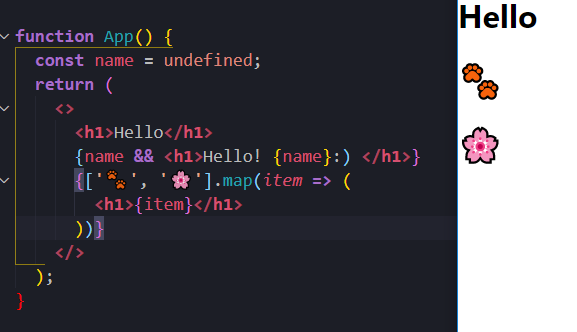

=> JSX는 HTML처럼 간편하게 마크업할 수 있고 비즈니스 로직 자바스크립트 코드와 함께 섞어서 사용 가능

<br />

[목차로](#목차)

<br />

---

<br />

### Habit_컴포넌트

<br />

Habit(습관) 이라는 컴포넌트 만들기

<br />

components 폴더 안에 habit.jsx 만들고

앞서 익스텐션 설치했다면 rcc 탭 하면 기본적인 컴포넌트 골격

<br />

클래스는 항상 대문자로 시작

```jsx
import React, { Component } from 'react';

class Habit extends Component {
    render() {
        return <div>Habit</div>;
    }
}

export default Habit;
```

<br />

app.jsx에 와서

```jsx
import React from 'react';
import './app.css';
import Habit from './components/habit';

function App() {
  return <Habit></Habit>;  // 이 경우 <Habit /> 으로 써도 됨
}

export default App;
```

<br />

폰트 어썸 쓰자

`yarn add @fortawesome/fontawesome-free`

index.js에

import '@fortawesome/fontawesome-free/js/all.js';

https://fontawesome.com/icons?d=gallery&p=2&q=plus

<br />

Ctrl + p 가고자하는 파일명

<br />

[목차로](#목차)

<br />

---

<br />

### State

<br />

컴포넌트에 실제로 필요한 데이터 count를 넣기 위해 State 이용

<br />

Habit 이라는 클래스 안에는 state라는 멤버변수가 있다

그 변수는 오브젝트다

오브젝트에는 count라는 데이터가 있다

<br />

그냥 오브젝트 안에 있는 데이터를 업데이트하면 리액트는 업데이트 여부를 모름

그래서 state 업데이트할 땐

리엑트에서 제공하는 setState 함수를 호출해야 한다

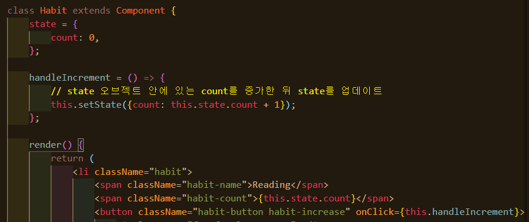

<br />

브라우저 Event, MDN: https://developer.mozilla.org/en-US/docs/Web/API/Event

리액트 Handling Events: https://reactjs.org/docs/handling-events.html

<br />

[목차로](#목차)

<br />

---

<br />

### Props

<br />

1. State

   컴포넌트 안에 컴포넌트 UI를 위한 데이터를 보관하는 state 오브젝트를 통해

   데이터에 업데이트가 발생하면 리액트가 자동적으로 render 함수 호출

2. Props

   컴포넌트 밖에서 주어지는 데이터

   컴포넌트 안에서 자체적으로 데이터를 정의해서 사용하는 State와 달리

   Props는 컴포넌트 외부에서 데이터를 제공받는다

   컴포넌트의 재사용성을 높이기 위해

   상황에 따라 주어진 데이터를 받아서 그 데이터에 맞게 UI를 보여주기 위해 사용됨

   <br />

   부모 컴포넌트에서 LikeButton 컴포넌트 사용할 때

   ```jsx
   <LikeButton title={'Like'} onClick={this.handleClick} />
   ```

   title, onClick 같은 애들을 인자로 전달해줄 때

   props 오브젝트에 묶여서 LikeButton 컴포넌트에 전달되어진다(LikeButton 컴포넌트 안에서 this.props로 할당되어짐. React Dev Tools에서 확인 가능)

   <br />

   LikeButton 안에서 this.props.title, this.props.onClick으로 각각 전달된 'Like'와 'this.handleClick' 함수에 접근 가능

<br />

[목차로](#목차)

<br />

---

<br />

### Habits_컴포넌트

<br />

Object destructuring 문법

https://developer.mozilla.org/en-US/docs/Web/JavaScript/Reference/Operators/Destructuring_assignment

<br />

여러 가지 습관을 관리할 수 있는 Habits(습관들) 컴포넌트를 만들자

<br />

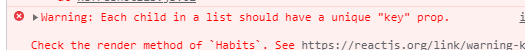

리액트에서는 자식 컴포넌트가 있으면 고유한 키를 가지고 있어야 한다

각각의 컴포넌트에 아이디를 부여 -> 성능 개선 위해 불필요한 렌더링 안함

=> 리스트 안에서 쓰이는 자식 컴포넌트에게 아이디 부여하기

key는 고유한 번호 써야하고 배열 인덱스 쓰면 절대 안된다

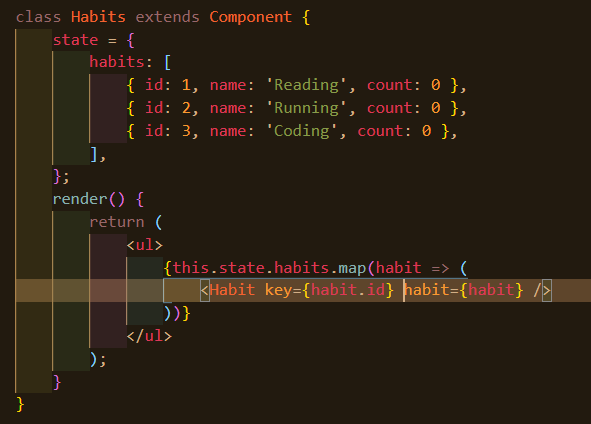

<br />

[목차로](#목차)

<br />

---

<br />

### 이벤트_처리

<br />

데이터를 가지고 있는 곳이 이 데이터를 어떻게 수정하면 되는지 잘 알고 있는 장소이므로 그곳에 처리를(로직들) 해준다(Habits)

<br />

함수는 오브젝트의 일종

함수의 이름을 인자로 전달해주면 함수를 가리키고 있는 참조값을 전달하는 것

<br />

Habits 컴포넌트 안에서

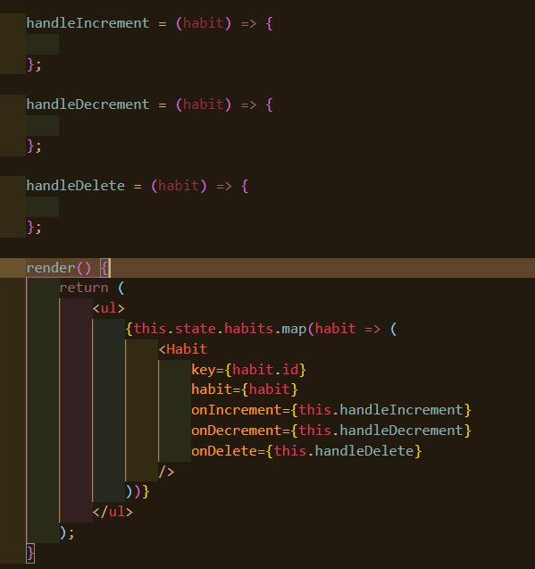

Habit 컴포넌트에게 + 버튼이 클릭되면 onIncrement라는 prop 이름으로 전달한 이 콜백 함수(handleIncrement)를 호출하고 - 버튼 클릭되면 onDecrement .. 호출하라고 전달

<br />

이제 Habit 컴포넌트에서는

props로 전달된 해당 콜백함수들을 호출해주면 됨

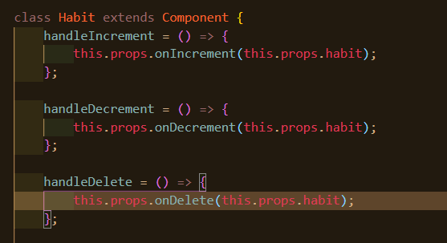

<br />

=> Habit 컴포넌트에 props로 데이터를 전달했다(각각의 habit과 Increment, Decrement, Delete 콜백함수들을)

그래서 버튼 누르면 전달된 함수를 호출하게 되는데

해당 컴포넌트에 들어있는 habit 이라는 오브젝트를 콜백함수 인자로 전달한다

그래서 해당 habit에 한해서 count 값 변경

<br />

결론적으로

Habits 컴포넌트에 모든 데이터가 들어있고 데이터를 처리하는 함수들도 있다

Habit 컴포넌트에는 단순히 props로 전달된 콜백함수들을 호출하게 되고 호출할 때 props로 전달받은 각각의 데이터를 다시 인자로 전달한다

<br />

함수 등록할 때 함수에 전달되는 인자와 그 안에서 호출하는 인자가 동일하면 문법 간소화 가능

```jsx
// 클릭이 발생할 때 둘 다 arrow 함수(콜백 함수)를 만들어서 전달한다
// arrow 함수 안에는 각각 logClickEvent, makeSomeMeal 필요한 함수들을 호출

onClick={ (event) => this.logClickEvent(event) }  // 함수에 전달되는 인자와 그 안에서 호출하는 인자가 동일하다. 문법 간소화 가능
onClick={ (event) => this.makeSomeMeal(this.rice) }  // 간소화 할 수 없다
```

```jsx
onClick={this.logClickEvent}
onClick={ (event) => this.makeSomeMeal(this.rice) }
```

<br />

<br />:sparkles: 리액트에서는 State를 직접 수정하면 안된다

<br />

**Spread Syntax**:

https://developer.mozilla.org/ko/docs/Web/JavaScript/Reference/Operators/Spread_syntax

<br />

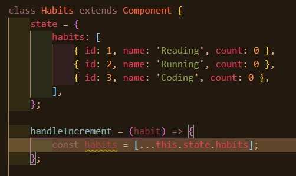

habits라는 배열 안에 있는 아이템들을 하나하나씩 새로운 배열 안으로 복사해오기

즉 배열의 껍데기는 새로운 껍데기이고

안에 들어있는 아이템들은 그대로 하나하나 복사해온다

... <- spread syntax

<br />

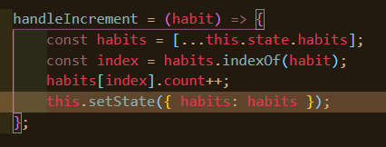

그리고 indexOf라는 배열의 API 이용해서 count 값 변경

this.state에 있는 오브젝트는 새로 만들어진 배열 habits에 들어있는 오브젝트와 동일해서 직접 수정 가능

setState는 새로운 state 오브젝트를 만들어줘야하는데

key는 habits이고 실제로 들어가는 배열은 로컬 변수인 habits

key와 value가 동일한 이름 가지고 있는 경우 하나로 생략 가능

<br />

handleDelete 는 habit을 배열에서 삭제해야하는데

전달받은 습관 제외한 새로운 배열 만들면 된다

특정한 곳 제외 또는 포함해서 만들 수 있는 배열 API인 filter를 쓴다

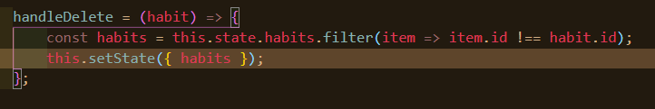

<br />

[목차로](#목차)

<br />

---

<br />

### App_컴포넌트_만들어보기

<br />

Navbar에도 count가 변경되어야 한다

state를 App으로 가져와서 App 안에서 Navbar 추가하고 input field 추가하고 리셋 버튼 추가해보자

App은 function이 아닌 클래스 컴포넌트로 변경

<br />

[목차로](#목차)

<br />

---

<br />

### Navbar_컴포넌트

<br />

자신만의 단축키 만들기 위해선 커맨드 팔레트에서 keyboard 검색

Open Keyboard Shortcuts 에서 

<br />

[목차로](#목차)

<br />

---

<br />

### Add_Form

<br />

DOM 요소를 직접적으로 쓰지 않으므로

리액트에서 다른 리액트의 요소에 접근하려면 Ref 쓴다

**Refs and the DOM**: https://reactjs.org/docs/refs-and-the-dom.html

<br />

멤버변수 정의 <- input에 접근해야하므로 inputRef라고 적는다(Ref 붙임)

리액트의 createRef() 함수 호출하면 ref 라는 오브젝트가 생김

이것을 원하는 요소 ref에다가 전달

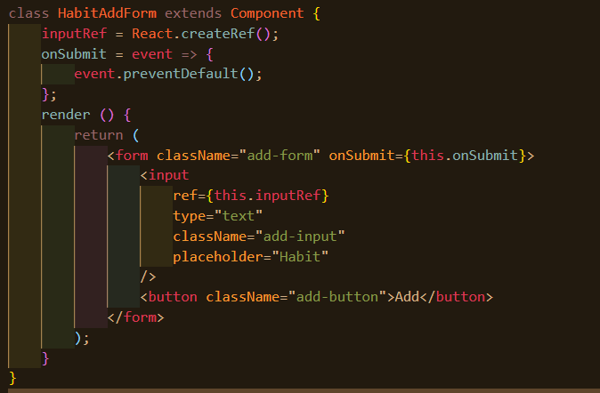

<br />

[목차로](#목차)

<br />

---

<br />

### Reset_처리

<br />

코드 참고

<br />

[목차로](#목차)

<br />

---

<br />

### PureComponent_성능_분석

<br />

**PureComponent:** https://reactjs.org/docs/react-api.html#reactpurecomponent

<br />

React <- 리액트는 Component들이다. 데이터가 조금이라도 업데이트가 되면 전체적으로 어플리케이션이 re-render가 된다 (Re-render the whole app on every update)

<br />

리액트의 중요한 컨셉

* Components
* Re-render <- state, render()
* VDOM <- virtual

<br />

리액트의 컴포넌트

- 클래스로 만들 수 있는 컴포넌트

  React.Component

  React.PureComponent

- 함수로 만들 수 있는 컴포넌트

  function

  memo(function)

  React Hook 쓰면 함수 쓰면서 클래스 컴포넌트와 같이 state와 라이프사이클 메소드 이용 가능

<br />

렌더 함수가 계속 호출됨에도 성능 괜찮은 이유: 필요한 요소만 업데이트해서

리액트 어플리케이션은 state가 변화되면 전체적으로 Render가 호출이 되는데

Virtual DOM(메모리 상에 트리 보관) 때문에

실제로 필요한 부분만 DOM 요소에 업데이트

디버깅할 때 HTML Elements에서 변화가 너무 많이 일어나면 뭔가 잘못된 것

<br />

```jsx

componentDidUpdate() {

}
```

위와 같은 React가 Component가 업데이트 될 때마다 호출해주는 함수가 있는데

예상하지 못한 화면 깜빡임이나 불필요한 일들이 수행될 수 있다

이렇게 관련 데이터가 전혀 변경 안되었음에도 불구하고 render 함수가 계속 호출되는 것은 성능에 좋지 않다

<br />

Components 탭에서 Settings 누르고 체크박스 선택

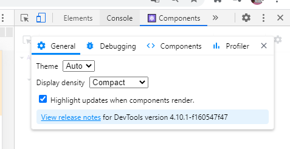

시각적으로 컴포넌트 렌더 확인

<br />

이걸 방지하는 것이

pureComponent와 memo인데

이들은 Component에 state나 props에 변화가 없다면 render 함수가 불려지지 않음

cf) VSCode에서 단어 선택 후 Ctrl + D 누르면 다중선택

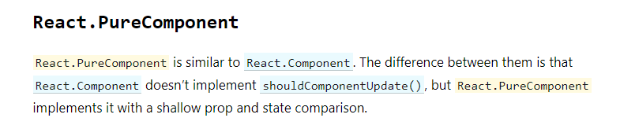

PureComponent(shouldComponentUpdate()을 구현. 컴포넌트를 업데이트 해야할지 안해야할지 알아보는 함수. 얇게 비교. 오브젝트 안 오브젝트 안 오브젝트.. 이런 식으로 트리처럼 뻗어나갈 수 있는데.. 오브젝트 레퍼런스만 비교. 내부 데이터 변경까진 비교X)는 props와 state 안에 들어있는 데이터가, 최상위에 있는 데이터가 변하지 않으면 render 함수 호출X

즉 re-rendering 안함

<br />

[목차로](#목차)

<br />

---

<br />

### PureComponent_활용

<br />

shallow comparison 때문에 안에 데이터 수정하면 동일한 오브젝트라고 판단해서 업데이트 안됨

그래서 전체적인 오브젝트 업데이트 함 this.setState({ habit });

<br />

해결 방법 2가지

1. 전달할 때 변화하는 것을 따로 빼서 오브젝트로 전달 

   count={habit.count} 써주고 const { count } = this.props;

   근데 이런 식으로 하면 불편함

2. 근본적인 문제는 오브젝트 전체 업데이트하지 않고 오브젝트 안에 있는 데이터 변경해서이다

   cf) deconstructing 오브젝트

   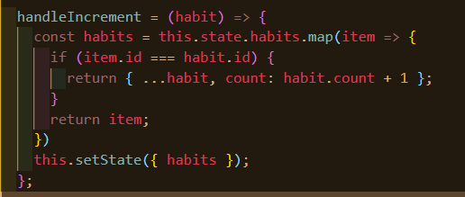

<br />

[목차로](#목차)

<br />

---

<br />

### Lifecycle_함수들

<br />


<br />

[목차로](#목차)

<br />

---

<br />

### function_컴포넌트

<br />


<br />

[목차로](#목차)

<br />

---

<br />

### React_Hook

<br />


<br />

[목차로](#목차)

<br />

---

<br />

### Spread_Operator

<br />


<br />

[목차로](#목차)

<br />

---

<br />

### 리액트_컴포넌트_훅

<br />


<br />

[목차로](#목차)

<br />

---

<br />

### State_오브젝트

<br />


<br />

[목차로](#목차)

<br />