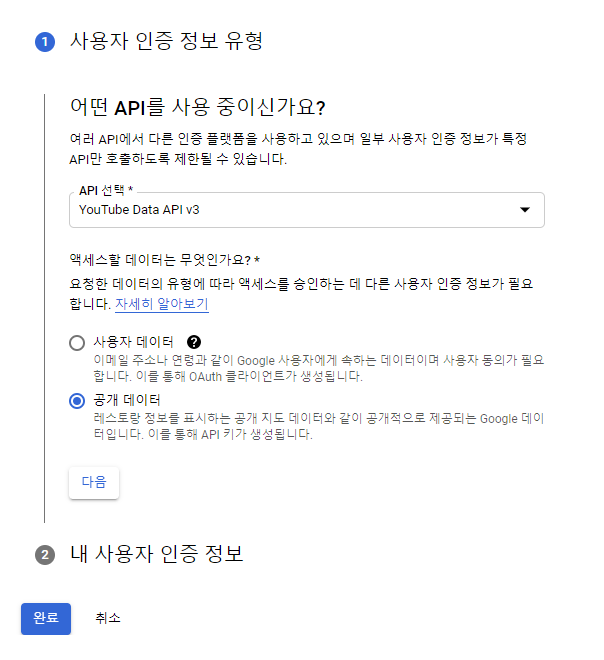
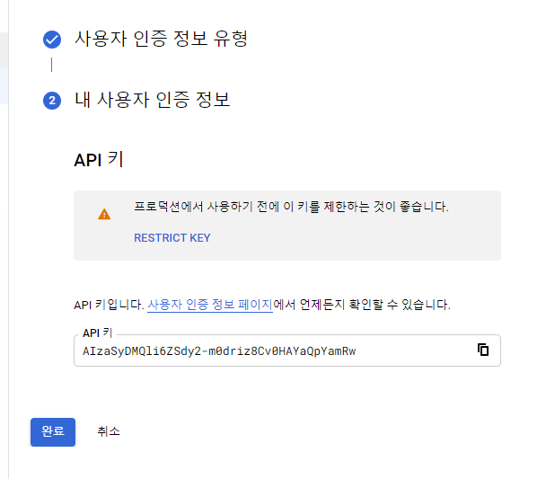
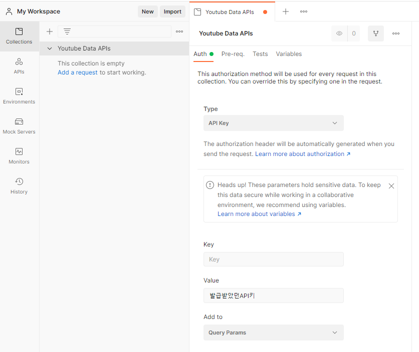
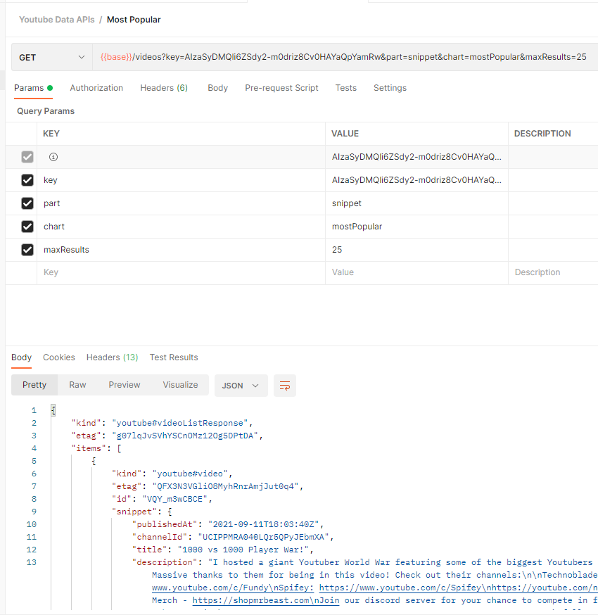

<br />
<a href="https://github.com/seol-yu/TIL/tree/master/React">
  
</a>
<br />

### 목차

[프로젝트 Kick off 인사](#Kick_off)

[유튜브 프로젝트 소개](#유튜브_프로젝트_소개)

[프로젝트 셋업](#프로젝트_셋업)

[API 키 설정하기](#API_키_설정)

[Youtube APIs 살펴보기](#Youtube_APIs_살펴보기)

[Postman_소개와_설정](#Postman_소개_설정)

[프로젝트_계획](#프로젝트_계획)

<br />

---

<br />

### Kick_off

<br />

1. 구현 사항 정리 및 파악
   - 기능, 구현 계획에 대해서 세울 수 있는데까지 정리
2. 강의 보면서 따라 작성
   * 콘솔 로그와 개발툴 적극 활용
   * 앱의 전반적인 흐름과 코드와 리액트에 대한 흐름/이해력 높이기
3. 강의 끝난 후, 다시 한번 스스로 만들어보기

<br />

[목차로](#목차)

<br />

---

<br />

### 유튜브_프로젝트_소개

<br />

Youtube API 이용

유튜브에서 가장 인기있는 영상 목록 보여주고

사용자가 원하는 영상 클릭하면 비디오 디테일, 영상 재생 화면, 오른쪽에는 인기 목록

비디오는 sticky로 유지

검색해서 마찬가지로 비디오 디테일 들어오기

반응형(오른편에 있던 검색 결과 밑으로)

<br />

문제 해결 연습

<br />

[목차로](#목차)

<br />

---

<br />

### 프로젝트_셋업

<br />

다른 프로젝트와 구분하기 위해

셋팅에 가서 

User <- 모든 비쥬얼 스튜디오에 적용

Workspace <- 지금 플젝에만 적용하기 위해

Workspace - Workbench - Appearance - Color Customizations 가서

settings.json 에다가

```json
{
    "workbench.colorCustomizations": {
        "titleBar.activeBackground": "#F54133",
        "titleBar.inactiveBackground": "#F54133"
    }
}
```

<br />

[목차로](#목차)

<br />

---

<br />

### API_키_설정

<br />

Youtube API 구글링

https://developers.google.com/youtube/v3?hl=ko

<br />

플랫폼 쓰면서 불편하면 

해당 플랫폼에서 API 지원되는지 보고 나만의 플랫폼 만들기

<br />

API 쓰기 위해 허용받고 관련 API 키를 받아야 한다

Get started

https://console.cloud.google.com/dcredirect?hl=ko&pli=1

프로젝트 만들기

대시보드 - API 및 서비스 가서

+API 및 서비스 사용 설정 => API 라이브러리로 이동

YouTube Data API 사용 누르기

사용자 인증 정보 만들기





클립보드 복사하고 완료

API 키는 안전한 장소에 보관하든가 개발자 콘솔와서 확인

<br />

[목차로](#목차)

<br />

---

<br />

### Youtube_APIs_살펴보기

<br />

REST API(RESTful Web services)

REST(Representational state transfer)

백엔드와 클라이언트에서 커뮤니케이션 어떤 방식으로 할지 결정해 놓은 것

<br />

* GET <- 정보 읽을 때 (정보를 서버에서 받아올 때 이미 존재하는 사용자 정보 받아 온다면)

  (?url param을 이용해서 받아옴)

* POST <- 새로운 사용자 만들 때

* PUT <- 이미 있는 사용자 정보 업데이트

* DELETE <- 이미 존재하는 사용자 삭제

* PATCH <- 통상적으로 REST API 중 하나로 간주안됨

  ......

<br />

GraphQL을 이용하지 않으면 REST API 이용

유튜브 API도 REST API임

API는 문서화가 잘 되어있음

<br />

IFrame Embed Code 보기 위해선

https://developers.google.com/youtube/youtube_player_demo

플레이어 매개변수 표시

https://developers.google.com/youtube/v3/docs/search/list?hl=ko%2F3%2Fgetting-started&apix=true#%EC%A7%81%EC%A0%91-%EC%82%AC%EC%9A%A9%ED%95%B4-%EB%B3%B4%EC%84%B8%EC%9A%94

위 주소 가면 try 해볼 수 있는데

Google OAuth 2.0은 체크 해제하고 API Key만 사용할 것임

<br />

snippet <- 정보 단위

? <- query param 시작

<br />

개발툴 - 네트워크 - Ctrl + R 리프레쉬(쉬프트 누르면서 하면 강제 리프레쉬)

<br />

[목차로](#목차)

<br />

---

<br />

### Postman_소개_설정

<br />

퍼블릭 API 이용할 때 유용한 포스트맨

<br />




Variables 에서는

컬렉션에서 반복적으로 사용되어지는 값이 있을 때 유용한데

유튭 플젝의 경우 컬렉션에서 공통적으로 베이스 url을 쓸 것이므로


그 후

리퀘스트 추가


Query Params에 KEY, VALUE 넣고 Send




<br />

[목차로](#목차)

<br />

---

<br />

### 프로젝트_계획

<br />


<br />

[목차로](#목차)

<br />
