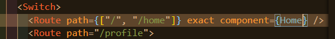
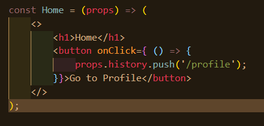
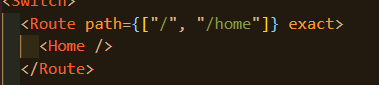
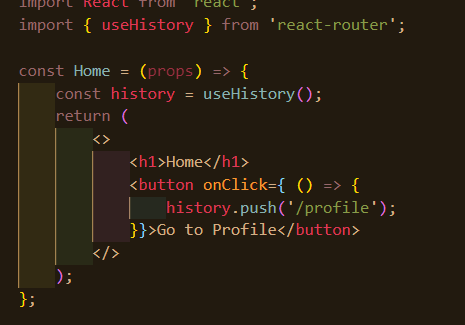

 

 

### 목차

[프로젝트 소개](#프로젝트_소개)

[React Router란?](#React_Router)

[React Router 예제](#React_Router_예제)

[Firebase](#Firebase)

[Cloudinary](#Cloudinary)

[Cloudinary 문서](#Cloudinary_문서)

[프로젝트 셋업](#프로젝트_셋업)

 

---

 

### 프로젝트_소개

 

명함 예쁘게 만들어주는 웹 어플리케이션

라우팅 이용 - 두 가지 페이지 나눠서 제작

1. 사용자 로그인 화면 - 구글 / 깃허브 가입
2. 비즈니스 카드 제작 메인 화면 - 리얼타임 데이터베이스 이용. 업데이트 즉각적

 

React Hooks

PostCSS

React Router

Firebase <- 사용자의 정보를 데이터베이스 서버에 저장 가능

Cloudinary <- 이미지 서버에 올릴 수 있는

 

[목차로](#목차)

 

---

 

### React_Router

 

라우팅 <- 우리가 네트워크에 있는 traffic의 path를 선택하는 프로세스다

네트워크에서 라우팅이란 네트워크상에 특정 url을 이용했을 때 

어떤 경로를 이용해서 데이터를 받아 올 것인지 결정해주는 길을 결정하는 애

 

HTTP 리퀘스트(사용자가 요청하는 url 링크를 요청) 시 

어떤 특정 페이지로 연결할지 결정하는 메커니즘

사용자가 url 줬을 때 어떤 페이지로 연결할지 결정

 

라우터는

메인 경로 다음에 /home, /profile, /login 경로 붙었을 때 

어떤 페이지 보여줄 것인지 결정하고 도와줌

 

리액트(싱글 페이지 어플리케이션 쉽게 만들 수 있는 라이브러리)

 

싱글 페이지 어플리케이션란

하나의 url로 한번 페이지가 로딩되고 나면 

그 안에서 사용자가 다른 페이지를 클릭하거나 링크를 클릭했을 때 

새로운 페이지가 열리는 것(전체적인 페이지 리프레쉬)이 아니라 `부분적인 내용만 업데이트`

 

SPA의

북마크 못하고 뒤로가기, 앞으로가기 내비게이션 추가가 안되는 문제 보완하기 위해

`리액트 라우터`를 쓴다

리액트 라우터 <- 싱글 페이지 어플리케이션을 유지하면서 url 붙일 수 있고, 해당 페이지 바로 갈 수 있고 북마크, 앞/뒤로 가기, 네비게이션 추가 가능하게 한다

 

[목차로](#목차)

 

---

 

### React_Router_예제

 

예제 플젝 만들어보자

`yarn create react-app router`

 

https://reactrouter.com/web/guides/quick-start

`yarn add react-router-dom`

 

위와 같이 쓰면 성능 문제 있어서 안됨 

자식 컴포넌트로 전달해야 한다

React Hook의 useHistory 사용

 

리액트 라우팅을 이용하면 HTML에서 링크 쓰는 것과 달리

기존 페이지 그대로 유지한 상태에서 해당 내용만 업데이트

싱글페이지 어플리케이션이 제공하는 장점 그대로 유지하면서 

라우팅 가능해서 성능이 좋다

 

[목차로](#목차)

 

---

 

### Firebase

 

Firebase + Crashlytics 

 

파이어베이스는

어플리케이션 만들 때 빠르게 만들 수 있게 도와준다

ex) Authentication, Cloud Firestore, Cloud Storage, Realtime Database(소켓 프로그래밍처럼 실시간 업데이트), Hosting, ML 등등 지원

 

SDK? software development kit 개발에 필요한 모든 것 들어있는

우리가 어떻게 통신을 해야 되는지, 파이어베이스에는 어떤 API가 있는지

어떤 것을 호출하고 어떤 순서로 설정해서 써야하는지 걱정X

파이어베이스에서 자체 제공하는 SDK를 

우리가 만드는 어플리케이션에 라이브러리처럼 포함해두면, 

SDK에서 제공하는 API 함수들만 이용하게 되면 

SDK가 알아서 자동으로 파이어베이스와 통신을 하게 된다

dependence가 하나 추가되는 것이므로 필요한지 이득 생각하고 나서 추가

 

https://firebase.google.com/docs

https://firebase.google.com/docs/auth

우리가 사용할 것은

Authentication, Realtime Database

 

[목차로](#목차)

 

---

 

### Cloudinary

 

 

[목차로](#목차)

 

---

 

### Cloudinary_문서

 

 

[목차로](#목차)

 

---

 

### 프로젝트_셋업

 

 

[목차로](#목차)

 