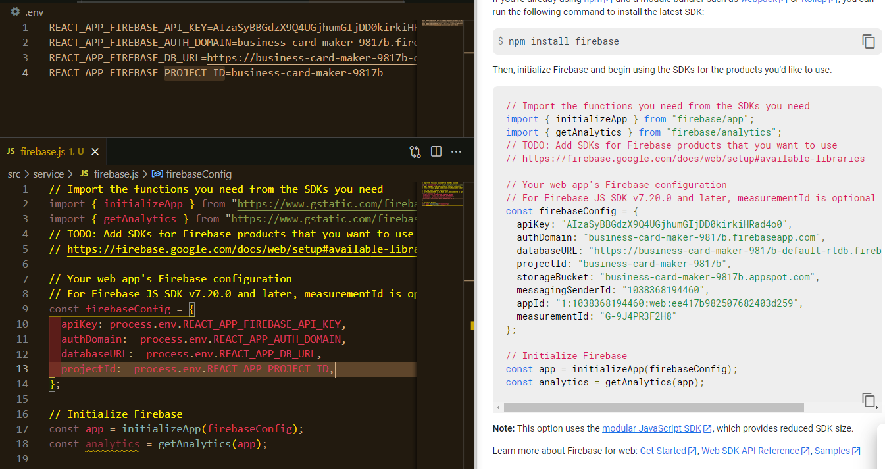
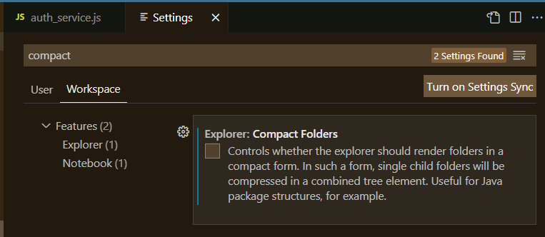
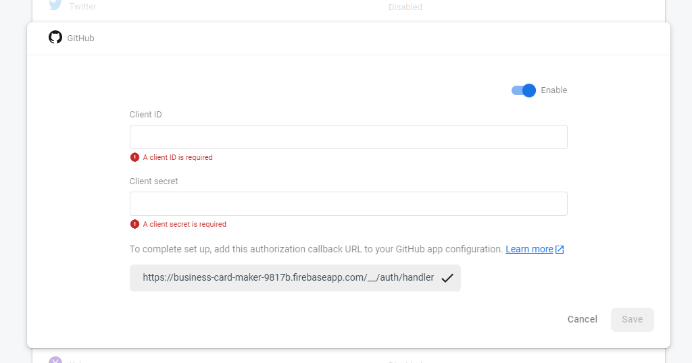
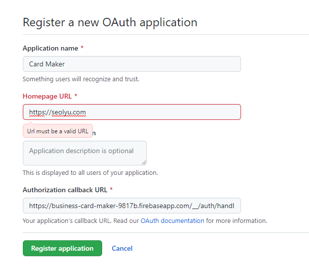

<br />
<a href="https://github.com/seol-yu/TIL/tree/master/React">
  </a>
<br />

### 목차

[로그인 화면](#로그인_화면)

[로그인 화면 Firebase 추가](#로그인_Firebase)

[로그인 화면 UI 완성](#로그인_UI)

[Route로 화면 전환](#Route_화면_전환)

[Maker 헤더와 푸터](#Maker_헤더_푸터)

[Maker 레이아웃 완성](#Maker_레이아웃)

[Maker Card UI](#Maker_Card_UI)

[Maker EditForm](#Maker_EditForm)

[Maker AddForm](#Maker_AddForm)

[State 업데이트](#State_업데이트)

[이미지 업로드](#이미지_업로드)

[Firebase 실시간 Database 추가](#Firebase_실시간_Database)

[성능 개선](#성능_개선)

[프로젝트 마무리(firebase 정리, useEffect 중요 포인트)](#프로젝트_마무리)

[성능 점검과 useCallback 주의점](#성능_점검_useCallback_주의점)
<br />

---

<br />

### 로그인_화면

<br />

https://firebase.google.com/docs/auth

인증 - 웹

구글, 깃허브 .. 

<br />

[목차로](#목차)

<br />

---

<br />

### 로그인_Firebase

<br />

`yarn add firebase`



.gitignore에

```
# API Keys
.env
```

<br />



<br />

firebase 콘솔에서 Authentication - 구글, 깃허브 enable



주소 복사해서

깃허브 - 셋팅 - Developer settings - OAuth Apps



등록한 후 Client ID랑 Client secrets 복사해서

파이어베이스 깃허브에 붙여넣기

<br />

[목차로](#목차)

<br />

---

<br />

### 로그인_UI

<br />

코드 참고

<br />

[목차로](#목차)

<br />

---

<br />

### Route_화면_전환

<br />

`yarn add react-router-dom`

<br />

[목차로](#목차)

<br />

---

<br />

### Maker_헤더_푸터

<br />

코드 참고

<br />

[목차로](#목차)

<br />

---

<br />

### Maker_레이아웃

<br />

코드 참고

<br />

[목차로](#목차)

<br />

---

<br />

### Maker_Card_UI

<br />

코드 참고

<br />

[목차로](#목차)

<br />

---

<br />

### Maker_EditForm

<br />

코드 참고

<br />

[목차로](#목차)

<br />

---

<br />

### Maker_AddForm

<br />

코드 참고

<br />

[목차로](#목차)

<br />

---

<br />

### State_업데이트

<br />

상태를 업데이트할 때 map, for loop 성능에 좋지 않은 경우가 있는데

object 특징 key, value 이용

<br />

[목차로](#목차)

<br />

---

<br />

### 이미지_업로드

<br />

코드 참고

<br />

[목차로](#목차)

<br />

---

<br />

### Firebase_실시간_Database

<br />


<br />

[목차로](#목차)

<br />

---

<br />

### 성능_개선

<br />


<br />

[목차로](#목차)

<br />

---

<br />

### 프로젝트_마무리

<br />


<br />

[목차로](#목차)

<br />

---

<br />

### 성능_점검_useCallback_주의점

<br />


<br />

[목차로](#목차)

<br />
