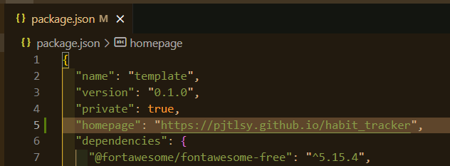
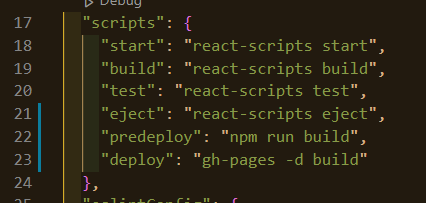

 

 

### 목차

[Github에 배포 및 다른 방법](#Github_배포)

[Netlify 배포](#Netlify)

[Netlify 최종 배포와 현업에서의 배포 과정](#Netlify_배포_현업_배포)

 

---

 

### Github_배포

 

**Deployment**: https://create-react-app.dev/docs/deployment

 

깃허브 레포지토리 만들고 플젝 올리기

만약 문제가 생기면

`open ~/.gitconfig` <- 윈도우는 start 명령어

글로벌적으로 설정되어 있는 gitconfig 열어서 유저 정보 정확한지 확인

 

Settings - GitHub Pages - master 브랜치

배포하면 얻게 될 주소 나옴

 

package.json에서

`yarn add gh-pages`

`yarn build`

`npm run deploy`

깃헙 페이지s에서 브랜치 gh-pages로

 

이 방법은 리액트 라우터에서 제공하는 브라우져 히스토리 지원 안됨

 

[목차로](#목차)

 

---

 

### Netlify

 

`npm install netlify-cli -g`

json 파일에 위에서 작성했던 homepage 부분 지우고

`netlify deploy`

깃허브로 가입

Create & configure a new site

Publish directory는 build 폴더

 

위 과정으로 했더니 빈화면 떠서

node_modules 폴더와 build 폴더 삭제하고

`npm i`

`yarn build`

`netlify deploy`

...

 

[목차로](#목차)

 

---

 

### Netlify_배포_현업_배포

 

Netlify로 하면 임시 url 생김

변경/추가한 내용 정상적으로 동작하는지 확인한 후

공식적으로 배포

 

개발자들이 개발해서 변경 커밋, 수정 내용 마스터 브랜치에 반영

qa와 검증 후 main repository에 반영

주기적으로 dev라는 환경에 배포, 반영

dev(테스트용 데이터베이스 담은 환경)에서 확인

주기적으로 배포하는데

staging 환경에서 변경사항 한번 더 확인하고 문제 없으면

production prod로 배포(사용자가 확인)

 

변경 -> deploy -> Draft URL로 확인 -> 배포

`netlify deploy --prod`

동일하게 build 쓰고

최종 url 나옴(사용자에게 배포)

https://habit-tracker-pjtlsy.netlify.app

 

[목차로](#목차)

 