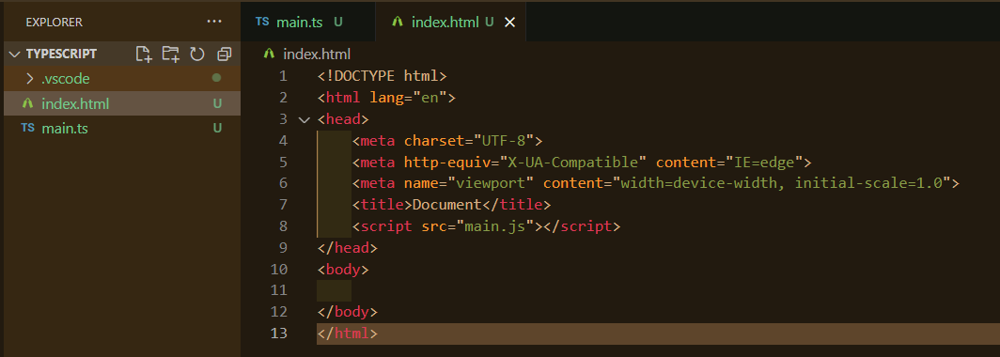

<br />

<a href="https://github.com/seol-yu/TIL/tree/master/TypeScript/TS_OOP" target="_blank"></a>
<br />

---

<br />

### 목차

[타입스크립트란](#타입스크립트란)

[타입스크립트가 뜨는 이유](#타입스크립트_뜨는_이유)

[타입스크립트_공부법](#타입스크립트_공부법)

[준비물_설치](#준비물_설치)

[북마크](#북마크)

[공식 사이트에서 타입스크립트 포인트 정리](#타입스크립트_공식사이트)

[사용해보기](#사용해보기)

[타입스크립트 컴파일러 툴](#타입스크립트_컴파일러_툴)

<br />

---

<br />

### 타입스크립트란

<br />

타입스크립트는

마이크로소프트사에서 만든 프로그래밍 언어(2년 개발. 2012/10 v0.8 ~)

<br />

 오픈소스 프로젝트라 코드 확인 가능

어느 브라우저, OS.. 자바스크립트 동작하는 어디든 JS 대체 가능

왜냐면

 JS 베이스로 한 superset of JavaScript라서.

TS를 transcompiles(컴파일러 툴은 TS 자체제공 컴파일러 툴 or BABEL 이용 가능) 해서 JS 코드로 변환

<br />

JS의 특징인 dynamically typed <- 프로그램이 동작할 때 실시간으로 타입이 결정되어서  runtime errors 발생할 수 있는 문제

but, JS에 타입이 더해진 TS는 Statically Typed <- 컴파일할 때 타입 관련 에러 잡을 수 있다

<br />

JS도 객체지향 프로그래밍 언어이지만 Prototype 베이스로 구현 가능하고

Constructor Functions 이용하면 클래스 이용해서 오브젝트 만드는 것처럼 간편히 오브젝트 제작 가능하지만 이 자체만으로 강력한 객체지향 프로그래밍하기 어렵다

ES6에서 클래스 도입되었지만(프로토타입 베이스) 그래도 할 수 있는게 거의 없다

<br />

TS에선 class, interface, generics, types 활용 가능해서 객체지향 프로그래밍 가능

<br />

[목차로](#목차)

<br />

---

<br />

### 타입스크립트_뜨는_이유

<br />

JS는 프로그램이 동작할 때 타입이 결정되지만(위험)

TS는 타입이 정적으로 결정(Statically Typed), 즉 코딩할 때 타입 결정됨(즉각적 타입 에러 볼 수 있다)

<br />

프로그래밍 언어 타입 결정 언제 되냐에 따라

1. dynamically typed - 런타임 환경 때 타입이 결정

   파이썬, 루비, 자바스크립트 등등

   ```python
   let age = 10;
   age = 'hi';  # no type at programming time and compile time
   ```

   가독성(readability) 떨어짐, 사용자가 사용할 때야 에러남 bugs

2. statically typed - 컴파일 시간에 타입이 결정

   TS, 자바, 고 등등

   ```javascript
   let age:number = 10;  // type of variable is known at compile time
   age = 'hi';  // 다른 타입 할당하면 컴파일 시간(코딩할 때)에 에러남
   ```

   실시간 에러 검사

   안정적, 확장성있는 소프트웨어 만들 수 있다

cf) 코드 -> 컴파일러가 컴파일 -> 런타임

<br />

강력한 객체지향 프로그래밍(Object-Oriented Programming) 가능

modern programming paradigm으로 알려진 객체지향 프로그래밍 OOP

객체 위주로 modularity(모듈성), reusability(재사용성), extensible(확장성), maintainability(유지보수성) 높다

Productivity 생산성

higher-quality

Faster

<br />

[목차로](#목차)

<br />

---

<br />

### 타입스크립트_공부법

<br />

1. JS 기본 지식 익히기 - 기본 문법 ~ 최신 문법

2. 브라우져 환경에서 쓰이는 웹 APIs

3. 타입에 대한 정확한 이해 - TS는 유연하고 강력한 타입 제공(언제 어떻게 쓸지)

   class, interface, generics 있어서 OOP 가능

   OOP 원칙 알기

<br />

[목차로](#목차)

<br />

---

<br />

### 준비물_설치

<br />

VSCode

터미널 <- ex) iTerm2 cmder

node.js(자바스크립트 런타임 환경) - npm(패키지 매니져) 때문에 필요

TS <- npm으로 설치, TS를 JS로 컴파일해주는 컴파일러

<br />

`node -v` 설치 확인 nodejs.org에서 LTS 버전 다운로드

`npm -v`

typescriptlang.org/download 가보면 다운로드 방법 나옴

`npm install -g typescript`

<br />

`tsc -v`

<br />

[목차로](#목차)

<br />

---

<br />

### 북마크

<br />

https://www.typescriptlang.org/

https://github.com/microsoft/TypeScript

<br />

[목차로](#목차)

<br />

---

<br />

### 타입스크립트_공식사이트

<br />

JS에 타입을 더해서 확장한 언어

안전하게 프로그래밍 할 수 있고 가독성 높여줌

JS 동작하는 곳 어디서든 동작 가능

<br />

자바스크립트 코드에서 빠르게 에러 catch 가능

<br />

JavaScript and More

A Result You Can Trust

Gradual Adoption

<br />

[목차로](#목차)

<br />

---

<br />

### 사용해보기

<br />

https://www.typescriptlang.org/

Playground 가서 코딩해보기

<br />

TS Config 탭에서 컴파일러 설정할 수 있다

<br />

[목차로](#목차)

<br />

---

<br />

### 타입스크립트_컴파일러_툴

<br />


node에서는 TS 코드 다 이해할 수 없음

브라우져도 마찬가지




<br />

TS를 JS로 변환해야 함

`tsc main.ts`

JS 코드 생성됨

`node main.js`

이렇게 해보면 되는 것 확인

index.html 에도 main.js로

<br />

공부, 빠르게 결과 보고 싶을 때 JS로 변환하지 않고 바로 실행해주는 툴(내부적으론 JS로 변환해서 node 실행하는 것이지만)

`npm install -g ts-node`

`ts-node main.ts`

에러나서

`npm install @types/node --save-dev`

<br />

`tsc -h`

가능한 모든 옵션 보기

<br />

`tsc main.ts` 하면 main.ts에서 코드 업데이트 했을 때 main.js에는 반영 안되어서 매번 컴파일 해줘야함

`tsc main.ts -w`

watch 옵션 쓰면 ts 파일에서 변환한거 저장하면 js 파일 코드에도 자동 반영

<br />

[목차로](#목차)

<br />
