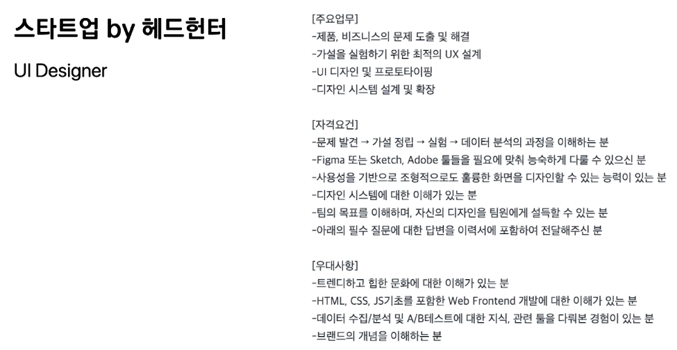

### UX / UI 디자인 이해

왜 공부?? 기획 역량을 향상하기 위해, 실무 노하우 습득을 위해, 포트폴리오 제작을 위해, 툴 활용 능력을 올리기 위해...

=>

다양한 디자인 이론 및 방법론 전달

실사례 통한 실무 노하우 전달

템플릿 제공을 통한 포트폴리오 구성 요소 전달

비슷하면서도 다른 직무명..

UX Researcher

UX Designer

Product Designer

UI Designer

직무명과 달리 자격요건은 명확한 편

* 문제 정의
* 리서치
* IA
* 프로토타이핑
* 사용성 테스트
* 툴
* 가설수립
* 퍼소나
* 저니맵
* FGI
* A/B 테스트

따라서 학습 목표는

* 해당 직무를 위한 자격요건을 갖췄다는 증거를 만드는 것

  => 포트폴리오

  => 인터뷰에서 포트폴리오 내용을 논리적 구조로 전달.. 진정성까지

---

어떻게 커리어를 쌓아 나가야 할까?

커리어를 위한 6단계

1. 이론 공부

   책 UX 120권.. UI 75권

   다 읽기를 추천

   하지만 다 못 읽음

   다 읽기보단 디자인에 대한 사상, 프로세스에 집중해서 읽어보기 ... 점점 작은 단위로

   책은 국내자료 읽어도 되지만 번역기가 있으니까 웹에서 해외 자료 많이 읽으며 나만의 관점을 얻자

   https://medium.com

   

   https://www.smashingmagazine.com

   https://www.nngroup.com

   

2. 툴 익히기

   시중에 책 많지만 매달 1~3회 업데이트(스케치)

   https://www.sketch.com/docs/getting-started

   https://www.facebook.com/groups/sketchappkorea

   

3. 경험 쌓기

   * 작더라도 다른 이들에게 피드백을 받고 이로 인해 성취감을 얻는 것이 중요

   * 다양한 프로젝트를 접하면서 실무 경험 쌓기와 학습을 동시에 달성

     https://www.behance.net

     올리고 칭찬받기

     https://www.wanted.co.kr/events/gigs

     프리랜서로 일해봐라

     https://www.wishket.com

     협업 경험

     https://kmong.com

     여긴 페이지단위. 포폴로 도전해보기

4. 네트워킹

   * 업계 및 직무 분야 최신 동향을 파악 가능

   * 온라인 상에서 알기 어려운 채용 관련 상세 정보 입수 가능

   * 이후 멘토를 찾기 위한 과정 <- 멘토 없는 사람보다 불리할 수 있음

     https://www.linkedin.com <- 현직자 대답해주기도 함

     https://www.designspectrum.org

     https://www.wanted.co.kr/events

     강사/강연자와 명함..소통

     https://www.facebook.com/from.designer

     http://conference.hcikorea.org/hcik2019

     세미나, 컨퍼런스 적극 참여

     아이디어 개진/피드백

     소통 기회

5. 멘토 찾기

   * 멘토(시니어, 연차 있는, 진로 조언)는 네트워킹을 통해 찾는 것이 빠름
   * 직무 및 포트폴리오에 대한 피드백을 받거나
   * 향후 진로에 대한 조언을 얻을 수 있음
   * 멘토가 있는 기업에 임직원 추천 전형으로 가거나
   * 다른 기업 입사 시 레퍼런스 체크를 위한 추천인이 되거나
   * 헤드헌터를 소개시켜 줄 수 있음

6. 채용 정보 찾기

   * 시니어 디자이너라면 링크드인 추천

   * 주니어 디자이너라면 원티드와 로켓펀치 추천

   * 일부 대기업은 자사 채용 사이트에서만 채용 공고를 냄

   * 경력자라면 멘토와 헤드헌터를 적극 활용하는 것이 좋음

     https://www.linkedin.com/jobs

     https://www.wanted.co.kr

     https://www.rocketpunch.com

     https://recruit.linepluscorp.com/lineplus/career

     https://www.hyundai.co.kr/Careers

---

UX, UI, 사용성, UCD는 어떻게 다른가?

UX 사용자 경험 <= 모든 것을 아우르는 **전체**

UI 사용자 인터페이스 <= 접점(공간에 대한 것)

USABILITY 사용성 <= 측정

UCD 사용자 중심 디자인 <= 철학

UX(User Experience, 사용자 경험)이란?

* 국제표준기구(ISO 9241-210, 2019)의 정의

  시스템, 제품, 서비스를 사용하거나 사용을 예상하면서 도출된 사용자의 인식과 반응

* 위키피디아의 정의

  사용자가 어떤 시스템, 제품, 서비스를 직/간접적으로 이용하면서 느끼고 생각하게 되는 **총체적 경험**

* 닐슨 노먼 그룹의 정의3

  사용자와 회사, 그 회사의 서비스나 제품과의 상호작용과 관련된 모든 측면

UI(User Interface, 사용자 인터페이스)란?

* 국제표준기구(ISO 9241-210, 2019)의 정의

  사용자가 대화형 시스템으로 특정 작업을 수행할 수 있도록 정보와 제어 수단을 제공하는 대화형 시스템(소프트웨어 또는 하드웨어)의 모든 구성 요소

* 위키피디아의 정의

  산업 디자인과 HCI(Human Computer Interaction) 분야에서 인간과 기계 사이의 상호작용이 발생하는 공간

  * UI는 다양한 형태로 존재
    * UI (User Interface) <- 스크린 기반 인터페이스
    * PUI (Physical User Interface) <- 물리적 제품 기반 인터페이스
    * 서비스 디자인에서는 이 개념이 터치 포인트(Touch Point)로 확장

USABILITY 사용성

* 국제표준기구(ISO 9241-210, 2019)의 정의

  특정 사용자가 특정 사용 맥락에서 시스템, 제품, 서비스 등을 사용할 때 효과(Effectiveness), 효율성(Efficiency), 만족도(Satisfaction)를 가지고 특정 목표를 달성할 수 있는 정도나 범위

* 위키피디아의 정의

  도구(Tool)나 장치(Device)와 같은 인간이 만든 물체가 가진 사용 편의성(Ease of use) 및 학습성(Learnability)

* 닐슨 노먼 그룹의 정의

  사용자 인터페이스의 사용성을 평가하는 품질 속성 또한 디자인 과정 중 사용성을 향상시키는 방법

  cf) 제이콥 닐슨의 10가지 사용성 평가 원칙

사용자 중심 디자인(User Centered Design)이란?

* 위키피디아의 정의

  사용자가 원하고 필요로 하는 것에 대해 사용자의 한계 능력과 상황에 맞추어 디자인 프로세스를 통해 사용자를 중심으로 사고하여 만들어 내는 인터페이스, 서비스, 제품 디자인의 철학적 접근 방법이자 디자인 사상

* Adobe Blog

  Before user experience design there was "user-centered design"

  Donald Norman's book, The Design of Everyday Things

  책) 도널드 노먼의 디자인과 인간 심리

다양한 디자인 접근 방법 존재(시스템 디자인, 기능 중심 디자인, 직관적 디자인, 연구 중심 디자인)

시스템 디자인(System-centered Design): 구현하고자 하는 시스템을 다양한 역할을 하는 요소로 분리하고 조합하여 만들어가는 접근 방법

기능 중심 디자인(Feature Centered Design): 제품과 시스템의 기능에 중점을 두는 디자인 접근 방법으로 폭포수 프로세스에 적합

직관적 디자인(Intuitive Design): 디자이너 개인이 뛰어난 재능을 발휘하여 자신의 결정에 따라 디자인을 진행하는 방법

연구 중심 디자인(Research Centered Design): 기술, 인문학, 자연과학, 사회과학 등 다양한 분야의 연구 결과를 바탕으로하는 디자인 접근 방법

---

UX, CX, BX는 어떻게 다른가

UX 사용자 경험

CX 고객 경험

BX 브랜드 경험

CX(Customer Experience, 고객 경험)

* 닐슨 노먼 그룹의 정의

  디지털 상호작용에 있어 전체적인 경험을 설명하기 위해 제안된 UX와 달리,

  CX는 더 넓은 의미의 총체적 경험을 설명하기 위해 사용

BX(Brand Experience, 브랜드 경험)

* WHATIS.COM의 정의

  기업이 특정 제품이나 회사 이름에 대해 고객이 느끼는 감정에 영향을 주기 위해 만든 종합적이고 체험적인 마케팅의 일종

프로덕트 디자이너(Product Designer)가 떠오르는 이유..

=> 디지털 상호작용에 머무르지 않고 고객의 관점에서 제품(Product) 전체의 경험을 디자인해야한다는 관점에서 호칭부터 바꾼 것

cf) 앱스트랙트 디자인의 미학 시즌2 이안 스폴터: 디지털 경험과 디자인

---

Design Thinking 디자인 씽킹 이란

디자인적 사고

비즈니스 전략에 대한 요구를 충족시키기 위해 디자이너의 감수성과 작업방식을 이용하는 사고 방식

1. 이해하기

   1. 공감 <- 사용자를 더 잘 이해하기 위해 리서치를 수행

   2. 문제 정의 <- 리서치 결과와 사용자가 가진 문제를 연결

2. 탐구하기

   1. 아이디어 <- 문제 해결을 위한 창의적 아이디어 도출
   2. 프로토타입 <- 아이디어를 눈으로 볼 수 있고 만질 수 있게 표현

3. 구체화하기

   1. 검증 <- 사용자로부터 다시 피드백 얻기

   2. 실행 <- 목표를 달성하기 위해 실행

      ex) GE 헬스케어, 어린이용 MRI

☆ Multidisciplinary 다양한 전문과들과의 협업 <- 비즈니스, 테크, 마케팅, CS ..

☆ Empathy 공감

---

디자인 작업을 위한 맥 환경

다양한 분야의 뉴스를 빠르게 접하기 위해

RSS Feed를 제공하는 피들리(Feedly) 사용

=> FEEDS 설정 IMPORT OPML

검색 속도를 올리기 위해

알프레드(Alfred)를 사용

---

어떻게 디자인 프로세스를 만들어야 할까

개발 프로세스를 먼저 알아야하는 이유

* UX/UI 디자이너는 개발 부서의 프로세스에 따라 업무 방식이 달라짐
* 개발 부서에서는 일반적으로 폭포수 or 애자일 프로세스 사용
* 때문에 회사/플젝별 개발 프로세스 파악 후 디자인 프로세스 구축

애자일 기반의 프로세스가 대세

* 그러나 회사 또는 제품의 특성에 따라 폭포수 프로세스를 사용해야하는 경우도 있음

폭포수(Waterfall)

* 디자이너는 다음 단계로 넘어가기 전에 모든 것을 문서화 함

* 단계별로 모든 작업이 완료되기에 상대적으로 디자인 적용이 쉬움

  문제 정의 -> 디자인 -> 개발 -> 검증

애자일(Agile)

* 폭포수 프로세스의 단점을 보완하기 위해 만들어짐

* 작은 팀 규모, 가까운 물리적 위치, 팀원 간 역할 구분이 엄격하지 않아야 함

  문제 정의 -> 디자인 -> 개발 -> 검증 -> 문제 정의 .. (작게 쪼개서 ex. 회원가입, 플레이리스트, 결제)

* 때문에 전체적인 사용자 경험을 디자인하는 UX 디자인과 애자일 프로세스는 모순되는 관계

린 UX(Lean UX) <- 애자일에 속하긴함

* 리서치를 통한 가설같은 불확실성을 다루는데 최적화된 애자일 프로세스 중 하나

* 최소 요건 제품(Minimum Viable Product, MVP)를 검증할 때 사용

  아이디어 -> 구현 -> 제품 -> 측정 -> 데이터 -> 학습 -> 아이디어 ..

MVP(Minimum Viable Product)란?

* 고객에게 비즈니스 가치를 제공할 수 있는 최소한의 기능을 구현한 제품
* 비즈니스 가설을 검증하는 것을 목표로 함

디자인 스프린트(Design Sprint) <- 애자일에 속함

* 구글에서 새로운 제품을 시장에 출시할 때 위험을 줄이기 위해 고안해낸 프로세스

* 목표를 명확하게 정의 후 가정을 검증하고, 개발을 시작하기 전에 제품 로드맵을 결정하는데 사용

  아이디어 <=> 학습 -> 개발 -> 출시 -> 아이디어 <=> 학습 ...

* 디자인적 씽킹(Design Thinking)을 5일 간의 시간적 제약을 주고 실행

  * 월요일: 프로젝트 이해(목표를 크게하고 문제점 찾아보기)
  * 화요일: 아이디어 도출(주어진 과제에 대한 해결책 찾기)
  * 수요일: 의견 수렴(중요한 결정 내리기)
  * 목요일: 프로토타이핑(프로토타입 만들기)
  * 금요일: 평가와 학습(사용자의 반응을 토대로 앞으로의 진행 방향 결정하기)

애자일 프로세스에서 디자이너는

* 공감 능력: 비즈니스와 사용자를 빠르게 이해하고 공감하며
* 다양한 방법론: 이를 위해 다양한 방법론과 스킬을 목적에 맞게 사용하고
* 프로토타이핑: 아이디어를 빠르게 시각화하고 검증할 수 있어야

---

왜 비즈니스를 이해해야 하나

많은 기업과 조직들이 그들의 비즈니스를 성공시키기 위해 디자인 씽킹(Design Thinking)을 활용

비즈니스 전략에 대한 요구를 충족시키기 위해 디자이너의 감수성과 작업방식을 이용하는 사고 방식

* Multidisciplinary 다양한 전문가들과의 협업(비즈니스, 테크, 마케팅, CS ..)
* Empathy 공감

많은 기업과 조직들이 애자일 기반으로 일함

애자일 프로세스에서 디자이너는 공감능력(비즈니스와 사용자를 빠르게 이해하고 공감), 다양한 방법론(이를 위해 다양한 방법론과 스킬을 목적에 맞게 사용), 프로토타이핑(아이디어를 빠르게 시각화하고 검증)

디자이너가 비즈니스를 이해해아만

* 목적에 맞는 디자인 방법론을 사용

* 비즈니스의 가치를 사용자에게 전달

* 프로젝트의 성공과 실패 판단

디자인을 위한 디자인X

비즈니스를 위한 디자인O

---

어떻게 비즈니스를 이해할 수 있나

비즈니스(Business)란?

상품이나 서비스 등을 생산하거나 사고팔아서 생계를 유지하거나 돈을 버는 활동

비즈니스 모델(Business Model)이란?

기업 업무, 제품 및 서비스의 전달 방법, 이윤을 창출하는 방법을 나타낸 모형

비즈니스 모델 캔버스(Business Model Canvas)란?

* 스위스의 비즈니스 이론가이자 사업가인 알렉산더 오스터왈더가 제안
* 비즈니스 모델에 관한 실제 모델 리서치와 인터뷰 등을 통해 9가지 핵심 요소로 재구성한 템플릿

비즈니스 모델 캔버스(Business Model Canvas)란?

비즈니스 모델의 탄생

비즈니스 모델의 원천에 대한 강력한 인사이트를 제시하는 이 책은 끊임없이 변화하고 새로운 것을 원하는 경쟁시장에서 살아남기 위한 방법을 알려주고, 자신의 모델이 과연 비즈니스로서 성립 가능한지 점검하고 계획을 구체화할 수 있도록 구성하였다.

'창업을 위한 비즈니스 플래닝', '신규사업과 틈새 시장을 위한 기획', '혁신과 창의의 조직문화 구축', '사업 아이템의 시장성과 현실성 분석', '고객 밀착형 마케팅과 유통 모델 설계' 등 비즈니스를 구성하는 요소들을 통틀어, 합리적이면서도 탁월한 사업 모델을 구상하고 실현할 수 있는 실용적인 지식을 망라했다

린 캔버스(Lean Canvas)란?

* 창업가이자 창업 멘토인 에시 모리아가 제안
* 비즈니스 모델 캔버스(Business Model Canvas)를 린 UX에 최적화한 템플릿

https://www.google.com/search?q=%EB%B9%84%EC%A6%88%EB%8B%88%EC%8A%A4+%EB%AA%A8%EB%8D%B8+%EC%BA%94%EB%B2%84%EC%8A%A4&source=lmns&bih=969&biw=1920&hl=ko&sa=X&ved=2ahUKEwiH6M6by9PvAhUMAKYKHblOBWUQ_AUoAHoECAEQAA

---

어떻게 비즈니스를 정리할 수 있나

린 캔버스(Lean Canvas) 작성 순서

1. 고객이 겪는 문제(Problem)

   * 가장 중요한 문제 1~3가지 (문제가 너무 많으면 핵심에 집중X)
   * 불편함, 문제점 등을 단순화해서 작성
   * 고객(Demand) 측면과 공급(Supply) 측면을 작성해도 됨
   * 완전히 새로운 것이 아닌 현재 존재하는 것에 대한 대안을 찾아도 됨
   * 고객이 그 문제를 해결하기 위해 사용중인 대체제도 작성

   ex) 

   PROBLEM

   * 다 읽은 책을 처분하기가 어려움
   * 취향이 같은 사람들과 소통하고 싶음
   * 어떤 책을 완독한 사람에게 책 추천 받고 싶음

   EXISTING ALTERNATIVES

   * 중고나라
   * 알라딘 중고서적
   * 주제 관련 커뮤니티

2. 고객 세분화(Customer segments)

   * 목표로 하는 고객 또는 사용자를 세분화
   * 문제를 가장 크게 느끼고 가장 개선 의지가 강한 사용자로 정의

   ex)

   CUSTOMER SEGMENTS

   * 다 읽은 책을 무료 나눔하면서 비슷한 독서 취향을 가진 사람들을 만나 소통하고 싶은 고객
   * 자신의 독서 취향과 관심 분야가 같은 사람들에게 더 많은 책을 소개 받고 싶은 고객

   EARLY ADAPTERS

   * 한 달에 5권 이상의 책을 읽는 책벌레
   * 집에 보관 중인 책이 300권 이상인 고객
   * 다른 사람들과의 소통에 적극적인 고객

3. 제품이 고객에게 주는 가치(Unique Value Proposition)

   * 제품을 사용해야하는 이유
   * 한 마디로 표현 가능한 컨셉

   ex)

   UNIQUE VALUE PROPOSITION

   * 독서 후기를 통한 불안감 감소
   * 위치 기반 사용자 매칭으로 시간 및 수고 절감
   * 같은 취향을 가진 사용자와의 네트워크 확대

   HIGH LEVEL CONCEPT

   * 책 벌레들을 위한 당근마켓

     ex) 비슷한 듯 다른 부동산 거래 플랫폼들의 하이레벨 컨셉

     * 직방: 좋은 집 구하는 기술
     * 호갱노노: 아파트 실거래가 1등 앱

   가치 피라미드(Value Pyramid)

   - 사회적 영향 - 자기초월 ex) 인스타, 라임 킥보드
   - 생활변화적 - 희망 제공, 자아 실현, 동기 부여, 가보, 제휴·소속
   - 감정적 - 불안 감소, 나에 대한 보상, 향수, 디자인·심미, 배지 가치, 웰빙, 치유적 가치, 재미·엔터테인먼트, 매력, 접근성 제공
   - 기능적 - 시간 절약, 단순화, 수입, 위험 감소, 정리, 통합, 연결, 수고 절감, 번거로운 상황 방지, 비용 절감, 품질, 다양성, 감각적 어필, 정보

4. 문제에 대한 해결책(Solution)

   * 문제(Problem)를 해결하기 위한 핵심 기능 3가지
   * 필요하다면 문제에 대한 리서치 후 마지막에 작성해도 됨

   ex)

   * 지역 기반의 무료나눔 환경 제공
   * 독서 취향이 같은 사용자와의 매칭 제공
   * 독서 후기 공유를 통한 책 추천 기능 제공

5. 고객에게 제품이 도달하는 경로(Channels)

   * 고객에게 제품이 도달하는 경로
   * 인스타, 페이스북, TV 광고, 매장 등의 아웃바운드(Outbound)
   * SEO(검색엔진최적화) 등의 인바운드(Inbound)

   ex)

   * 베스트 독서 후기를 올린 인스타그램
   * 책 제목 검색 결과 시 블로그 노출
   * 중고서적 관련 키워드 검색 결과 시 블로그 노출
   * SEO 최적화

6. 수익 구조(Revenue Streams)

   * 수수로, 판매, 광고 등의 수익 구조
   * 종량제, 시간, 사용량에 따른 과금 정책 등

7. 고정 비용과 유동 비용(Cost Structure)

   * 고객 획득 비용, 유통 비용, 호스팅, 인건비 등

8. 측정 가능한 지표(Key Metrics)

   * 측정 가능한 핵심 지표나 활동
   * 모바일 메신저 - 사용자 수, 메시지 건수
   * 소셜 네트워크 - 사용자 수, 체류 시간
   * 커머스 - 거래 금액, 거래 건수

   ex)

   * 일간 무료 서적 등록 수
   * 일간 메시지 개수
   * 무료 나눔에 대한 만족도 지수

9. 대안들 대비 강점(Unpair Advantage)

   * 대안들 대비 강점
   * 경쟁자와 쉽게 흉내낼 수 없는 특징
   * 기술·시간·조직 우위 등

   ex)

   * 단순히 중고 물품을 사고 파는 것이 아닌 취향과 독서 후기를 공유
   * 나와 취향이 맞는 사람들과 소통을 위한 시공간 제공

위험 반복 경로(Risk Iteration Path)란?

린 캔버스에 제시된 비즈니스 모델 가설을 검증하기 위해 제안된 테스트 순서

* Product Risk 제품 리스크

  

* Customer Risk 고객 리스크

  

* Market Risk 시장 리스크

  

---

어떻게 비즈니스를 위한 데이터를 찾을 수 있을까

https://datalab.naver.com

https://trends.google.co.kr

https://some.co.kr

https://keywordtool.io

https://gs.statcounter.com

---

비즈니스 목적에 따라 UX가 어떻게 다른가

비즈니스 목적: 컨텐츠, 태스크, 마케팅, 브랜딩, 커머스, 온디맨드, 소셜

컨텐츠(Contents)

* 사용자에게 다양한 형태의 콘텐츠와 관련 정보를 제공
* 사용자의 멘탈모델에 맞는 카테고리와 효과적인 검색 도구 설계가 중요

태스크(Task)

* 사용자의 중요한 업무를 처리하는 것을 목적으로 함
* 다른 곳에서 할 수 없는 기능을 제공해야하며 초보 사용자와 숙련 사용자를 모두 고려해야 함

마케팅 캠페인(Marketing Campaign)

* 일정 기간 동안 특정 사용자들로부터 설문에 대한 답변이나 통계학적 데이터를 얻는 것을 목적으로 함
* 사용자에게 명확하고 즉각적인 가치를 제안하여 흥미와 재미를 유발하고 특정한 행동을 유도해야 함

브랜딩(Branding)

* 회사와 이 회사의 제품에 관심을 가진 사용자 간의 긍정적인 관계를 촉진시키는 것을 목적으로 함
* 현재 사용자와 잠재 사용자는 물론 투자자, 사업 파트너, 미디어, 구직자까지 고려해야 함

커머스(Commerce)

* 앞 선 4가지(컨텐츠, 태스크, 마케팅, 브랜딩) 비즈니스 목적의 UX 특성을 모두 포함
* 제품의 특성을 명료하게 설명해야하고 유용한 콘텐츠와 편리한 기능 제공 필요

온디맨드(On Demand)

* 태스크, 마케팅, 브랜딩 제품 유형의 특성을 포함
* 초보 사용자와 숙련 사용자를 고려해야하며 빠르게 원하는 태스크를 수행가능해야 함

소셜(Social)

* 태스크 중심의 제품 특성을 포함
* 즐거운 기능을 제공하는 동시에 강력한 보안 기능을 제공해야 함

---

왜 초기 사용자가 중요한가

기술 수용 주기(Technology Adoption Lifecycle)

미국의 사회심리학자 에버렛 로저스(Everett Rogers)가 소비자 집단 혹은 사회가 어떻게 새로운 기술을 수용하는가를 모형화한 것

* 혁신 수용자(Innovators) 2.5%
* 선각 수용자(Early Adopters) 13.5%
  * 혁신 수용자와 마찬가지로 분석하기를 좋아함
  * 제품을 구매할 때 주변의 평가에 의존하기보다는 자신의 직관과 분석에 의존
  * 혁신수용자와 달리 입소문 내기를 좋아함
* 전기 다수 사용자(Early Majority) 34%
  * 선각 수용자의 행동을 보고 첨단 기술이나 제품의 실용적인 활용방법을 모색하는 집단
  * 어느 정도 기술과 신제품에 대해 관심은 있지만, 혁신 수용자/선각 수용자보다 실용성에 더 무게를 둠
* 후기 다수 사용자(Late Majority) 34%
  * 신제품이 시장의 표준으로 자리 잡을 때까지 기다린 후 제품을 구매하는 집단
  * 첨단기술을 소화하는데 있어 전기 다수 사용자들 만큼 자신의 능력을 확신하지 않음
  * 제품 구매 후에도 많은 지원을 기대해 AS가 확실한 큰 회사의 상품을 구매하는 경향이 있음
* 지각 수용자(Laggards) 16%
  * 개인적 성향 또는 경제적 이유로 좀처럼 신기술을 받아들이지 않는 사람들
  * 첨단 기술을 구매하는 경우가 있다 하더라도 제품의 기술성과  필요성은 모를 확률이 높음

새로운 제품으로 시장에 진입하기 위해서

초기시장(새로운 것을 추구하는 사람들 - 혁신/선각 수용자)

주류시장(완벽한 해결 방안과 편의성을 추구하는 사람들 - 전기 다수 사용자, 후기 다수 사용자, 지각 수용자)

그런데 왜 모든 제품이 성공하지 못할까

95%의 새로운 제품이 캐즘(Chasm)을 극복하지 못하기 때문

캐즘(Chasm)이란? 지질학 용어로 지각변동으로 인해 골이 깊고 넓어지면서 지각이 단절된 것을 의미

초기시장에서 주류시장으로 넘어가는 과도기에 일시적으로 수요가 정체되거나 후퇴하는 단절현상을 의미

캐즘을 뛰어넘기 위해

빠르게 가설을 잡고, 테스트하고, 검증을 통해 사용자로부터 배워야 함

볼링핀 전략(Bowling Pin Strategy)

하나의 세분화 시장을 집중 공략한 이후에 인접한 세분화 시장의 새로운 고객 층을 차례로 확보해 나가는 전략

시장 진입(거점이 될 세그먼트를 타게팅) -> 시장 개발(기존 솔루션을 활용하는 새로운 세분화 시장) + 제품 개발(기존 세분화 시장을 활용하는 새로운 솔루션)

