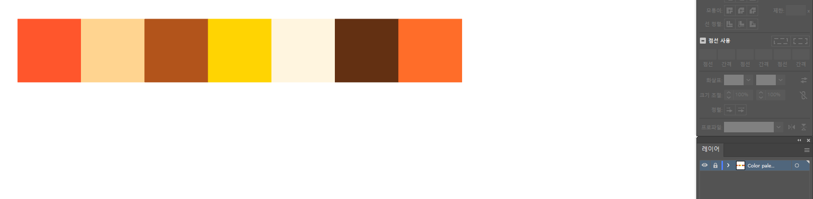

:art:

일러스트레이터의 기본 인터페이스  이해

: 일러스트레이터의 기본 인터페이스 구조인 `Tool bar`, `Control panel`, `Menu bar`, `Panels`, `Status bar`, `Artboard` 이해

 

:heavy_check_mark: `Artboard`는 프레임 사이즈로 작업 화면을 보여준다

:heavy_check_mark: 그림을 그리는 주요 기능은 `Toolbar`에 있다

:heavy_check_mark: 오브젝트들에 대한 세부 설정은 `Control pannel`, `Pannels`에서 한다

:heavy_check_mark: 화면의 확대, 축소, 활성화된 툴은 `Status bar`에서 확인

:heavy_check_mark: 파일 열기와 저장, 편집, 설정, 효과 주기, 선택, 보기 등은 `Menu`에서 한다

 

---

 

:heavy_check_mark: 자신만의 `Workspace`와 `컬러 팔레트` 설정

:heavy_check_mark: `Tool bar`에 있는 기능들과 `Pathfinder`를 활용

:heavy_check_mark: `Outline Stroke`와 `Guides` 기능 활용

윈도우 - 작업영역(workspace) - New workspace 로 저장

 

Ctrl + U / Command + U view - 스마트가이드

view - snap to grid(격자에 물리기?)

view - rulers 눈금자표시 Ctrl + R .. 가이드라인 만들어보고 필요없으면 안내선 지우기(clear guides), lock / unlock

Ctrl + ; 가이드 끄고 켜기

swatch 견본에 색상 추가(드래그해서) 삭제해보기

 

---

 

레이어에 컬러 팔레트 만들기, 자물쇠

가이드 색상 마음에 안들면 illustrator 속성 가이드그리드 가서 원하는 색상

윈도우는 편집 - 환경설정 - 안내선과 격자

 

---

 

:heavy_check_mark: Window panel에서 자신이 쓰는 기능을 꺼내고 정리해서 쓴다

:heavy_check_mark: Tool bar에서 기본 도형툴과 Pen tool을 사용해 그림을 그린다

:heavy_check_mark: `Pathfinder`로 오브젝트를 합쳐주거나 분리한다

:heavy_check_mark: 라인을 면으로 만들 때 `Outline Stroke`을 사용한다

:heavy_check_mark: Ruler와 Guide, Reflect tool을 사용해 대칭의 오브젝트를 만든다

 

---

 

Google Fonts

https://fonts.google.com

Adobe Fonts

https://fonts.adobe.com

 

:heavy_check_mark: Type Tool로 기본적인 글자 설정

:heavy_check_mark: 글자를 편집 가능한 shape으로 만들기 위해 `Create outlines` 해주기

:heavy_check_mark: `Outline Stroke`을 사용해 Stroke을 면으로 만든다

:heavy_check_mark: `Blend`와 `3D Bevel&Extrude`로 입체감있는 글자를 만든다

:heavy_check_mark: Blend와 3D extrude한 글자는 반드시 `Expand` 해준다

 

---

 

명암이 있는 라인 일러스트레이션 그리기

Pathfinder 기능으로 빛과 그림자 디테일 만들기

Transparency 기능 활용

Effect 효과를 활용해 형태에 변화주기

 

---

 

:heavy_check_mark: Pathfinder의 Minos front, Intersect로 빛과 그림자의 영역을 만든다

:heavy_check_mark: Joint를 사용해 오브젝트를 연결

:heavy_check_mark: Wave 기능으로 형태에 변화를 주고 Expand appearance 해준다

:heavy_check_mark: Transparency 패널에서 블렌딩 모드와 투명도 설정

:heavy_check_mark: 같은 그룹에 속하는 레이어는 Grouping해서 레이어 정리

 

---

 

:heavy_check_mark: 기본 캐릭터를 설정을 기반으로 다양한 응용 동작과 디자인 만들기

:heavy_check_mark: Stroke 활용해 캐릭터의 팔, 다리 만들기

:heavy_check_mark: Stroke으로 캐릭터의 신체, 옷, 장식 요소 만들기

:heavy_check_mark: 배경 제작시 카메라 무브먼트를 고려해 배경 요소 제작

:heavy_check_mark: Pathfinder의 Divide, Intersect로 그림자 영역을 만들고 디테일 더하기

 

---

 

그리드를 활용한 아이소메트릭 아트웍 제작

 

:heavy_check_mark: 아이소메트릭 그리드라인 만들기

:heavy_check_mark: 그리드에 맞춰 아트웍 오브젝트 제작

 

Citypop

밝고 선명한 컬러톤. 푸른 계열. 명암차이가 나는 색을 그림자로 사용

 

Isometric projection

 

:heavy_check_mark: Selection tool의 Copy 기능으로 일정한 간격의 그리드 라인 만들기

:heavy_check_mark: Clipping mask를 사용해 보여질 영역만 설정

:heavy_check_mark: 그리드 라인을 기준으로 아이소메트릭 오브젝트 그리기

:heavy_check_mark: 여러 점을 Align panel을 사용해 정렬 방식을 정하고 위치 맞추기

:heavy_check_mark: 기존 레이어를 복제해 오브젝트의 두께감을 만들거나 그림자 주기

 

---

 

